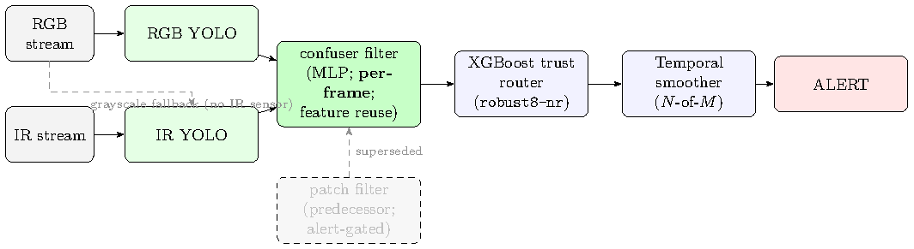
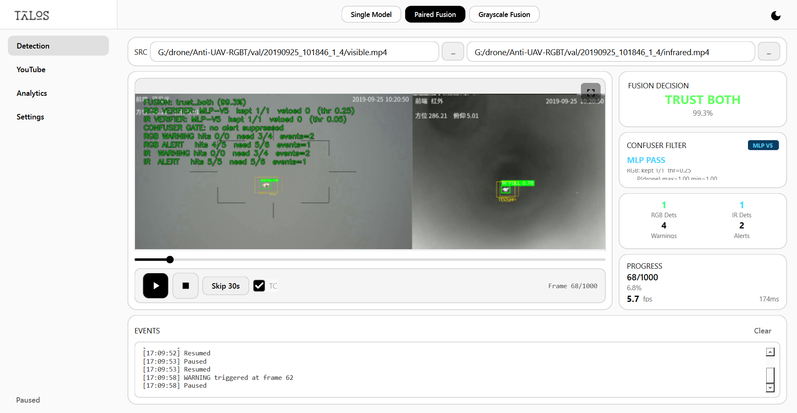

# Real-Time Multimodal Drone Detection Through Visual and Thermal Sensor Fusion

Companion code and thesis for the MSc dissertation of the same title (Ahmed Eltayeb, University of
Salerno). The system pairs an RGB detector and a thermal-IR detector, routes each frame to the modality
it can trust, suppresses bird / airplane / helicopter false alarms with feature-space filters, and raises
an alert only when a short sliding window agrees. It ships with an operator GUI, a human-in-the-loop
labeling tool, and a model-diagnosis tool (Model MRI).



This repository is **self-contained for reading and auditing the thesis numbers**: clone it and every
headline number in the dissertation can be re-verified against its frozen source on a CPU, with no
dataset and no GPU (see [Reproduction tiers](#reproduction-tiers)). The thesis source and figures, the
frozen result JSONs, and the full pipeline code are committed.

**Model weights and datasets are not published** (they are large). Contact the author for the trained
weights and the datasets. Auditing and viewing the numbers (`eval.py`, the audit) need neither; running
the GUI, replaying from cache, or retraining do.

## Repository map

| Directory | What is in it |
|---|---|
| `docs/thesis_working_distilling_overleaf/` | The thesis: LaTeX source, figures, `references.bib`, `build_thesis.ps1` |
| `models/` | All trained weights by role: `rgb/ ir/ routers/ verifiers/ patches/ pretrained/` |
| `audit/` | Number-integrity audit: `audit_headline_numbers.py` re-checks every headline cell against its frozen JSON |
| `thesis_eval/` | The evaluation harness: detect-once cache builder, zero-GPU replay that produces the thesis numbers, and the held-out evaluations |
| `eval/` | Evaluation library used by the harness (metrics, routing, verifier, dataset utilities) and committed result artifacts |
| `training/` | One folder per model in the architecture, each holding its trainer (see [training/README.md](training/README.md)) |
| `classifier/` | Trust-router and verifier model definitions and feature code used by the harness |
| `mri/` | Model MRI: detector feature-space diagnosis (PCA / LDA / ANOVA) and verifier training |
| `gui/` | Operator GUI (PySide6, "TALOS"): fused RGB+IR view, alert-gate temporal logic, settings |
| `label_reviewer/` | Human-in-the-loop label review tool |
| `runs/` | Frozen result bundles cited by the thesis (clean-split, DUT test split, resolution sweep) |
| `configs/` | Evaluation and training configuration files |

## Production stack

| Role | Model | Weight |
|---|---|---|
| RGB detector | `ft4` (YOLO26n, SelCom + confuser fine-tune) | `models/rgb/Yolo26n_selcom_confuser_ft4_1280/weights/best.pt` |
| IR detector | `v3b` | `models/ir/corrective_finetune/finetune_v3b/weights/best.pt` |
| Trust router | `robust8-nr` (3-class, no reject) | `models/routers/robust8_noreject_drop/model.joblib` |
| RGB confuser filter | `mlp_v5_v4` at P(drone) 0.25 | `models/verifiers/rgb_v5/mlp_v5_v4.pt` |
| IR confuser filter | `mlp_aligned_thermalonly` at 0.05 | `models/verifiers/ir_aligned/mlp_aligned_thermalonly.pt` |
| Grayscale filter | `mlp_aligned_gray_balanced` at 0.25 | `models/verifiers/ir_aligned/mlp_aligned_gray_balanced.pt` |
| Temporal smoother | 2-of-3 sliding window | (in `gui/` and the eval harness) |

Weight paths are shown for reference; the weight files themselves are not published (contact the author).

## Reproduction tiers

Each tier needs strictly more than the one above it. The audit tier is the one this repo is built to make
trivial.

| Tier | What it does | Needs | Command |
|---|---|---|---|
| Read | Read the thesis and the frozen result JSONs | nothing | open `docs/.../main.pdf`, `thesis_eval/results/*.json` |
| **Audit / view** | Re-check or print every headline number against its frozen source | a clone, Python standard library only | `py audit/audit_headline_numbers.py`, `py eval.py --all` |
| Replay | Regenerate the result JSONs from the cached detections | the cache + weights (contact author), `requirements.txt` | `py eval.py --pipeline svanstrom --replay` |
| Rebuild | Rebuild the cache from the detectors | a GPU + the weights (contact author) | `py thesis_eval/pipeline_cache_unified.py` |
| Retrain | Retrain a model from data | a GPU + the datasets and weights (contact author) | see [training/README.md](training/README.md) |

## Evaluate any dataset or table: `eval.py`

`eval.py` is the main entry point for the numbers. By default it reads the frozen result JSONs (the same
source the audit checks), so it prints the exact thesis values, with frames evaluated, on a fresh clone
with no cache and no GPU. Pass `--replay` to recompute from the cache instead.

```
py eval.py --list                  # every dataset and the tables it has
py eval.py --all                   # print every table in the thesis
py eval.py svanstrom               # all tables for one dataset
py eval.py --rgb rgb_test          # RGB detector, bare, on the RGB test set
py eval.py --ir  antiuav           # IR detector on Anti-UAV
py eval.py --pipeline svanstrom    # full pipeline ablation table
py eval.py --confuser rgb_confuser # confuser false-alarm table
py eval.py --temporal              # segment / video window metrics
py eval.py --dut                   # DUT Anti-UAV held-out test split
py eval.py --router-cm             # trust-router held-out confusion matrix
py eval.py --filter-cm             # confuser-filter held-out confusion matrices
py eval.py --pipeline svanstrom --replay   # recompute from the cache (needs the cache + requirements.txt)
```

It covers every surface in `thesis_eval/results/` plus the standalone tables (resolution and filter-operating
sweeps, clean split, CBAM held-out). It reads the JSONs and never re-implements a metric, so it cannot drift
from the audited numbers.

## Audit the numbers

The audit reads only the committed result JSONs, so it runs on a fresh clone with no cache and no GPU. It is
the only audit command in the repository:

```
git clone <this repo> && cd <repo>
py audit/audit_headline_numbers.py
# -> 203/203 checks pass (161 headline cells + 42 cited paths)
```

For the replay and rebuild tiers, install the Python dependencies first (PyTorch is installed separately,
CPU or CUDA, see the comment at the top of `requirements.txt`):

```
python -m venv .venv
.venv\Scripts\activate
pip install -r requirements.txt
```

## Trace any number to its source

Every headline claim maps to one generating script and one frozen results file. The audit enforces this
mapping; the table below is the human-readable version.

| Claim (thesis) | Generating script | Frozen results file |
|---|---|---|
| Svanstrom composed F1 0.946, recall 0.991 | `thesis_eval/pipeline_eval_unified.py` | `thesis_eval/results/tier1_results.json` |
| Anti-UAV composed F1 0.984 | `thesis_eval/pipeline_eval_unified.py` | `thesis_eval/results/tier1_results.json` |
| Confuser false-alarm rate 30.4% to 1.4% | `thesis_eval/pipeline_eval_unified.py` | `thesis_eval/results/tier1_results.json` |
| Held-out clean split 0.684 to 0.913 | `thesis_eval/leakage_controlled_replay.py` | `runs/clean_split/clean_split_results.json` |
| Segment and video window metrics | `thesis_eval/temporal_replay.py` | `thesis_eval/results/temporal_results.json` |
| Trust-router held-out confusion matrix | `thesis_eval/eval_router_heldout.py` | `thesis_eval/results/per_model_heldout/router_heldout.json` |
| Confuser-filter held-out confusion matrices | `thesis_eval/eval_filter_heldout_cm.py` | `thesis_eval/results/per_model_heldout/filter_heldout_cm.json` |
| Resolution sweep (Svanstrom) | `eval/svan_resolution_sweep.py` | `eval/results/svan_resolution_sweep.json` |
| Filter operating points | `eval/filter_operating_sweep.py` | `eval/results/filter_operating_sweep.json` |
| CBAM IR held-out filter | `eval/eval_ir_heldout.py` | `eval/results/ir_heldout_results.json` |

See [audit/README.md](audit/README.md) for what the audit asserts, and
[thesis_eval/README.md](thesis_eval/README.md) for how to rebuild the cache and replay a single surface.

## Build the thesis

MiKTeX with `pdflatex` and `bibtex` (the biblatex backend is `bibtex`, not `biber`):

```
powershell -ExecutionPolicy Bypass -File docs/build_thesis.ps1
```

## The operator GUI



```
py gui/pyside_app.py     # needs the trained weights (contact the author)
```

## Datasets and weights

The trained model weights and the raw image / video datasets are not included in this repository (they are
large). **Contact the author** (Ahmed Eltayeb) for access. Everything needed to read and audit the thesis
numbers is committed, so the weights and datasets are only required for running the GUI, replaying from the
cache, rebuilding the cache, or retraining.

## License

Released under the [MIT License](LICENSE).
