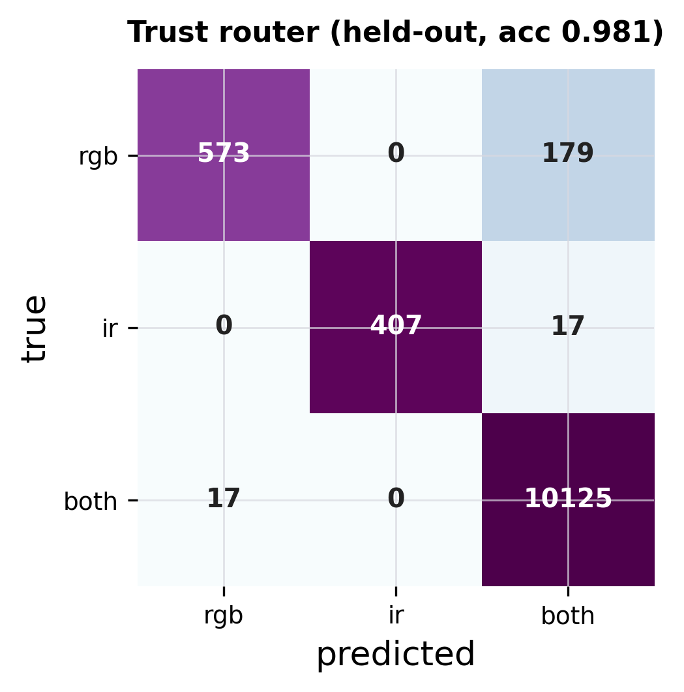
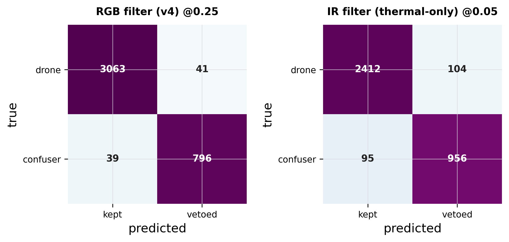

# audit/

Number-integrity audit for the thesis. `audit_headline_numbers.py` re-checks every headline number in the
dissertation against the frozen results file it came from, so a reader can confirm the thesis was not
hand-edited away from its evidence.

## Run it

```
py audit/audit_headline_numbers.py
# -> 203/203 checks pass (161 headline cells + 42 cited paths); 0 failures
```

It imports only the Python standard library and reads only committed result JSONs, so it runs on a fresh
clone with no cache, no GPU, and no `pip install`. This is the friendliest reproduction tier (see the root
[README](../README.md#reproduction-tiers)).

## What it asserts

1. **Value vs source.** Each hardcoded number in the thesis equals the matching cell in its frozen JSON
   (for example, the Svanstrom composed F1 in the text equals `tier1_results.json` for that surface).
2. **Arithmetic.** Dataset counts reconcile (drones + confusers equal the stated total; the production
   filter set equals its base set plus the documented additions).
3. **Cross-reference.** A consistency registry extracts each load-bearing number from every place it is
   restated across chapters and asserts they all agree, so one quantity has exactly one value.
4. **Cited paths exist.** Every file the thesis cites as evidence is present in the repository.

If any check fails the script prints the offending claim and the value it expected, and exits non-zero.

## Held-out evidence behind the production claims





These matrices come from `thesis_eval/eval_router_heldout.py` and `thesis_eval/eval_filter_heldout_cm.py`;
their JSONs are in `thesis_eval/results/per_model_heldout/` and are checked by the audit.
