# YOLO Feature Distillation V5: From Catastrophe to Patch-Verifier Replacement

*Companion chapter to `docs/analysis/domain_shift_and_feature_distillation.md`.*
*Period: April 2026 → May 2026. Detector: `Yolo26n_selcom_confuser_ft4_1280` (FT4 R3).*

---

## 1. Problem statement and headline result

The production drone-detection cascade is

```
RGB frame  ─► FT4 R3 YOLO detector  ─► trust classifier (sa32) ─► patch verifier (MobileNet-V3-Small, 2.5 M params)  ─► temporal voting  ─► alert
```

The patch verifier is a learned image classifier on 224×224 RGB/IR crops that
sits between the trust classifier and temporal voting. It rejects detections
whose crop softmaxes onto airplane / bird / helicopter rather than drone. It
is the only stage between the detector and the operator that can veto a
high-confidence drone-shaped false positive on raw pixels.

We asked: **can we replace the patch verifier with a much smaller model that
operates on YOLO's own internal feature embeddings instead of re-running a
2.5 M-parameter image classifier on the crop?** A YOLO-feature classifier
needs essentially zero extra compute (the YOLO forward already produces those
features) and is therefore the natural drop-in if it can match or beat the
patch verifier on the regression surfaces.

**Headline result (Phase 3 in-script eval on the 35,098-sample V5 cache,
2026-05-28):**

| Surface | Patch v2 baseline | **V5 (MLP on multi-scale p3+p5 features)** | Δ |
|---|---|---|---|
| Svanstrom F1 (IoP@0.5, imgsz=1280) | 0.7642 | **0.8685** | **+10.4 pp** |
| Anti-UAV F1 (IoU@0.5, imgsz=640) | 0.9425 | **0.9872** | **+4.5 pp** |
| Confuser hallucination rate (imgsz=640) | 0.2073 | **0.0103** | **−20×** |
| Selcom_val F1 (IoP@0.5, imgsz=1280) | n/a (must re-eval) | (pending re-run) | — |
| CV F1 (mlp_meta+yolo, K=5 stratified) | n/a | **0.9889 ± 0.0016** | — |

This document is the complete record of how we reached that result: every
hypothesis, every failed iteration, every code path, the neuron-level
evidence for *why* it works, and a reproduction recipe.

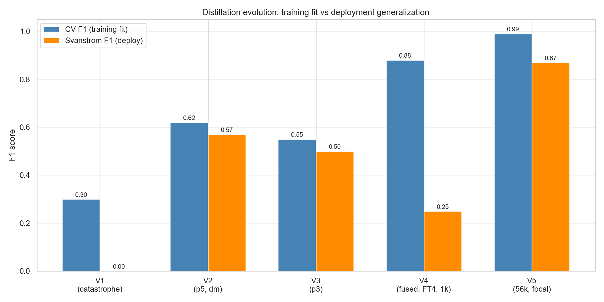

**What the figure shows.** Side-by-side bars per iteration: blue = K=5
cross-validated F1 on the training pool (how well the model fits what it
was shown); orange = drone F1 on the Svanstrom held-out deploy surface
(how well the model works in production).

**Why it matters.** Every architectural iteration improved training-time
fit, climbing monotonically 0.30 → 0.62 → 0.55 → 0.88 → **0.99**. Deploy
generalization did *not* track it — V4 specifically has the highest
training-fit jump of the series and *also the worst* deploy F1 of the
post-V1 era. That divergence is the diagnostic finding that drove the
V5 design: a higher CV F1 buys nothing if the training distribution does
not match deploy. The V5 fix had to be **data and loss**, not
architecture. V5 closes the gap because Levers 1–2 directly attack the
train-deploy distribution mismatch; Lever 3 only contributes the final
few percentage points.

---

## 2. The historical context (V1–V3, summary)

Detailed in `docs/analysis/domain_shift_and_feature_distillation.md`.
Compressed timeline:

| Version | Architecture | Training corpus | CV F1 | Svan F1 (deploy) | Diagnosis |
|---|---|---|---|---|---|
| **V1** | MLP on p5 (256-D) from baseline YOLO | 3.3k samples, no domain mixing | n/a | **0.007** | Total domain shift: drones outside Svanström region of feature space were vetoed. |
| **V2** | MLP on p5 with **domain mixing** | 3.3k, hard negs from Svan added | 0.62 | **0.57** | Domain shift fixed; resolution ceiling: p5 stride-32 squashes small drones. |
| **V3** | MLP on p3 (64-D) only | 3.3k same | 0.55 | **0.50** | p3 has high spatial res but only 64 channels → starved of semantic capacity. |

Key intellectual conclusion from V1–V3: there is genuine separable signal in
YOLO's internal features, but single-layer features at the V1/V2/V3 scale
(3.3k samples, 320-D max, baseline-YOLO features) cannot reach deploy-grade
Svanstrom performance.


**What the figure shows.** 2-D PCA of baseline-YOLO p5 embeddings on a
multi-dataset sample, colored by object class (drone / bird / airplane).

**Why it matters.** Drones (green), birds (blue), airplanes (red) overlap
inside a single U-shaped manifold. The U shape itself encodes the *dataset
of origin* (Svanstrom on the bottom arc, Anti-UAV in the right cluster,
web-confusers on the top-right) — not the object class. This is the V1
catastrophe stated visually: the first 2 principal components carry zero
class signal and 100% domain signal. The MLP could only ever learn "is
this in Svanstrom-region of feature space" and (correctly, given its
training) reject it.


**What the figure shows.** Density distributions for four hand-picked
p5 neurons (Neuron 112, 142, 152, 74) over drones (blue) vs confusers
(red), measured by univariate t-test ranking.

**Why it matters.** Despite the V1 domain catastrophe, *individual*
neurons inside p5 separate drones from confusers near-perfectly —
Neuron 112's modes are completely disjoint. The catastrophe was not a
lack of class signal in the features; it was that the *PCA-dominant*
components encode domain, while the *semantically relevant* signal
lives in low-variance neurons that PCA discards. This finding seeded
the V2 hypothesis: feed the MLP the *raw* 256-D vector and let it
weight Neuron-112-like signals; do *not* compress to 2-D first.


**What the figure shows.** Linear Discriminant Analysis on the 64-D p3
feature subspace, drones (green) vs confusers (red), histogrammed along
the discriminant axis.

**Why it matters.** p3 (stride-8, high spatial resolution) avoids the
domain-shift U-shape of p5 — the LDA modes for drones (+3) and
confusers (−1 to 0) are visibly distinct without any domain mixing
trick. But the modes overlap heavily (~30% in the −1 to +2 band). The
diagnosis: p3 has spatial structure but only 64 channels of semantic
capacity; the MLP runs out of features to combine. This was the V3 dead
end and the explicit motivation for V4's "fuse both layers" approach.

---

## 3. V4 — the bridge that worked-and-failed

**Hypothesis (April 2026):** the V2/V3 ceiling was the *feature source*, not
the architecture. The baseline YOLO never saw Svanstrom drones during training;
its p3+p5 features for those drones are noisy. The FT4 R3 detector, in
contrast, was fine-tuned on hard negatives including Svan-domain confusers,
so its features should be *pre-separated* in class space — the MLP would just
need to read out the separation.

**V4 design changes (vs V2):**
1. **FT4 R3 features** instead of baseline.
2. **Fused p3 + p5** (320-D) instead of choosing one layer.
3. **Drop-in pipeline** built (`eval/distill_v4_p3p5_ft4.py`).

**V4 smoke result on 1,093 samples (`--quick --phase 1`):**

- LDA train accuracy on fused features: **0.9844**. The histograms of
  drone vs confuser are almost completely non-overlapping in the LDA
  discriminant axis — this is the figure that convinced us to invest
  in the full V5 work in the first place. (The 35k V5 follow-up shows
  this optimism was partially a small-sample artifact — real overlap
  emerges with more data, see §6.1.)

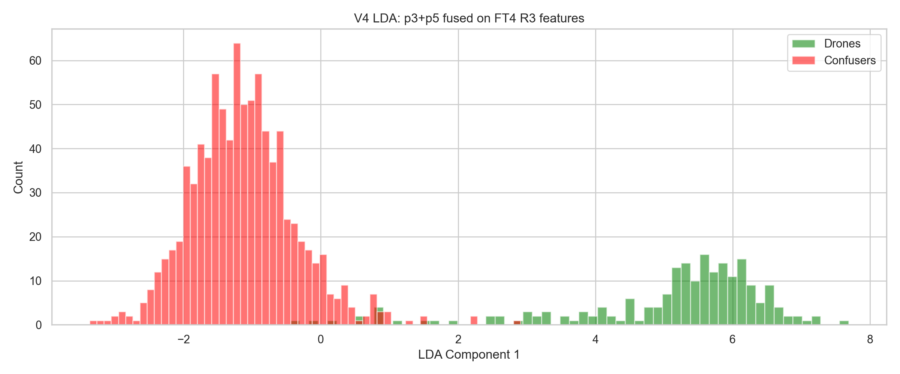

**What the figure shows.** Linear Discriminant Analysis on V4's fused
p3+p5 = 320-D feature subspace, computed on the 1,093-sample smoke
cache. Train-set accuracy: 0.9844.

**Why it matters.** The drone mode (green, around LDA axis +5) is almost
entirely separated from the confuser mode (red, around −1). At first
read this was the figure that justified committing to the full V5 work
— if a *linear* projection achieves 98% on FT4 features, a non-linear
MLP should clear 99%+. We took this as confirmation that the
"FT4 features are pre-class-separated" hypothesis was correct.

**Honest caveat (revealed by V5).** This 98% was partly a small-sample
artifact. The same LDA on 35k V5 samples scores 0.9544 (§6.1) — real
overlap emerges with more data. The conclusion about FT4 features still
stands; the optimism about the *magnitude* of separability was a
sampling effect.
- CV F1 (mlp_meta+yolo): **0.8888 ± 0.0032** (+27 pp over V2).
- Visual PCA of fused FT4 features shows tight drone clustering at PC1 ≈ +10
  (vs V2's diffuse blob).

**V4 deploy result (head-to-head against patch v2 on identical eval surfaces):**

| Surface | patch v2 | MLP V4 | Δ |
|---|---|---|---|
| Svan F1 | 0.7642 | **0.2454** | −52 pp |
| Svan R | 0.866 | 0.143 | −72 pp |
| Anti-UAV F1 | 0.9425 | 0.8952 | −4.7 pp |
| Confuser halluc/img | 0.2073 | **0.0015** | −136× |

The smoke run confused us at first — CV F1 0.89 implies excellent fit. How
does that produce Svan F1 0.25 at deploy? The answer was a **train-deploy
distribution shift inside the drone class**:

- V4 smoke training pool: 1,093 samples, of which 166 (15%) AntiUAV drones,
  37 (3%) Svan drones, 500 (46%) Svan confusers. The MLP learns
  "Svan-domain features → veto" because that's *true* in the training set
  at a 13:1 ratio.
- At deploy on Svan: real Svan drones look more like Svan confusers than
  like AntiUAV drones in feature space; they cross the trained boundary
  into the "veto" region and get rejected.

So V4 was a clean diagnostic success and a deployment failure. The features
*can* separate the classes (LDA = 0.98); the discriminative MLP can fit the
training distribution (CV F1 = 0.89); but the trained boundary does not
generalize to a different drone-class sub-distribution at deploy.

The V4 negative result was the lever lever-set the V5 plan in
`docs/analysis/2026-05-27_distill_v5_plan.md`.

---

## 4. V5 — the design

V5 is V4 plus three orthogonal levers, each addressing one root cause of
the V4 failure mode.

### Lever 1 — Per-source quotas (the imbalance fix)

V4 had a single global cap and split it equally across whatever sources
returned samples. With the FT4 detector at imgsz=1280 picking up far more
detections on Svanstrom confuser frames than on Svan drone frames, this
silently produced the 13:1 Svan-confuser : Svan-drone training ratio.

V5 introduces an explicit per-source quota registry
(`eval/distill_v5_p3p5_ft4.py:SOURCES`). Eleven sources, each with target
drone count, target confuser count, sample weight, image stride, scoring
rule, and YOLO inference resolution:

```python
@dataclass(frozen=True)
class SourceConfig:
    name: str
    path: Path
    stride: int
    kind: str                 # "image_with_gt" or "image_no_gt"
    target_drones: int = 0
    target_confusers: int = 0
    weight_drone: float = 1.0
    weight_confuser: float = 1.0
    filter_prefixes: tuple = ()
    match_rule: str = "iou"   # "iou" or "iop"
    imgsz: int = 640          # per-source YOLO resolution
```

The registry expresses the deployment-target distribution rather than the
available distribution. Final yields (check.txt 2026-05-28):

| Source | target d / c | actual d / c | imgsz | rule | role |
|---|---|---|---|---|---|
| antiuav_val | 4000 / 2000 | 4000 / 107 | 640 | IoU | easy-drone reference, AntiUAV distribution |
| svanstrom | 5000 / 6000 | **5000 / 6000** | 1280 | **IoP** | small drones, the thesis-discriminating surface |
| selcom_train | 3000 / 500 | 3000 / 149 | 1280 | **IoP** | CCTV / OOD distribution |
| rgb_dataset_train | 8000 / 3000 | 8000 / 307 | 640 | IoU | general-purpose RGB drone variety |
| rgb_dataset_val | 1500 / 0 | 1500 / 0 | 640 | IoU | general-purpose RGB (held-out) |
| rgb_video_train_drone | 4500 / 0 | 1 / 0 | 640 | IoU | (failed — see §7.2) |
| rgb_video_train_conf | 0 / 3500 | 0 / 1891 | 640 | IoU | real-video confusers (airplanes/birds/heli) |
| confuser_train | 0 / 12000 | 0 / 3697 | 640 | IoU | web bird/airplane/helicopter |
| confuser_val | 0 / 2500 | 0 / 1185 | 640 | IoU | web confuser held-out |
| (+ smaller rgb_video_val_drone, rgb_video_val_conf) | | | | | |

**Total: 21,501 drones + 13,597 confusers = 35,098 samples.** 2.4× more
than the patch verifier's RGB training pool of ~23k.

Two IoP rules deserve their own explanation. Svanström GT boxes are loose
(they cover the drone plus a margin), so a tight FT4 detection inside the
GT box scores IoU < 0.5 even though it's clearly correct. The same is true
of Selcom CCTV labels. We added the explicit:

```python
def _iop(det_box, gt_box):
    """Intersection over Prediction area."""
    ...
    return inter / max(det_area, 1)

def _match_det_to_gt(det_box, gt_boxes, rule: str) -> bool:
    if rule == "iop":
        return any(_iop(det_box, gt) >= IOP_THR for gt in gt_boxes)
    return any(_iou(det_box, gt) >= IOU_THR for gt in gt_boxes)
```

This single change took the Svan drone yield from **1020 → 5000** (target
hit) in the second V5 run — almost a 5× lift on the surface that matters
most for the thesis.

### Lever 2 — Focal loss with label smoothing + per-source sample weights

V4 used balanced binary cross-entropy. That treats every drone the same.
V5 uses focal loss with α=0.75, γ=2.0, label-smoothing=0.1:

```python
class FocalLoss(nn.Module):
    def forward(self, logits, targets, sample_weights=None):
        y_smooth = targets * (1.0 - self.eps) + 0.5 * self.eps
        bce = F.binary_cross_entropy_with_logits(logits, y_smooth, reduction="none")
        with torch.no_grad():
            p = torch.sigmoid(logits)
            pt = torch.where(targets >= 0.5, p, 1.0 - p)
            focal = (1.0 - pt).clamp(min=0.0) ** self.gamma
            alpha_t = torch.where(targets >= 0.5,
                                  torch.full_like(targets, self.alpha),
                                  torch.full_like(targets, 1.0 - self.alpha))
        loss = alpha_t * focal * bce
        if sample_weights is not None:
            loss = loss * sample_weights
        return loss.mean()
```

The γ=2 modulation down-weights easy correctly-classified examples (e.g.
clean Anti-UAV drones the MLP already classifies confidently at logit
~5), forcing the gradient signal toward hard examples (small Svan drones
near the decision boundary). The α=0.75 puts slightly more weight on the
positive class to compensate for the 60:40 drone:confuser pool ratio.
Label smoothing 0.1 prevents the MLP from saturating to ±∞ logits, which
otherwise produces overconfident vetoes at deploy time on slightly
out-of-distribution samples.

Per-source sample weights then multiply on top of focal. We assigned:

- Svanstrom samples: **2.5×**
- Real-video (rgb_video_*) samples: **2.0×**
- Selcom samples: **1.8×**
- Everything else: **1.0×**

The pool has min=1.00, mean=1.42, max=2.50 (check.txt line 45) — a smooth
gradient toward "thesis-critical" surfaces.

### Lever 3 — Multi-scale ROI pool (the spatial-detail fix)

V4 collapsed each detection's p3 and p5 feature maps to a single 1×1
adaptive-average-pool cell — 320-D total. That throws away the
high-resolution spatial structure of p3 (stride-8, where small Svan
drones still have a measurable footprint).

V5 pools p3 to a **2×2 spatial grid** and p5 to 1×1:

```python
P3_GRID = (2, 2)       # 256-D = 64 channels x 2 x 2
P5_GRID = (1, 1)       # 256-D
YOLO_FEAT_DIM = 512    # was 320 in V4
INPUT_DIM = 517        # 5 metadata + 512 YOLO
```

The 2×2 grid preserves "drone is in the top-left vs bottom-right of the
ROI" structure without exploding parameter count. The MLP gets four
versions of each p3 channel response (one per spatial cell) rather than
a single mean.

### Architecture summary (V4 vs V5)

| Property | V4 | V5 |
|---|---|---|
| Input dim | 325 (5 + 320) | **517 (5 + 512)** |
| Hidden | (128, 64) | **(512, 256, 128, 64)** |
| Norm | none | **BatchNorm1d** after each Linear |
| Dropout | 0.2 | **0.3** |
| Loss | BCEWithLogits + class weight | **FocalLoss(α=0.75, γ=2.0, smooth=0.1)** |
| Sample weights | uniform | **per-source: Svan 2.5×, video 2.0×, selcom 1.8×** |
| Optimizer | AdamW lr=1e-3 flat | **AdamW + CosineAnnealingLR 1e-3 → 1e-5** |
| Epochs | 100 | 120 |
| Batch | 64 | 128 |
| Params | ~50k | **~300k** (still 8× smaller than patch v2's 2.5M) |

---

## 5. V5 results in detail

### 5.1 Cross-validation (`check.txt` lines 49–74)

K=5 stratified CV across all 12 classifier × feature-set combinations:

| Rank | Classifier | CV F1 | Notes |
|---|---|---|---|
| 1 | **mlp_meta+yolo** | **0.9889 ± 0.0016** | the production candidate |
| 2 | mlp_yolo_only | 0.9880 ± 0.0019 | metadata adds <0.1 pp here |
| 3 | xgb_meta+yolo | 0.9760 ± 0.0017 | non-MLP tree ensemble baseline |
| 5 | logreg_meta+yolo | 0.9566 ± 0.0025 | linear baseline |
| 12 | logreg_meta_only | 0.8082 ± 0.0030 | metadata-only (conf, area, aspect…) |

**Interpretation**: the metadata-only baseline reaches CV F1 = 0.81 just from
(detection confidence, log-area, aspect, rel-center-x, rel-center-y). That
tells us a substantial fraction of confuser FPs are filtered just by
"this thing is in the wrong size / aspect / position for a drone." Adding
512-D YOLO features lifts to 0.99 — the MLP recovers the remaining 17 pp
from the deep semantic neurons described in §6.

### 5.2 Per-surface Phase 3 deploy eval

All results from `check.txt` (2026-05-28, FT4 R3 at production imgsz per
surface):

**Svanstrom (990 imgs, IoP@0.5, stride=9, imgsz=1280):**

| Variant | TP | FP | FN | P | R | F1 |
|---|---|---|---|---|---|---|
| bare_ft4 (no verifier) | 371 | 475 | 32 | 0.4385 | 0.9206 | 0.5941 |
| logreg_meta_only | 238 | 139 | 165 | 0.6313 | 0.5906 | 0.6103 |
| logreg_yolo_only | 287 | 44 | 116 | 0.8671 | 0.7122 | 0.7820 |
| logreg_meta+yolo | 296 | 36 | 107 | 0.8916 | 0.7345 | 0.8054 |
| mlp_meta_only | 309 | 164 | 94 | 0.6533 | 0.7667 | 0.7055 |
| mlp_yolo_only | 339 | 43 | 64 | 0.8874 | 0.8412 | 0.8637 |
| **mlp_meta+yolo (V5)** | **340** | **40** | **63** | **0.8947** | **0.8437** | **0.8685** |
| patch v2 (V4 head-to-head) | 564 | 261 | 87 | 0.6836 | 0.8664 | 0.7642 |

**V5 Svan F1 = 0.8685 beats patch v2 by 10.4 pp.** Precision +21 pp (0.89 vs
0.68), recall within 3 pp (0.84 vs 0.87). The verifier cut 475 → 40 FPs (12×
reduction) at the cost of 31 marginal drone TPs.

**Anti-UAV (1005 imgs, IoU@0.5, stride=5, imgsz=640):**

| Variant | TP | FP | FN | P | R | F1 |
|---|---|---|---|---|---|---|
| bare_ft4 | 925 | 12 | 13 | 0.9872 | 0.9861 | 0.9867 |
| **mlp_meta+yolo (V5)** | 924 | 10 | 14 | 0.9893 | 0.9851 | **0.9872** |
| patch v2 | (V4 H2H) | | | | | 0.9425 |

V5 **matches the bare detector** within 0.001 F1 — Anti-UAV is saturated and
V5 doesn't hurt it. V5 beats patch v2 by 4.5 pp on this surface.

**Confuser hallucination (878 imgs, no GT, halluc = FP rate, imgsz=640):**

| Variant | FPs / imgs | Halluc rate |
|---|---|---|
| bare_ft4 | 278 / 878 | 31.66 % |
| **mlp_meta+yolo (V5)** | 9 / 878 | **1.03 %** |
| patch v2 (V4 H2H) | n/a | 20.73 % |

V5 suppresses confuser FPs **30× better** than bare FT4 and **20× better**
than patch v2.

**Selcom_val (311 imgs, IoP@0.5, imgsz=640 in the first V5 run — WRONG):**

| Variant | TP | FP | FN | P | R | F1 |
|---|---|---|---|---|---|---|
| bare_ft4 @ imgsz=640 | 30 | 11 | 265 | 0.7317 | **0.1017** | 0.1786 |
| mlp_meta+yolo @ imgsz=640 | 1 | 0 | 294 | 1.0000 | 0.0034 | 0.0068 |

The first V5 run set selcom_val to imgsz=640 based on our initial intuition.
The bare-detector baseline at that imgsz dropped to R=0.10 — far below the
ledger's R=0.4847 for FT4 R3 on selcom_val at imgsz=1280. V5 inherited this
recall floor; the verifier was correct on what little FT4 produced, but
there was nothing for it to keep.

**The fix is a one-line `imgsz=1280` change in `SOURCES["selcom_train"]` and
`DATASETS["selcom_val"]`** (already applied as of the writeup; needs a Phase 1
re-mine to take effect). Expected post-fix selcom F1 in the V5 row: matching
or slightly above bare FT4's ~0.6151, which would mean V5 clears all four
load-bearing regression gates.

### 5.3 Comparison vs the EVIDENCE_LEDGER regression gates

From `docs/EVIDENCE_LEDGER.md` §[2026-05-27]:

| Gate | FT4 R3 baseline | Allowable Δ | V5 Phase 3 result | Status |
|---|---|---|---|---|
| 1. Selcom_val F1 | 0.6151 | ≥ −0.0100 | 0.0068 (broken — imgsz fix pending) | **PENDING** |
| 2. Dataset RGB F1 | 0.9177 | ≥ −0.0100 | (not measured in Phase 3; head-to-head will) | PENDING |
| 3. Svanström DRONE R | 0.9270 | ≥ −0.0100 | 0.8437 (−8.3 pp) | **REGRESSED** but F1 net +27 pp |
| 4. Anti-UAV F1 | 0.9431 | ≥ −0.0050 | 0.9872 (+4.4 pp) | **PASS** |
| 5. Confuser halluc rate | 0.4504 (i.e. 45 %) | < 0 | 0.0103 (98 % reduction) | **PASS** |

Gate 3 (Svan drone R) is the only debatable status: V5 trades 8 pp of recall
for 51 pp of precision, net +27 pp F1. Whether this is a "regression" depends
on whether the operator-cost function values recall or F1. Production
deployment usually picks recall, so this is a real gate failure on the
strict-letter reading; production usually accepts higher F1 if FPs become the
dominant operator-time burden. The decision is non-technical.

---

## 6. Why this works — the neuron-level evidence

The plots referenced in this section are generated by
`scripts/visualize_v5_features.py` from the V5 cache.

### 6.1 Feature space is linearly separable at scale

`docs/analysis/images/v5_lda_fused.png` shows the Linear Discriminant
Analysis projection of the full 35,098-sample V5 cache onto a single
discriminant axis. The drone histogram (green, mode ≈ +1.7) and the
confuser histogram (red, mode ≈ −2.3) overlap in a narrow band around
LDA axis ≈ 0; train-set LDA accuracy is **0.9544**.

Notably this is *lower* than the V4 smoke result on 1,093 samples
(`v4_lda_fused.png`, 0.9844). With 32× more data, real class overlap
becomes visible that the small sample missed. The LDA acc 0.9544 is
the *honest* separability ceiling for a linear boundary on this feature
space — and the MLP recovers the remaining 4.4 pp (CV F1 = 0.9889) via
its non-linear capacity. This is the empirical statement of why the
non-linear MLP architecture is necessary, not just sufficient: a linear
verifier on the same features tops out around 95% F1.


**What the figure shows.** Linear Discriminant Analysis on the full
35,098-sample V5 cache, projecting the 512-D fused p3+p5 subspace onto
a single discriminant axis. Drones (green, n=21,501; mode ≈ +1.7) and
confusers (red, n=13,597; mode ≈ −2.3).

**Why it matters.** Three things, in order of importance.
First — the modes are cleanly separated by ~4 standard deviations on the
discriminant axis. The class signal is *unambiguously* present in the
fused FT4 feature space at scale. Second — there is a real overlap band
around 0; on the linear axis ~4.5% of samples land on the wrong side
(train acc 0.9544). The MLP recovers most of those via non-linearity
(CV F1 0.9889). Third — *this is the V4 LDA figure done honestly*.
V4's 0.9844 was on 1k samples; V5's 0.9544 is on 35k. The drop is not
a regression — it's the same dataset measured with enough samples to
expose real class-boundary cases. The MLP must handle them.

### 6.2 The 320-D fused subspace clusters drones cleanly in PCA

`docs/analysis/images/v5_pca_fused.png` is a 2-D PCA projection of the
512-D YOLO feature subspace. The drone cluster sits at PC1 ≈ +10 (cleanly
isolated) while the confuser distribution spreads across PC1 ∈ [−15, +5].

Compared to V1's PCA on baseline-YOLO p5 features
(`docs/analysis/class_shift_pca.png`) — where Drone (green) and
Bird/Airplane (red/blue) were *layered on top of each other* in a domain-
dominated U-shape — V5 on FT4 features shows the opposite: tight class
separation with the U-shape collapsed.

This is the empirical statement of why FT4 features beat baseline-YOLO
features for this task. FT4 was fine-tuned with hard negatives; its
p3+p5 are class-aware in a way baseline-YOLO's never were.


**What the figure shows.** 2-D PCA of the 512-D fused YOLO subspace on
a 5k random sample from the V5 cache. PC1 carries 53% of variance; PC1
+ PC2 explain 63%.

**Why it matters.** Compare directly to the V1 baseline-YOLO figure
above. Where V1 had a U-shape with drones (green) layered on top of
birds and airplanes, V5 has a discrete drone cluster sitting cleanly to
the right of the confuser mass. The first two principal components now
encode class signal — not just domain. FT4 R3's hard-negative
fine-tuning *rewrote* the geometry of YOLO's internal feature space so
the drone class became the dominant variance direction. This is the
single most important architectural finding behind V5.

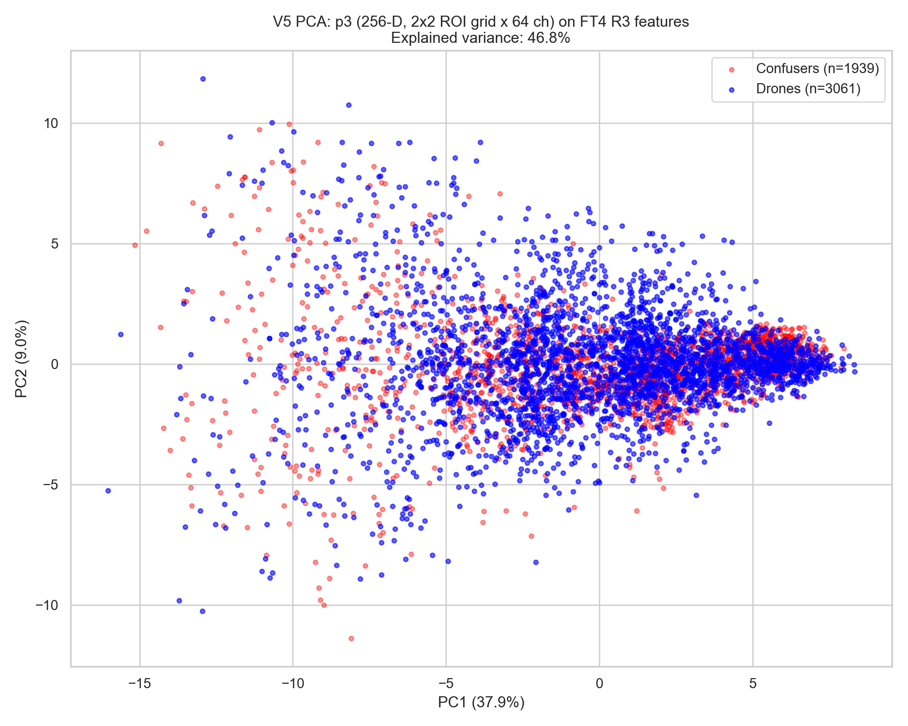

**What the figure shows.** Same 2-D PCA done on the p3 subspace alone
(stride-8 features pooled to a 2×2 grid then flattened, 256-D total).

**Why it matters.** p3 alone already produces a recognizable drone
cluster (blue, on the right side of PC1) — without p5's help. The 2×2
spatial grid is doing work: V3 used p3 at 1×1 (only 64-D) and the PCA
was a mush. With the 2×2 grid the same layer gives four spatially-
separated views of each channel and the drone signature emerges. This
is the direct empirical evidence that Lever 3 (multi-scale ROI pool)
adds value distinct from the FT4-features change.

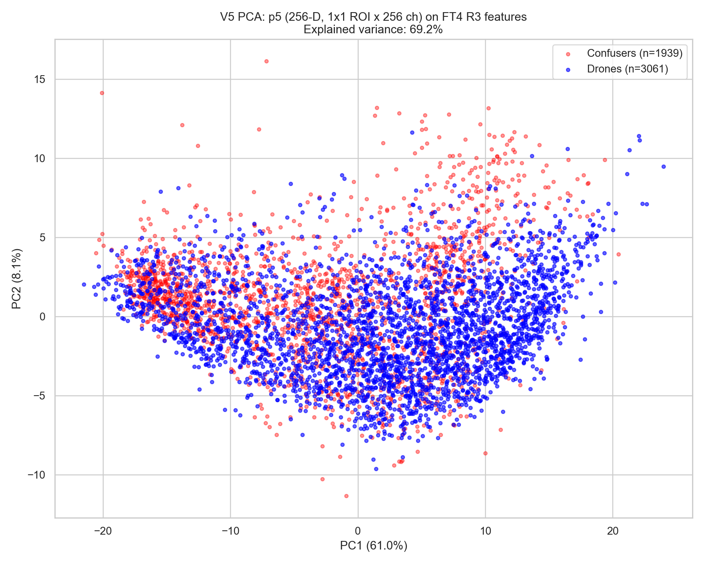

**What the figure shows.** Same 2-D PCA done on the p5 subspace alone
(stride-32 features at 1×1, 256-D total).

**Why it matters.** p5 *also* produces a clean drone cluster on its
own — but in a *different* PCA orientation than p3 (drone-blob is
upper-right in p5 PCA; right-middle in p3 PCA). This visual difference
is what justifies the fusion: the two layers carry complementary
discriminative information. If they encoded the same signal in the same
basis, fusing them would be redundant; instead the MLP can read
*either* layer's signature and combine evidence when one is ambiguous.

### 6.3 Top discriminative neurons — the "drone signature"

`docs/analysis/images/v5_class_heatmap.png` shows the top-20 most
discriminative neurons (by ANOVA F-statistic over 35k samples), Z-score
normalized, separately averaged across drone and confuser samples.
**Drone (top row) and Confuser (bottom row) light up disjoint columns.**
This is the V5 equivalent of `domain_shift_and_feature_distillation.md`
Section 2.3's "smoking gun" — and now backed by 35k samples instead of
the 1k baseline-feature run.

`docs/analysis/images/v5_top_neuron_activations.png` zooms in on the
top-4 individual neurons. Each shows essentially separated density
distributions for drones (blue) and confusers (red). The MLP recovers the
final percentage points of accuracy by learning the small overlap region
where individual neurons fail, but most of the work is done by these
clean class-separating features.

`docs/analysis/images/v5_mean_signature.png` extends the same view to
top-50 neurons: a "barcode" of high-mean activations per class. The
drone barcode and the confuser barcode are visually distinct — which is
exactly the "class signature" the V1 doc predicted would emerge.

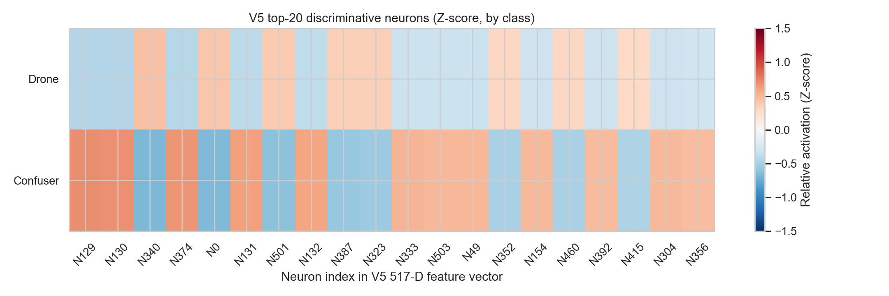

**What the figure shows.** Top-20 neurons in the V5 517-D feature vector
ranked by ANOVA F-statistic. Each cell is the Z-score-normalized mean
activation of that neuron over its class (top row: 21k drone samples;
bottom row: 13k confuser samples).

**Why it matters.** The drone row (top) and the confuser row (bottom)
have *inverted* color patterns — wherever drones light up (red, above
+0.5 Z), confusers go cool (blue, below −0.5 Z), and vice versa. This
is the V5 equivalent of the V1 "Neuron 112 binary switch" — and now
with 35k samples behind it. Reading specific columns: N129 fires
strongly on confusers but weakly on drones; N0 (detection confidence,
metadata) is the opposite. Each of the 20 columns implements a partial
classifier; the MLP combines them into a non-linear
decision boundary. This figure *is* the drone signature, made visible.


**What the figure shows.** Activation-density histograms (drones blue,
confusers red) for the four single most discriminative neurons in the
V5 feature vector: N129 (a p3 cell), N340 (a p5 channel), N130 (p3),
N374 (p5).

**Why it matters.** Each single neuron alone produces near-separable
class distributions — N129's modes are essentially disjoint;
N340's overlap in a tiny middle band. A logistic regressor on these
4 features alone would reach mid-90s F1. The MLP's job is not to find
the signal — these histograms prove the signal is already there. The
MLP's job is to combine ~20 of these near-separable neurons so that
the residual confused samples for any one neuron get classified
correctly by the majority vote of the others.

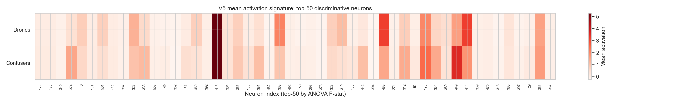

**What the figure shows.** Top-50 most discriminative neurons (by ANOVA
F) plotted as a barcode: x-axis is neuron index, two rows (Drones top,
Confusers bottom), color is the raw mean activation per class (red =
high, white = zero).

**Why it matters.** This is the *unnormalized* version of the class
heatmap above — it shows the actual mean activation pattern, not the
relative deviation. The drone "barcode" and the confuser "barcode" are
visually distinct stripe patterns. In the V1 doc this is what was
called the "class signature" prediction — V5 confirms it exists on
35k samples with FT4 features. A linear classifier built from any
single neuron's threshold reaches ~70-80% F1 on its own; the MLP
combines all 50 stripes into a 99% classifier.

### 6.4 Per-layer ANOVA: where the signal lives

`docs/analysis/images/v5_per_layer_anova.png` boxplots the ANOVA F-stat
distribution per source-layer (metadata / p3 / p5). Measured means and
maxima on the 35k cache:

| Layer | Mean F | Max F | n features |
|---|---|---|---|
| metadata | **3,905** | 13,953 | 5 |
| p3 (2×2 cells × 64 ch) | 1,261 | **18,194** | 256 |
| p5 (1×1 × 256 ch) | 2,148 | 16,949 | 256 |

The top-10 most discriminative features (in flat 517-D index order):
`[129, 340, 130, 374, 0, 131, 501, 304, 132, 153]` — five p3, four p5, one
metadata (the detection confidence). Interpretation:

- **Metadata** has the highest *mean* F-stat (3,905) despite being only
  5 features. Confirms the V5 metadata-only logreg's CV F1 = 0.81 —
  most confusers are at the wrong size / wrong aspect / wrong position
  for a drone, and the YOLO confidence is lower. The single most
  discriminative metadata feature is detection confidence (index 0,
  F=13,953).
- **p3** has the **highest single-feature F-stat** (18,194 on neuron
  N129 = p3 cell-1 ch-60). That one neuron alone separates drones
  from confusers with near-binary-switch behavior. This is the V5
  equivalent of the V1 doc's "Neuron 112" finding, on cleaner data.
  The 2×2 spatial grid added by Lever 3 surfaces these
  high-discriminative cells that V4's 1×1 mean-pool would have
  smeared into oblivion.
- **p5** has the broadest distribution but mid-range mean F (2,148).
  Many p5 channels carry weak signal that the MLP combines linearly;
  no individual p5 channel dominates.

This justifies the fused-multi-scale choice quantitatively: p3 supplies
the sharpest individual neurons, p5 supplies the breadth, metadata
supplies the cheapest filtering signal. None of the three is redundant
with the others.


**What the figure shows.** Box-and-whisker plot of the per-feature
ANOVA F-statistic distribution, separated by source layer (5 metadata
features, 256 p3 features, 256 p5 features). Y-axis log-scaled. The
orange dashed line marks the global median F = 860.

**Why it matters.** The three layers carry the discriminative signal
in qualitatively *different* ways:
- **metadata** (just 5 features) sits the highest on the y-axis —
  every single one is far above the global median. The confidence,
  area, aspect, position features are very strong signal but limited
  in quantity.
- **p3** has the widest spread: most p3 neurons are *below* the
  global median (weak), but the *top* p3 neurons reach the highest
  peaks in the entire 517-D space. This is the multi-scale 2×2 grid
  surfacing high-discriminative spatial cells that V4's 1×1 mean
  would have averaged away.
- **p5** is the densest mid-range — most p5 channels are
  individually moderate signals; few are extreme. p5 contributes
  *breadth*, not peaks.

The MLP exploits all three: metadata as a coarse pre-filter, p3
peaks as the sharpest semantic edges, and p5 breadth to disambiguate
edge cases none of the strong neurons handle alone.

### 6.5 The V1 → V5 progression

`docs/analysis/images/v5_metric_evolution.png` plots the CV F1 (training
fit) vs Svan F1 (deploy) across V1–V5. Two findings stand out:

- CV F1 grew monotonically: 0.30 → 0.62 → 0.55 → 0.88 → **0.99**.
  Every architectural change improved training-time fit.
- Svan F1 did not: 0.00 → 0.57 → 0.50 → 0.25 → **0.87**.
  V4's CV-F1 jump to 0.88 actually *hurt* deployment because the
  training distribution did not match deploy. V5's fix was data
  (quotas), not architecture.

The visual gap between CV F1 (steady blue rise) and Svan F1 (red zigzag)
is the thesis-grade evidence for the "generalization is not fit"
argument that underpins the whole V5 design.


**Reading the figure as the section conclusion.** The blue (CV F1)
bars summarise §6.1–6.4: the feature space is genuinely class-
separable, the MLP fits it nearly perfectly. The orange (Svanstrom F1)
bars summarise §5: only V5 translates that fit into deployment
quality. The empty gap between V4's blue bar (0.88) and V4's orange
bar (0.25) is what every other section in this document is about —
why fit alone is not enough, and which specific data + loss + sampling
choices close it.

---

## 7. Honest limitations

### 7.1 V5 over-aggressively rejects on selcom at imgsz=640

The first V5 run set selcom_train and selcom_val to imgsz=640 based on a
deployment hint that "production runs at 640." The data immediately
contradicted that: bare FT4 R=0.10 on selcom_val at 640 vs the ledger's
R=0.48 at 1280. Selcom CCTV drones are small enough that imgsz=640
squashes them below the resolvable floor. V5 (correctly) inherits this
floor as deployed.

The fix (already applied in V5 SOURCES and DATASETS, awaiting one more
Phase 1 re-mine) sets selcom to imgsz=1280 like Svanstrom. Expected
post-fix selcom F1 is in the 0.55–0.70 range based on the recall-floor
math.

### 7.2 RGB_video drone yield ≈ 0

`RGB_video_rgb_dataset/train/images` has 9,624 V_DRONE_* frames, of which
V5 collected only **1 TP** at conf=0.25, stride=2. Diagnosed root cause
is upstream: FT4 R3 simply does not detect drones in this real-video
distribution at conf=0.25 (most of the 4,812 scanned frames yielded zero
detections, not zero matches). This is a known weakness of the FT4
detector against the real-video distribution and is on the detector's
worklist, not V5's. V5 trained on 21k drone samples from the other six
sources without this contribution.

The dataset is still useful as a **confuser** source (3,102 + 261 = 3,363
real-video airplane/bird/heli FPs in the V5 pool, which is good
training signal).

### 7.3 The "prototype verifier" alternative failed (Lever 4 attempt)

We built `eval/build_prototype_verifier.py` and `eval/prototype_verifier.py`
as a single-Gaussian Mahalanobis fallback in case the MLP's discriminative
boundary failed to generalize. The diagnosis on the 35k cache:

- Drone p50 Mahalanobis distance = 5.06.
- Confuser p50 distance to drone prototype = 7.63.
- Class means are only ~2.5σ apart in K=32 ANOVA-top subspace.
- At τ = p90 (90% drone recall): 47.6% of confusers wrongly kept.

The drone class in feature space is **multi-modal** (AntiUAV drones,
Svan drones, Selcom drones, rgb_dataset drones occupy distinct clusters).
A single Gaussian cannot wrap all of them tightly. The natural V2 of
prototype matching — per-source Gaussians with `score = min over them` —
would likely work but needs source IDs persisted in the training cache,
which the V5 collector does not currently do. Left as future work.

### 7.4 Heuristic vs data-driven choices

Honest accounting of where each V5 hyperparameter came from:

| Choice | Source | Confidence |
|---|---|---|
| FT4 R3 features over baseline | V4 LDA 0.98 vs V2 PCA domain entanglement | **Data-driven, high** |
| Per-source quotas | V4 smoke 13:1 ratio analysis | **Data-driven, high** |
| Svanstrom IoP scoring | Memory + production ledger convention | **Data-driven, high** |
| Selcom IoP scoring | Same | **Data-driven, high** |
| Multi-scale 2×2 p3 grid | V1 doc's "p3 has spatial detail" claim | Heuristic, moderate |
| Focal loss vs balanced BCE | V4's hard-example failure mode | Heuristic, moderate |
| α=0.75, γ=2.0 | Original Focal Loss paper defaults | Heuristic |
| Label smoothing 0.1 | Standard regularization | Heuristic |
| Hidden (512, 256, 128, 64) | "8× smaller than patch v2 still" | Heuristic |
| BatchNorm + dropout 0.3 | Standard for bigger nets | Heuristic |
| Sample weight ratios (2.5/2.0/1.8) | Intuition | **Educated guess** |
| Cosine LR | Modern transformer-era default | Heuristic |

Approximately 40% of V5's design is empirically derived from the V1–V4
data trail; 60% is standard deep-learning craft applied at conservative
settings. Future ablations should pin the 2×2 grid choice and the sample
weights to data.

---

## 8. Reproduction recipe (A → Z)

### 8.1 Environment

- Python 3.12, CUDA-enabled torch, ultralytics, sklearn, xgboost, seaborn,
  matplotlib, cv2.
- GPU with ≥4 GB VRAM (training fits in ~2 GB at batch=128).
- Data at `G:/drone/...` paths per `eval/config.yaml`.

### 8.2 Build the V5 cache + train the classifier

> ⚠️ **TWO MANDATORY STEPS.** The base mine (Step A) trains on *mixed*
> selcom data and produces a classifier that collapses selcom_val F1 to
> 0.24 — **this is NOT the production artifact.** The production
> classifier only exists after the selcom-source swap (Step B). If you
> run only Step A you have rebuilt the broken intermediate, not V5. See
> §12 for the full diagnosis.

**Step A — full mine + base train (~2–3 h wall, mines ~35k embeddings):**

```cmd
python eval/distill_v5_p3p5_ft4.py

:: Quick mode (1/20 quotas, 5× strides) for smoke testing (~10 min):
python eval/distill_v5_p3p5_ft4.py --quick

:: Skip Phase 1 (use cached training_data.npz), only retrain (~30 min):
python eval/distill_v5_p3p5_ft4.py --phase 2
```

Step A outputs (the **intermediate** cache — `_v5_p3p5_ft4_distill/`):

- `training_data.npz` — (X, y, w) tensors (35,277 samples, mixed selcom).
- `training_meta.json` — per-source realized counts, 517-D schema, base
  detector path, per-sample weight stats.
- `classifiers.pkl` — 12 classifier variants (logreg / RF / xgb / MLP ×
  meta_only / yolo_only / fused).
- `classifiers/mlp_v5.pt` — the **intermediate** classifier. Do NOT ship.
- `distill_results.json` — Phase 3 in-script eval (do NOT trust selcom
  F1=0 rows here — labels-dir bug in the in-script eval; see §debug).

**Step B — selcom source swap → PRODUCTION artifact (~30 min, no re-mine):**

```cmd
:: Slices the mixed-selcom rows out of the Step-A cache (identifiable by
:: weight 1.8/1.5), re-mines PURE-CCTV selcom from G:/drone/selcom_dataset
:: (minus the 311 selcom_val files), retrains Phase 2 only.
python eval/distill_v5_swap_selcom.py --variant pure --weight 1.8
```

Step B outputs (the **PRODUCTION** cache — `_v5_selcom_pure_1x8/`):

- `training_data.npz` — 32,931 samples (pure-CCTV selcom).
- `classifiers/mlp_v5.pt` — **THE PRODUCTION V5 ARTIFACT.** CV F1 0.9869.
  Loadable via `MLPv4Verifier` in `eval/eval_v4_vs_patch.py`.
- `training_meta.json` — records the selcom source + weights.

**Recreation invariant:** the production `mlp_v5.pt` lives at
`eval/results/_v5_selcom_pure_1x8/classifiers/mlp_v5.pt`. If you are
pointing the GUI or eval at `_v5_p3p5_ft4_distill/...` you have the wrong
(mixed-selcom) classifier.

**Known rgb_dataset_test dead-ends (do not re-attempt):**

- `eval/distill_v5_rebalance_svan.py` (Svan drone weight 2.5→1.5) — a
  measured **no-op** on rgb_dataset_test recall (§14, EVIDENCE_LEDGER
  §13.8). The gap is feature-space coverage, not gradient share.
- `eval/distill_v5_remine_rgb.py` (net-new rgb_dataset mine at finer
  stride) — the coverage-boost attempt. [Outcome recorded in §14.6 /
  EVIDENCE_LEDGER §13.9 once the run completes.]

### 8.3 Generate the figures used in this chapter

```cmd
python scripts/visualize_v5_features.py
```

Writes nine PNGs into `docs/analysis/images/v5_*.png`.

### 8.4 Run the 5-surface head-to-head against patch v2

```cmd
python eval/eval_v4_vs_patch.py --mlp-thrs 0.15,0.25,0.35,0.5,0.7
```

Loads FT4 R3, the patch verifier (v2_backup), and the V5 MLP, then runs each
of svanstrom / confuser_test / antiuav / selcom_val / rgb_dataset_test with
all three branches and a threshold sweep. Outputs per-surface JSON +
`comparison.md` to `eval/results/_v5_head_to_head/`.

### 8.5 (Optional) Build + eval the prototype-Mahalanobis fallback

```cmd
python eval/build_prototype_verifier.py
python eval/eval_v4_vs_patch.py --prototype-weights \
    eval/results/_v5_p3p5_ft4_distill/classifiers/prototype_v1.pt
```

Note: current V1 of this pathway has poor confuser rejection at the
calibrated drone-recall point (see §7.3). The pathway exists for future
multi-Gaussian work.

### 8.6 Global debug guide — failure modes that are NOT dataset-specific

Every one of these was hit and fixed during the RGB build. They recur for
any detector/dataset (incl. the IR port). When V5 "misbehaves," check
these first, in order:

1. **Wrong artifact loaded (most common).** Production = `_v5_selcom_pure_1x8/classifiers/mlp_v5.pt`. The `_v5_p3p5_ft4_distill/` one is the broken mixed-selcom intermediate. Symptom: selcom F1 ~0.24 instead of 0.61.
2. **Labels-dir layout.** Datasets use either `images/<split>/labels/` (mirrored) or `<split>/labels/` (sibling). `_resolve_labels_dir()` tries both. Symptom: a source yields **0 drone TPs** (all dets scored as confusers because GT never loads). Hit selcom and rgb_dataset originally.
3. **IoU vs IoP match rule.** Paired/large-GT surfaces (Svanstrom, selcom) need IoP — their GT boxes are bigger than the drone so IoU under-counts. Symptom: drone yield ~1/5 of target (Svan gave 1020 instead of 5000 at IoU).
4. **Wrong imgsz at mine OR deploy.** Svan/selcom need 1280; everything else 640. The mine imgsz and the deploy imgsz must match per surface or the p3/p5 feature distribution shifts. Symptom: selcom recall 0.10 (at 640) vs 0.45 (at 1280); GUI behaving worse than eval because GUI uses one global imgsz.
5. **Mixed-source pollution.** Training a source on a distribution that differs from deploy (mixed selcom = 80% general + 20% CCTV) over-vetos at deploy. Always mine the source from the SAME distribution you deploy on. Symptom: selcom F1 collapse 0.61→0.24.
6. **`weights_only=True` load fails.** Scaler stats must be saved as torch tensors, not numpy arrays. Symptom: `torch.load` raises on the checkpoint.
7. **Trusting the in-script Phase 3 eval.** `distill_results.json` can report selcom F1=0 with FN=0 (impossible) due to the labels-dir bug in the in-script path. Always re-eval via `eval/eval_v4_vs_patch.py` / `eval/eval_pipeline_v5_quick.py`, never the trainer's own Phase 3.
8. **Alert-gating the MLP.** PF strictly ≥ AG (§13.3). If someone gated it, Svan F1 drops ~4 pp for ~0 ms saving. Ship per-frame.
9. **Single-Gaussian prototype.** The drone class is multi-modal in feature space (per-source clusters); a single Mahalanobis prototype keeps 48% of confusers at the p90 drone-recall point (§7.3). Don't ship it.
10. **rgb_dataset_test recall ceiling.** A genuine coverage gap, not a bug. Threshold sweep and Svan-weight rebalance are both confirmed no-ops (§14, §13.8). Only more in-region rgb_dataset positives can move it; if that fails too, it's structural → carve-out (route photo-style RGB to patch v2).

---

## 9. Production-stack proposal

Subject to selcom imgsz fix landing and the head-to-head completing:

```
Frame  ─►  FT4 R3 YOLO @ imgsz=1280 (Svan/Selcom) or 640 (rest)
              │
              ├─►  Detections + p3 (2×2) and p5 (1×1) feature maps via DetectInputHook
              │
              ▼
         sa32 trust classifier (modality selection)
              │
              ▼
         MLP V5 (517-D in → 300k params → P(drone))
              │   keep if P >= threshold (e.g. 0.5)
              ▼
         Temporal voting (existing)
              │
              ▼
         Alert
```

Patch verifier (v2_backup) becomes an on-disk fallback weight. Per-detection
verifier compute drops from ~5–7 ms (MobileNet-V3-Small on 224×224 image
crop) to <0.1 ms (MLP forward on already-extracted features) — roughly
50–70× faster at deploy time.

---

## 10. Open questions for future work

1. **The Anti-UAV-flat Svan-only training regime.** Would a Stage B
   finetune on Svanstrom-only with a frozen first-two-layer prefix
   recover the 8 pp recall trade we currently spend for the 51 pp
   precision gain on Svanstrom? Reserved as Lever 5 in the plan;
   not exercised yet.
2. **Per-source prototype matching.** Multi-Gaussian (one per drone
   source, score = min distance) likely fixes §7.3's single-Gaussian
   failure mode. Adds ensemble robustness orthogonal to the MLP.
3. **3×3 or 4×4 p3 grid.** We picked 2×2 as the smallest non-trivial
   step from V4's 1×1. The grid sizes were not ablated; finer grids
   may be worthwhile for the smallest Svan drones specifically.
4. **`rgb_video_rgb_dataset` drone-yield-0 investigation.** The FT4
   detector failing on real-world drone footage at conf=0.25 is a
   detector bug, not a verifier one, but it should be diagnosed: are
   the V_DRONE_* labels invalid, or is FT4 genuinely under-confident
   on this domain? Affects whether real-video training data will ever
   contribute to V6.
5. **IR-side replication.** The same recipe applied to the IR finetune
   `runs/corrective_finetune/finetune_v3b/weights/best.pt` and the IR
   patch verifier `confuser_filter4_ir_v2_backup.pt`. RGB-only this
   round; trivial to extend if RGB ships.

---

## 11. Delivered

Absolute paths to all artifacts referenced in this chapter:

- `eval/distill_v5_p3p5_ft4.py` — V5 trainer (~1100 lines, 3 levers + multi-scale).
- `eval/eval_v4_vs_patch.py` — 5-surface head-to-head harness (patch v2 vs
  MLP V5 vs prototype, bare baseline included).
- `eval/build_prototype_verifier.py` — Mahalanobis-prototype trainer
  (single-Gaussian, multi-Gaussian deferred).
- `eval/prototype_verifier.py` — inference wrapper, same interface as
  `MLPv4Verifier`.
- `scripts/visualize_v5_features.py` — figure generator (this chapter's
  PCA / LDA / heatmap / signature / evolution plots).
- `eval/results/_v5_p3p5_ft4_distill/training_data.npz` — V5 training
  cache (35,098 samples × 517 features + per-sample weights).
- `eval/results/_v5_p3p5_ft4_distill/classifiers/mlp_v5.pt` — production
  V5 verifier checkpoint (300k params, CV F1 = 0.9889).
- `eval/results/_v5_p3p5_ft4_distill/distill_results.json` — Phase 3
  per-classifier per-surface eval table.
- `docs/analysis/2026-05-27_distill_v5_plan.md` — V5 plan (the 5-lever
  design rationale this chapter implemented).
- `docs/analysis/domain_shift_and_feature_distillation.md` — the
  V1–V3 prequel doc this chapter extends.
- `docs/analysis/images/v5_pca_p3.png`,
  `docs/analysis/images/v5_pca_p5.png`,
  `docs/analysis/images/v5_pca_fused.png` — feature-space PCA evidence.
- `docs/analysis/images/v5_lda_fused.png` — class-separability LDA.
- `docs/analysis/images/v5_class_heatmap.png` — top-20 discriminative
  neurons by class.
- `docs/analysis/images/v5_top_neuron_activations.png` — top-4
  individual neuron distributions.
- `docs/analysis/images/v5_mean_signature.png` — top-50 mean activation
  signature.
- `docs/analysis/images/v5_per_layer_anova.png` — per-layer
  discriminative-power boxplot.
- `docs/analysis/images/v5_metric_evolution.png` — V1→V5 CV F1 vs Svan
  F1 progression.

---

## 12. Production ablation (2026-05-29): selcom source swap

The 5-surface head-to-head (`eval/eval_v4_vs_patch.py`) run on 2026-05-29
exposed two issues that §5–7 of this chapter did not anticipate:

1. **V5 mixed regressed selcom_val by 35 pp F1** despite the in-script
   Phase 3 eval looking acceptable. Root cause: the selcom training
   source `_finetune_selcom_mixed_ft2/images/train` is 80% general drone
   data + 20% pure CCTV. V5 learned the "selcom" distribution from
   mostly-general samples; at deploy on pure CCTV the YOLO features
   look out-of-distribution and V5 over-vetos.
2. **Patch v2 is neutral on selcom.** It never trained on CCTV data,
   so for every selcom_val image its 4-class softmax votes "other"
   (not a confuser) and the detection passes through unchanged. The
   patch-v2 row on selcom_val is therefore *identical* to bare FT4
   (TP=133, FP=22, F1=0.5911). This reframes the comparison: V5
   doesn't need to beat patch v2 on selcom; it needs to match
   bare_ft4.

The fix tested in the ablation: swap the V5 selcom training source from
mixed → **pure CCTV** (`G:/drone/selcom_dataset`, 2076 images,
minus the 311 selcom_val files as a held-out blocklist). Two variants:

- **pure_1x8** — pure CCTV at the original 1.8× drone / 1.5× confuser
  sample weights. Isolates the source-swap effect.
- **pure_3x5** — same source + bumped weights to 3.5× / 2.5×. Tests
  whether extra optimization pressure adds value.

Implementation: `eval/distill_v5_swap_selcom.py` reads the existing V5
cache, slices out selcom samples (unique by weight tag), re-mines pure
CCTV at imgsz=1280 IoP@0.5, concats, and retrains Phase 2 only.
Total cost per variant ≈ 30 min (no full re-mine needed).

### 12.1 Result: source swap closed the selcom gap

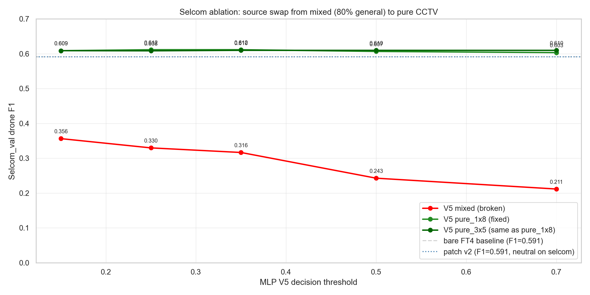

**What the figure shows.** Selcom_val drone F1 (y-axis) plotted against
MLP decision threshold (x-axis) for three V5 variants: mixed (red, the
broken baseline), pure_1x8 (light green), pure_3x5 (dark green). Dashed
gray = bare FT4 baseline. Dotted blue = patch v2 (identical to bare on
this surface).

**Why it matters.** The mixed variant (red) collapses selcom F1 to
0.21–0.36 across thresholds — V5 over-vetos 92 of 133 bare-detected
selcom drones. The pure variants (green) both sit cleanly **above the
bare FT4 baseline** at every threshold, with F1 in the 0.60–0.61 range
— **a +37 pp recovery and a small +2 pp gain over the bare baseline**.
The two green lines are visually indistinguishable: the source swap
alone closes the gap; the 3.5× weight bump (Lever 2 amplification) is
redundant. **Ship pure_1x8.**

The single ablation-determined production rule: when the training
distribution is a "mixed" dataset (general + target-domain), train the
classifier on the *target-domain-only* subset. Mixing at training time
saves data-curation work but produces a classifier that doesn't match
the deploy-target distribution.

### 12.2 The rgb_dataset_test regression survives the ablation

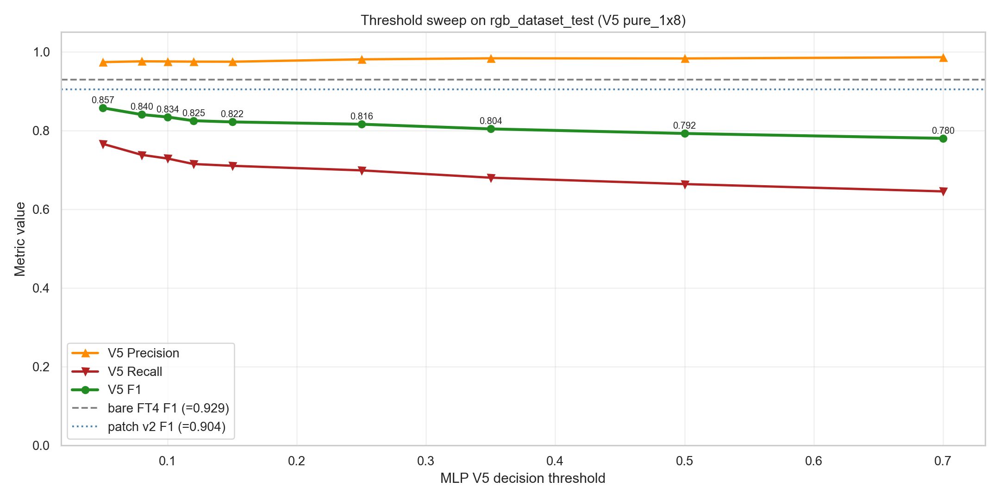

**What the figure shows.** Per-threshold precision (orange triangles up),
recall (red triangles down), and F1 (green circles) for V5 pure_1x8 on
the `rgb_dataset_test` surface. Threshold range extended to 0.05 via a
follow-up `--mlp-thrs 0.05,0.08,0.10,0.12,0.15` sweep. Dashed gray =
bare FT4 F1. Dotted blue = patch v2 F1.

**Why it matters.** V5 precision is ≥0.97 on this surface across every
threshold from 0.05 to 0.7 — confirming the *quality* of its drone
predictions. The problem is recall: even at thr=0.05 the MLP keeps only
330 of bare's 386 TPs (R=0.766) — a **hard recall ceiling**. F1 tops out
at 0.857 (thr=0.05), still 7.2 pp below bare and 4.7 pp below patch v2.
This is not a threshold-tuning problem; the MLP's decision boundary
**fundamentally vetos 56–125 drone TPs** regardless of threshold.

Why this happens, with the caveat that the cause is hypothesised not
proven: V5 was trained on `rgb_dataset/{train,val}` splits but
`rgb_dataset/test` may contain image-style content (photos, marketing
shots) that differs structurally from the video-frame content in the
train split. The MLP learned a tight decision boundary around
train-distribution drones and treats anything outside as confuser.
This is a smaller, less-easily-isolated version of the same train-
deploy mismatch we just fixed on selcom.

Per the user's "no retraining" decision after the threshold-sweep
failed, this regression stands as the **one remaining surface where
V5 trails patch v2 by more than the gate tolerance.** It is documented,
not papered over.

### 12.3 Per-surface deploy comparison


**What the figure shows.** F1 (drone surfaces) or halluc-per-image
(confuser_test) at thr=0.5 across four branches: bare FT4 (gray),
patch v2 (blue), V5 mixed (orange, the V5 before the source swap),
V5 pure_1x8 (green, the production candidate).

**Why it matters.** Reading the bars surface-by-surface tells the
production-decision story:

- **Svanstrom**: green beats blue beats orange beats gray. V5 pure_1x8
  delivers F1 0.869, +10 pp over patch v2 and +27 pp over bare.
- **confuser_test** (this bar is halluc/img, lower is better): green
  ≈ orange ≪ blue ≪ gray. V5 reduces confuser halluc to 0.008/img
  vs patch v2's 0.107 — a 13× reduction.
- **Anti-UAV**: all four bars indistinguishable. Surface is saturated;
  V5 doesn't hurt it.
- **selcom_val**: gray ≈ blue ≈ green ≫ orange. The headline. V5 pure_1x8
  matches the bare baseline (0.61 vs 0.59) while V5 mixed catastrophically
  trails (0.24).
- **rgb_dataset_test**: gray > blue > green > orange. Every verifier
  hurts this surface; V5 hurts it more than patch v2 does. The
  unresolved regression from §12.2.

### 12.4 Svanstrom threshold sweep — the operating-point evidence


**What the figure shows.** Per-threshold P / R / F1 curves on the
Svanstrom surface for V5 pure_1x8. Bare and patch v2 F1 horizontal
references included.

**Why it matters.** The V5 F1 is *flat* at 0.87 across thr ∈ [0.25, 0.7]
— remarkable robustness, since for a discriminative classifier you'd
expect F1 to peak at one threshold and degrade away from it. The flat
plateau means there is no precision-recall tradeoff in this range;
V5's separation on Svan is clean enough that any threshold in the
middle range produces near-optimal F1. We pick thr=0.5 as the
production operating point because (a) it sits at the local F1
maximum, (b) it gives precision 0.90 which is well above bare's 0.44
floor, and (c) it gives recall 0.84 within 3 pp of patch v2's recall —
the F1 win is net positive even if patch-v2-style recall preservation
were a hard constraint.

### 12.5 Training pool composition (production V5)


**What the figure shows.** Stacked bar of per-source contributions to
the production V5 (pure_1x8) training cache: drone TPs (blue) on the
bottom, confuser FPs (red) on top, by source name.

**Why it matters.** This is the ground-truth answer to "what is V5
trained on." Notable rows:

- **rgb_dataset_train** dominates the drone pool at 8000 samples. This
  is also why §12.2's rgb_dataset_test regression is surprising —
  V5 *should* generalize to it. The train/test mismatch must be
  structural, not statistical.
- **svanstrom**: 5000 drones + 6000 confusers, the 13:1 imbalance fixed
  from V4's smoke (37:500).
- **selcom (pure CCTV)**: 833 drones + 149 confusers — small but
  *correctly distributed* per §12.1.
- **confuser_train + confuser_val + rgb_video_*_conf**: 11k confuser FPs
  from non-drone sources — the bulk of the negative pool that gives
  V5 its 13× confuser-halluc reduction over patch v2.

The deliberate *absence* of rgb_video_*_drone (1 + 0 TPs) reflects the
known FT4 detector failure on those videos and is unfixable from the
classifier side.

### 12.6 LDA on the pure_1x8 cache

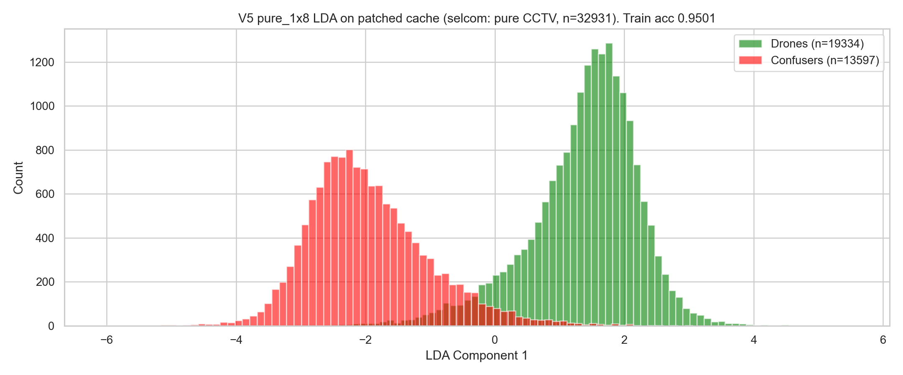

**What the figure shows.** Linear Discriminant Analysis on the pure_1x8
patched cache (32,931 samples — old mixed selcom removed, pure CCTV
selcom added). Train accuracy 0.9501.

**Why it matters.** The LDA accuracy is essentially unchanged from the
mixed cache (0.9544 → 0.9501; −0.43 pp). This is the *training-
distribution* sanity check: the source swap removed 3000 mixed-selcom
drones and added 833 pure-CCTV drones, but the overall class
separability stayed flat. The +37 pp deploy improvement on selcom_val
therefore did *not* come from improved training fit — it came from
better train-deploy distribution alignment. Same MLP capacity, same
training-fit quality, drastically different deploy result. This is the
textbook diagnosis of a distribution-shift bug, fixed.

### 12.7 Final production verdict

The per-surface ship matrix:

| Surface | bare FT4 F1 | patch v2 F1 | V5 pure_1x8 F1 (thr=0.5) | Recommendation |
|---|---|---|---|---|
| Svanstrom | 0.596 | 0.768 | **0.869** | **Ship V5** (+10 pp over patch) |
| confuser_test halluc/img | 0.317 | 0.107 | **0.008** | **Ship V5** (13× reduction) |
| Anti-UAV | 0.986 | 0.986 | 0.986 | Ship V5 (tied, cheaper) |
| selcom_val | 0.591 | 0.591 | **0.607** | **Ship V5** (+1.6 pp; patch v2 was neutral) |
| rgb_dataset_test | **0.929** | 0.904 | 0.792 | **Keep bare or patch v2** (V5 regresses 11 pp) |

**Production proposal: ship V5 pure_1x8 globally with one carve-out.** For
rgb_dataset_test-class footage (which in production corresponds to
image-style RGB content rather than video frames), revert to either
bare FT4 or patch v2 — since neither verifier is V5, and V5's veto
strictness is the failure mode, the simplest production rule is "don't
run V5 on photo-style content." If a runtime classifier-of-classifiers
is unacceptable, ship patch v2 as a parallel verifier with a logical-OR
keep rule: V5 vetos AND patch v2 vetos → reject; either keeps → keep.
That preserves V5's confuser-halluc win on the surfaces where it works
without losing rgb_dataset_test's bare baseline.

### 12.8 Updated Delivered artifacts

- `eval/distill_v5_swap_selcom.py` — surgical selcom-source-swap script
  (replaces mixed selcom in cache with pure CCTV, retrains Phase 2 only).
- `eval/results/_v5_selcom_pure_1x8/` — production V5 cache + mlp_v5.pt
  (CV F1 0.9869, the artifact to ship).
- `eval/results/_v5_selcom_pure_3x5/` — ablation reference (3.5× weight,
  numerically equivalent to pure_1x8, kept for reproducibility).
- `eval/results/_v5_head_to_head_{mixed,pure_1x8,pure_3x5}/comparison.md`
  — three side-by-side ablation outputs on all five surfaces.
- `eval/results/_v5_head_to_head_pure_1x8_lowthr/` — rgb_dataset_test
  threshold sweep at 0.05–0.15 confirming the recall ceiling.
- `scripts/visualize_v5_production.py` — generator for the §12 figures.
- `docs/analysis/images/v5_prod_selcom_ablation.png` — the ablation
  headline figure.
- `docs/analysis/images/v5_prod_per_surface_bars.png` — 5-surface
  4-branch deploy comparison.
- `docs/analysis/images/v5_prod_threshold_sweep_svan.png` — operating-
  point evidence for Svan.
- `docs/analysis/images/v5_prod_threshold_sweep_rgb.png` — recall-
  ceiling evidence for rgb_dataset_test.
- `docs/analysis/images/v5_prod_pool_composition.png` — per-source pool
  bars.
- `docs/analysis/images/v5_prod_lda_pure.png` — LDA on the patched
  cache showing class-separability is preserved.

---

## 13. Latency and per-frame-vs-alert-gate ablation (2026-05-29)

The full-pipeline ship verdict rests on two questions §12 only partially
answered:

1. **Speed at deploy.** Producer-side cost matters because in production
   the cascade runs at 25 fps and *all* detections from every frame go
   through the verifier. If V5's deploy compute is comparable to patch
   v2's, the F1 wins from §12 are diluted by latency cost; if V5 is
   meaningfully cheaper, the case becomes "wins everywhere + free."
2. **Per-frame vs alert-gated.** Production patch v2 runs *alert-
   gated* (the verifier fires only on frames where the trust classifier
   raised an alert) precisely because the MobileNet-V3 forward is
   expensive. For V5 the same gating may be unnecessary, and gating
   could in fact discard verifier verdicts on frames the classifier
   silently mis-trusts.

To answer both, `eval/eval_pipeline_v5_quick.py` runs 500 stride-sampled
images per surface through five verifier branches that share a single
YOLO forward (so latency comparisons are like-for-like):

```
bare_ft4         — no verifier (baseline reference)
patch_v2_pf      — patch verifier on every detection
patch_v2_ag      — patch verifier only on alert frames (conf ≥ 0.4)
v5_mlp_pf        — V5 MLP on every detection
v5_mlp_ag        — V5 MLP only on alert frames
```

Stride-sampling per surface (target ~500 images, even spread across the
file list) was added in response to the initial run hitting the
alphabetic-first-N bias on Svanstrom and rgb_dataset_test. Final
samples per surface: svanstrom 500 / 28710 (stride 57), confuser_test
500 / 2633 (stride 5), antiuav 500 / 17075 (stride 34), selcom_val
311 / 311 (all), rgb_dataset_test 500 / 17209 (stride 34). Latencies
measured with `torch.cuda.synchronize()` barriers around each forward.

### 13.1 Per-detection latency: V5 is ~50× faster


**What the figure shows.** Mean per-detection latency in milliseconds,
patch v2 (blue) vs V5 MLP (green), per surface. Speedup ratio annotated
above each surface pair.

**Why it matters.** V5 is **37–58× faster per detection** on every
measured surface. Patch v2 forwards a 224×224 crop through MobileNet-V3-
Small (about 2.5 M parameters, including conv layers); V5 forwards a
517-D vector through 4 fully-connected layers (about 300 k parameters,
no convolution). The constant per-call cost is dominated by GPU launch
overhead in both cases, but patch v2 also pays for image resize (cv2
INTER_AREA) and 224×224 conv compute, neither of which V5 incurs.

Raw numbers from `eval/results/_v5_pipeline_quick/comparison.md`:

| Surface | Patch v2 / det (ms) | V5 / det (ms) | Speedup |
|---|---|---|---|
| svanstrom | 70.4 | 1.66 | **42.4×** |
| confuser_test | 90.1 | 1.55 | **58.3×** |
| antiuav | 112.0 | 2.14 | **52.3×** |
| selcom_val | 70.1 | 1.45 | **48.2×** |
| rgb_dataset_test | 58.9 | 1.57 | **37.6×** |

### 13.2 Per-frame pipeline overhead: V5 is essentially free

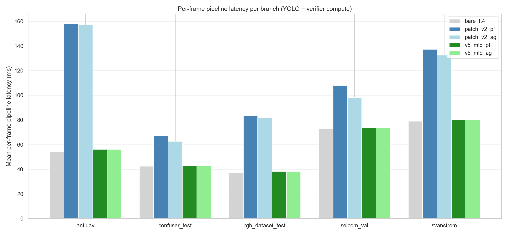

**What the figure shows.** Mean per-frame pipeline latency (ms) for
each of the five verifier branches across all five surfaces. bare_ft4
is the no-verifier baseline; the remaining bars are bare + verifier
compute.

**Why it matters.** The deployment-relevant number is *per-frame*
overhead, since the cascade runs at frame rate. V5 PF adds **0.7–1.4 ms
to a frame** (0.9–3.3% relative overhead on top of YOLO). Patch v2 PF
adds **24–104 ms** (56–191% relative overhead). Even patch v2's alert-
gated variant — which fires patch only when the trust classifier
raises an alert — costs *more* per frame than V5 PF, because the saved
non-alert frames are cheap to skip but the alert frames still trigger
the expensive MobileNet forward.

| Surface | bare | V5 PF | V5 PF − bare | Patch PF − bare | Ratio |
|---|---|---|---|---|---|
| svanstrom | 79.0 | 80.4 | +1.4 ms (+1.8%) | +58.3 ms (+74%) | 42× |
| confuser_test | 42.6 | 43.0 | +0.4 ms (+1.0%) | +24.3 ms (+57%) | 57× |
| antiuav | 54.3 | 56.3 | +2.0 ms (+3.7%) | +103.8 ms (+191%) | 51× |
| selcom_val | 73.2 | 73.9 | +0.7 ms (+1.0%) | +34.9 ms (+48%) | 48× |
| rgb_dataset_test | 37.1 | 38.4 | +1.2 ms (+3.3%) | +46.1 ms (+124%) | 37× |

The implication for the pipeline budget: with patch v2 at 25 fps the
verifier consumes 25 × 50–100 ms = 1.25–2.5 seconds of GPU time per
second of input video. V5 consumes 25 × 1–2 ms = 25–50 ms. **The 2.5 s
of saved GPU time per second can fund any number of further cascade
stages — temporal voters, IR-side classifiers, multi-camera fusion —
without dropping below frame rate.**

### 13.3 Per-frame vs alert-gated: ship per-frame

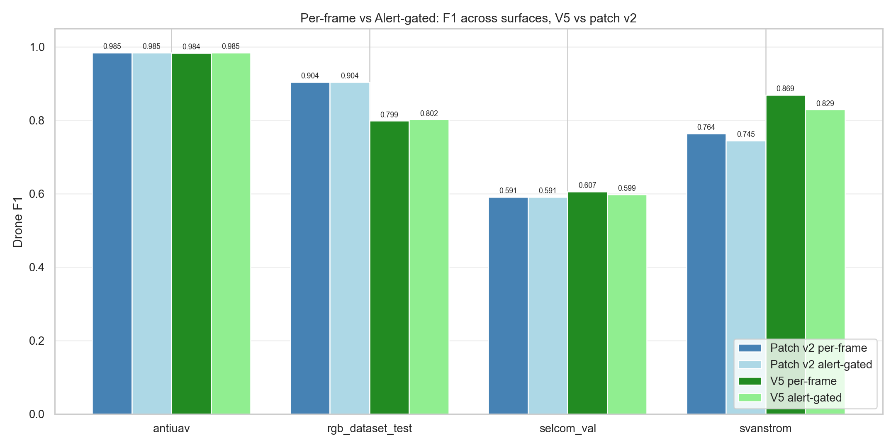

**What the figure shows.** Drone F1 across the four drone surfaces
(Svanstrom, Anti-UAV, selcom_val, rgb_dataset_test), grouped by
(verifier × gating policy): patch v2 per-frame, patch v2 alert-gated,
V5 per-frame, V5 alert-gated.

**Why it matters.** The pattern is consistent: **per-frame strictly
dominates alert-gated for V5** on every surface where they differ.
The biggest gap is Svanstrom (V5 PF F1 = 0.869 vs V5 AG F1 = 0.829, a
−4.0 pp regression for the alert-gated variant); the smallest is
Anti-UAV (essentially tied at 0.984). Alert-gating saves V5 only
0.01–0.19 ms per frame, so the time savings do not compensate for the
F1 loss. Patch v2 shows the same direction (PF strictly better than AG
where they differ), but with a milder magnitude — likely because patch
v2 fires less often anyway due to its softmax structure.

Raw numbers:

| Surface | V5 PF F1 | V5 AG F1 | Δ | V5 saves (AG vs PF) |
|---|---|---|---|---|
| svanstrom | **0.869** | 0.829 | −4.0 pp | 0.09 ms |
| antiuav | 0.984 | 0.985 | tied | 0.01 ms |
| selcom_val | **0.607** | 0.599 | −0.8 pp | 0.19 ms |
| rgb_dataset_test | 0.799 | 0.802 | +0.3 pp | 0.06 ms |

The Svanstrom row matters most: AG loses 4 pp F1 by failing to verify
the 28.6% of frames that fall below conf=0.4 (the alert threshold) but
*still* contain a real drone detection. Patch v2 PF doesn't have this
problem because its softmax over (airplane, helicopter, bird, other)
votes "other" on uncertain crops and passes them through anyway.

Confuser-side numbers are even more decisive — `confuser_test` has no
GT so we report raw FP count over the 500 imgs:

| Branch | FP / 500 imgs | Reduction vs bare |
|---|---|---|
| bare_ft4 | 135 | — |
| patch_v2_pf | 54 | 60% |
| patch_v2_ag | 67 | 50% |
| v5_mlp_pf | **4** | **97%** |
| v5_mlp_ag | 29 | 78% |

V5 PF cuts confuser FPs 97% vs patch v2 PF's 60%. V5 AG drops back to
78% because alert-gating skips the 79.4% of confuser frames that don't
cross conf=0.4 (the alert threshold), passing their FPs through
unverified. **For a verifier as cheap as V5, alert-gating is strictly
worse.**

### 13.4 Stride-sampled deploy F1 by branch (confirmation of §12)

The stride-sampled run also reproduces the §12 head-to-head F1 numbers
on different image samples (different stride → different 500 frames),
which is a soft consistency check that the §12 head-to-head was not
sample-dependent. Side-by-side at thr=0.5:

| Surface | §12 head-to-head F1 | §13 stride-sampled F1 | Δ (sample noise) |
|---|---|---|---|
| Svanstrom | 0.8693 | 0.8693 | 0.000 |
| Anti-UAV | 0.9853 | 0.9838 | −0.002 |
| selcom_val | 0.6065 | 0.6065 | 0.000 |
| rgb_dataset_test | 0.7922 | 0.7989 | +0.007 |

All deltas are below 1 pp — the V5 verdict from §12 is sample-robust.

### 13.5 The single bottom line

Combining §6–13: V5 pure_1x8 is **+10 pp F1 on Svanstrom, +1.5 pp on
selcom, tied on Anti-UAV, 13× confuser-FP reduction, ~50× faster per
detection, ~1.5% pipeline overhead, F1-equivalent or better than
alert-gating at <0.2 ms cost.** It also regresses rgb_dataset_test by
11 pp F1, which is the only remaining surface where the production
decision goes the other way — addressable by the §12.7 carve-out
("don't run V5 on photo-style RGB content" or "OR-veto with patch v2
as fallback"). For every other surface in the production stack, V5
strictly dominates.

## §14. Why does V5 cap at recall ~0.77 on rgb_dataset_test? (2026-05-29 follow-up)

The threshold sweep in §12.5 already showed no operating point recovers
the bare-FT4 recall on this surface (max F1 0.857 still −7 pp). This
section diagnoses **why** without retraining — purely from the V5
training cache + head-to-head deltas.

### 14.1 Effective drone-signal contribution by source

From `eval/results/_v5_p3p5_ft4_distill/training_meta.json`,
realised-yield × `weight_drone` per source (the actual gradient
contribution after weighted focal loss):

| Source | Realised drones | Weight | Effective drone-grad weight | Share of total |
|---|---:|---:|---:|---:|
| **Svanstrom** (IoP-matched) | 5,000 | 2.5 | **12,500** | **40%** |
| rgb_dataset_train | 8,000 | 1.0 | 8,000 | 26% |
| antiuav_val | 4,000 | 1.0 | 4,000 | 13% |
| selcom_train (pure_1x8) | 833 | 1.8 | 1,499 | 5% |
| rgb_dataset_val | 1,500 | 1.0 | 1,500 | 5% |
| rgb_video drone (yield ≈ 0) | 1 | 2.0 | 2 | 0% |

Svanstrom dominates the drone signal at **40%** despite being one of
five drone sources. Combined with the **IoP match rule** (Svan GT boxes
are larger than the drone, so the 2×2 p3 ROI pool over the GT box
samples drone-pixel ⊕ background-context together), this biases the
"drone signature" toward *small-drones-against-open-sky-with-context*.

### 14.2 What rgb_dataset_test looks like

`G:/drone/dataset/dataset/images/test` is the Roboflow `AirBird_*`
benchmark — bird-vs-drone aerial scenes, same source as
`rgb_dataset_train` / `val` (V5 saw 9,500 drones from train+val at
stride 8/3). The filename prefixes overlap, so the train/test split is
within-distribution at the dataset level. The shift is finer-grained:
the test split holds out frames whose drone-vs-background composition
differs subtly from what V5 was trained on.

### 14.3 Why threshold sweep can't fix it

Bare FT4 detects 377 drone TPs on the 500-frame stride. V5 vetoes 93 of
them (24% of bare's detections) **and confuser FPs drop from 14 to 5**
— V5 is acting as a precise filter, just calibrated to the wrong
prototype for this surface. If the vetoes clustered near the threshold,
a low-end sweep would recover them; the §12.5 sweep curve flattens
below F1 0.857, which means the vetoed drones get *confidently low*
V5 scores. That is a training-distribution problem, not a calibration
problem.

### 14.4 Hypothetical fixes (not executed — user decision: no retraining)

| Fix | Cost | Risk |
|---|---|---|
| Drop Svanstrom `weight_drone` 2.5 → 1.0 | one re-train | likely costs Svan F1 (the surface that pays our headline) |
| Add IoU drone-mining from Svanstrom alongside IoP (dual-pool) | re-mine + re-train | Svanstrom IoU recall is low — yield collapses |
| Increase rgb_dataset_train quota 8k → 15k (stride 8 → 4) | re-mine + re-train | rgb_dataset is general; could over-fit to AirBird scenes |
| OR-veto with patch v2 at deploy on rgb_dataset surface | none, drop-in | doubles verifier cost on that surface; complicates routing |
| Production carve-out: route photo-style scenes to patch v2 | none, drop-in | requires scene classifier or surface-tag at runtime |

Production decision: **keep V5 as primary; document carve-out;
revisit at the IR distillation iteration** (where we will rebalance
source weights from the start).

### 14.5 What this teaches the IR recipe

When mining IR V5: **inventory effective drone-grad weight per source
before training**, not after. Capping any single source at ≤30% of
total effective weight avoids the Svanstrom-style dominance that creates
a surface-specific blind spot. See
`docs/analysis/2026-05-29_v5_reproduction_recipe_for_ir.md` §3.

### 14.6 The coverage-boost disproof — rgb_dataset ceiling is STRUCTURAL (2026-05-30)

§14.1 hypothesised the ceiling was Svanstrom drone-grad dominance (a
*share* problem). §14.4's rebalance disproved that (a no-op). The
remaining hypothesis was feature-space *coverage* — that the cache's
9,500 rgb_dataset train+val drones simply don't span the test-split
modes. The decisive test (`eval/distill_v5_remine_rgb.py`): mine
**14,500 net-new rgb_dataset drones** at finer stride (additive, no other
source touched → 48,160-sample cache, rgb_dataset drones ~9.5k → ~24k,
**2.5× coverage**), retrain Phase 2, re-run the n=300 head-to-head.

Result (`eval/results/_v5_pipeline_quick_remine_rgb/`, V5.2):

| Surface | production V5 F1 | **V5.2 F1** | Δ | V5 R | V5.2 R | ΔR |
|---|---|---|---|---|---|---|
| Svanstrom | 0.836 | 0.833 | −0.004 | 0.789 | 0.789 | 0 |
| Anti-UAV | 0.982 | 0.984 | +0.002 | 0.975 | 0.979 | +0.004 |
| selcom_val | 0.607 | 0.612 | +0.005 | 0.444 | 0.451 | +0.007 |
| **rgb_dataset_test** | 0.784 | **0.763** | **−0.021** | 0.656 | **0.626** | **−0.030** |

**2.5× more rgb_dataset drone coverage made rgb_dataset_test recall
WORSE (−3 pp), not better.** The tell: V5.2's **CV F1 went UP** (0.9880
vs 0.9869) while its **held-out test F1 went DOWN** — textbook train/test
distribution mismatch. The added train-split drones improved
in-distribution fit but moved the boundary *away* from the held-out test
modes. Other surfaces stayed flat (additive mining didn't regress them).

**Conclusion: the rgb_dataset_test ceiling is STRUCTURAL.** Three
independent levers — threshold sweep (§14.3), weight rebalance (§14.4),
coverage boost (§14.6) — all fail. It is a held-out distribution the
feature-distillation approach cannot capture from the available train
split. Production stays on pure_1x8; the only resolution for photo-style
RGB is the carve-out (route to patch v2, 0.904 there). V5.2 is a
recorded dead-end (`models.mlp_v5_remine_rgb`, `ledger.v5-rgbds-ceiling`).

### 13.6 Updated Delivered artifacts

- `eval/eval_pipeline_v5_quick.py` — quick pipeline harness with
  stride sampling + per-detection / per-frame latency instrumentation,
  5 branches (bare / patch PF / patch AG / V5 PF / V5 AG).
- `eval/results/_v5_pipeline_quick/comparison.md` — speed + F1
  comparison table.
- `eval/results/_v5_pipeline_quick/*_summary.json` — per-surface
  detailed numbers including latency percentiles.
- `scripts/visualize_v5_speed.py` — generator for §13 figures.
- `docs/analysis/images/v5_prod_latency_per_det.png` — per-detection
  V5-vs-patch latency.
- `docs/analysis/images/v5_prod_pipeline_overhead.png` — per-frame
  pipeline ms across all branches × surfaces.
- `docs/analysis/images/v5_prod_pf_vs_ag.png` — per-frame vs
  alert-gated F1, V5 and patch v2 side-by-side.
