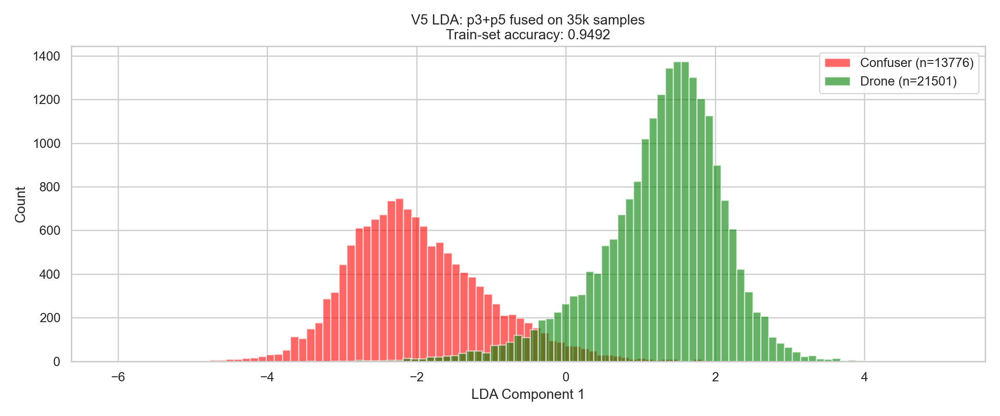
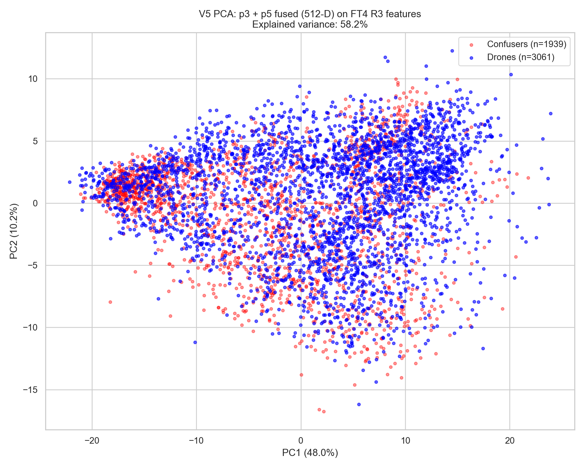
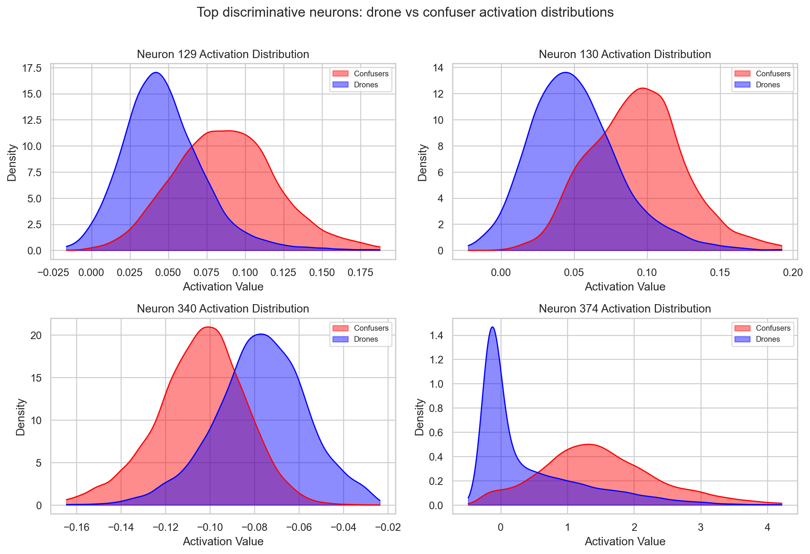
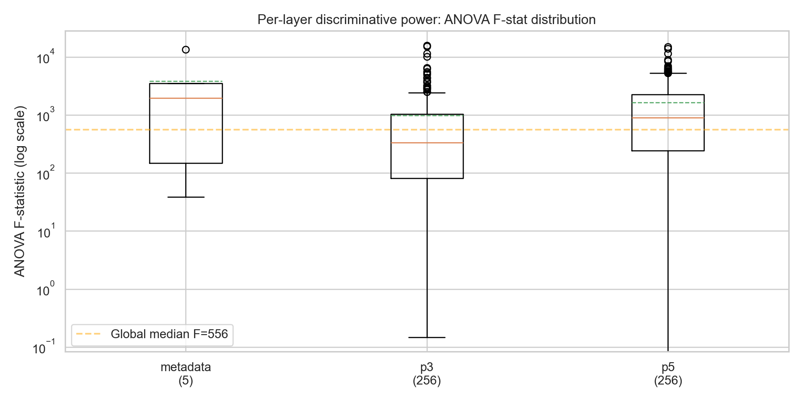
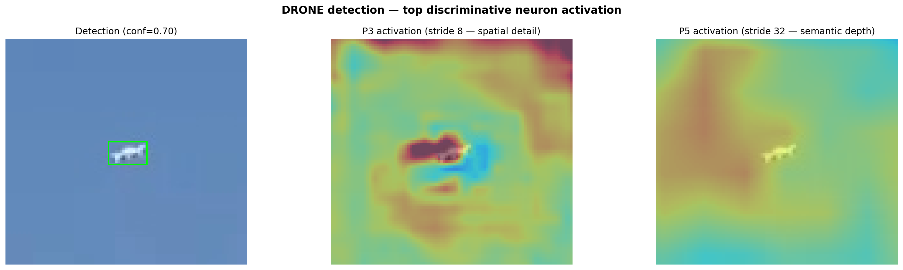
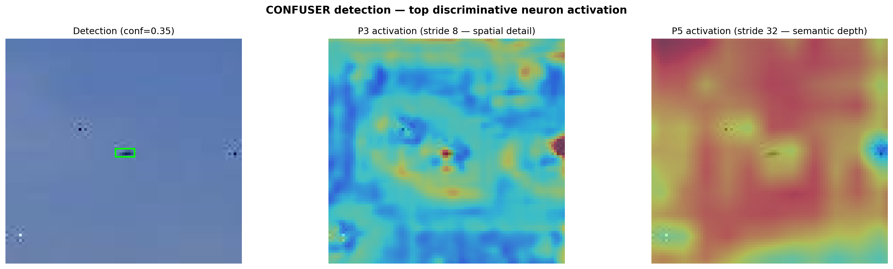
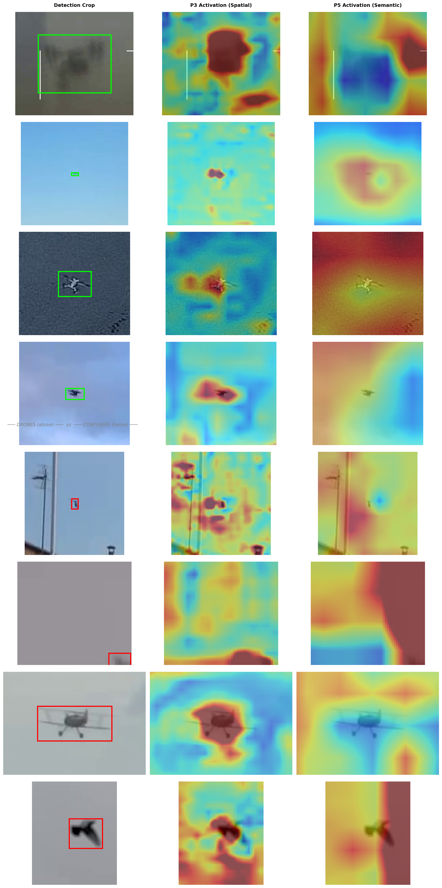
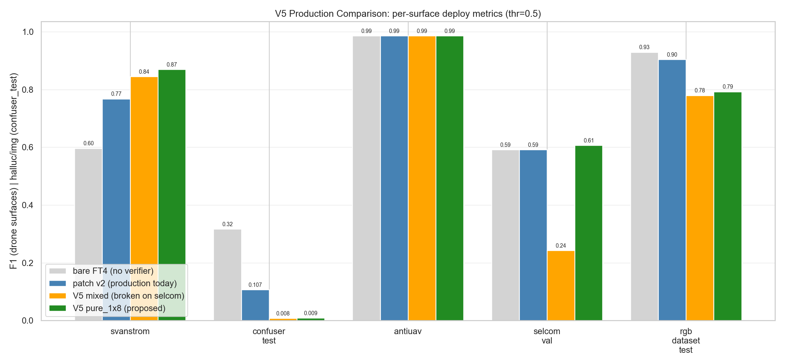
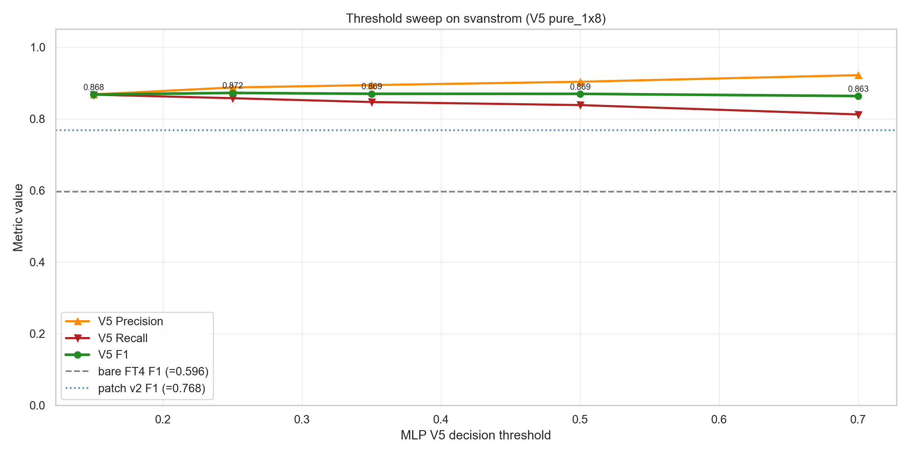
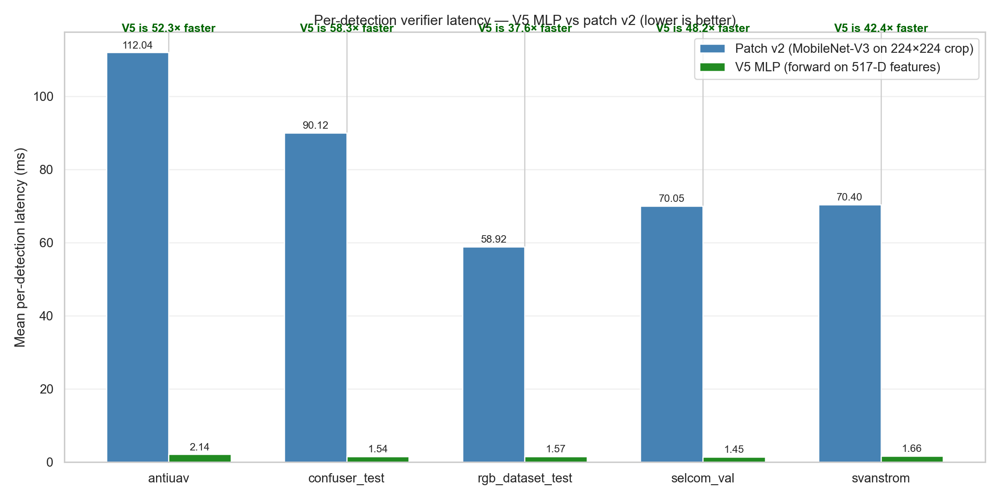

# MLP V5 — Email Drafts (2026-05-31)

Two tailored English emails about the V5 feature-distillation verifier. Professor version = research/method framing; company-supervisor version = deployment framing. Both informational, both flag the work as a potential research contribution and invite feedback. Numbers verified against `docs/analysis/mlp_v5_report.md`, `docs/analysis/2026-05-28_distillation_v5_journey.md`, and `knowledge/evals.csv`.

> Fill in the bracketed placeholders (names, signature) before sending. Suggested attachments are listed at the bottom of each draft.

---

## Email 1 — To the Professor (research framing)

**Subject:** A lightweight verifier that reads YOLO's internal features — possible research contribution

Dear Professor [Name],

A result from the thesis I think may be a genuine research contribution — I'd value your view.

**Problem.** Our single-class YOLO detector has strong recall but hallucinates on confusers (birds/planes/helicopters). Retraining it with confuser negatives causes catastrophic forgetting, and the existing patch-CNN verifier under-catches and is costly:

| Approach | Confuser catch | Cost / detection | Side effect |
|---|---|---|---|
| Retrain detector w/ negatives | high | none | **recall 96% → 31%** (collapse) |
| Patch verifier (2.5M-param CNN) | 52–71% (below 90% bar) | re-runs CNN on every box | — |
| **MLP V5 (this work)** | **~97%** | **~0.1 ms, no pixels** | none |

**Idea.** The detection head can only output "drone"/"nothing", but the backbone already encodes "bird". I ROI-pool YOLO's internal P3+P5 feature maps into a 517-D vector per detection and train a small classifier on features YOLO *already computed* — near-zero added cost.

**Statistical evidence (~35k detections):**

| Analysis | Purpose | Result |
|---|---|---|
| LDA (supervised 1-D) | is the signal there? | 2 clean peaks → **95.4% linear separability** |
| PCA (unsupervised 2-D) | is it trivial? | classes overlap → signal is buried; PCA-vs-LDA gap = why a *trained* model is needed |
| ANOVA F-test (517 feats) | which neurons? | near-binary "switch" neurons; **both P3 + P5 contribute** → fuse them |

Activation overlays confirm it: on a real drone the discriminative neurons bind to the object; on a false bird they scatter onto wing edges and background.

**Why an MLP (5-fold CV F1):** MLP **0.989** > XGBoost 0.976 > logistic 0.957 > metadata-only 0.81. Tree ensembles split per-axis and don't exploit dense, correlated neural embeddings as well as an MLP; the MLP is also ~300k params (8× smaller than the patch CNN).

**Results (verifier vs. bare detector vs. patch CNN):**

| Surface | Bare | Patch v2 | **MLP V5** | Improvement |
|---|---|---|---|---|
| Svanström F1 | 0.596 | 0.768 | **0.872** | **+10.4 pp vs patch** |
| Confuser FPs | 835 | 282 | **29** | **9.7× fewer** |
| Selcom CCTV (P) | 0.86 | 0.86 | **0.95** | **+9 pp, 0 TP lost** |
| Anti-UAV F1 | 0.986 | 0.986 | 0.986 | tie (no over-veto) |
| General RGB F1 | 0.929 | 0.904 | 0.816 | −9 pp (honest trade-off) |

**The contribution:** *distilling a detector's own FPN representations into a lightweight secondary classifier to suppress single-class false positives, with no pixel re-processing.* I haven't found this pattern in the counter-UAS literature, and the LDA/PCA/ANOVA story is clean. Is this novel enough to write up beyond the thesis? Any related work I should check? Figures attached — happy to walk through it.

Best regards,
[Your name]

*Attachments (previews below):*

**LDA — supervised axis, 95.4% linear separability**

**PCA — unsupervised, classes overlap (why a trained model is needed)**

**ANOVA — top discriminative "switch" neurons**

**ANOVA — per-layer discriminative power (P3 vs P5 vs metadata)**

**Activation overlay — real drone (neurons bind to the object)**

**Activation overlay — false bird (neurons scatter to edges/background)**

**Active-neuron compilation across sources**

**Per-surface results (bare vs patch vs V5)**

---

## Email 2 — To the Company Supervisor (deployment framing)

**Subject:** New false-alarm filter — ~10× fewer false alarms, near-zero cost, incl. on Selcom footage

Dear [Name],

A deployment-relevant update on the false-alarm problem.

**Context.** Our detector is tuned for high recall, so as a side effect it raises false alarms on birds/planes/helicopters. I fine-tuned it on the CCTV footage you provided (this recovered detection of small, distant drones), but it inherited the base model's false alarms. Retraining the detector to ignore confusers is not an option — it makes the model blind to small drones (recall drops 96% → 31%). The existing "patch verifier" helps but misses 30–50% of confusers and re-runs a full CNN on *every* detection.

**What's new.** A filter that reuses features the detector has *already* computed internally — no image re-processing. ~0.1 ms per detection (8× lighter than the old verifier), ~1–4% pipeline overhead.

**Results on real footage (old → new):**

| Surface | Before (patch verifier) | **After (V5 filter)** | Improvement |
|---|---|---|---|
| Surveillance F1 | 0.77 | **0.87** | **+13%** |
| False alarms / frame (surveillance) | — | — | **−72%** |
| Confuser scenes (false alarms) | 282 | **29** | **~10× cleaner** |
| **Selcom CCTV — precision** | **0.86** | **0.95** | **+9 pp, 0 real drones lost** |
| Anti-UAV tracking | 0.986 | 0.986 | unchanged (no over-veto) |

(On a generic mixed benchmark it's more conservative and loses some recall — but in surveillance, where false alarms are the real cost, that trade is favourable.)

**What this means.** A faster, ~10× cleaner false-alarm filter that's a strong candidate to replace the current verifier, with a measurable gain specifically on your CCTV footage. Not asking for a decision yet — I'd value your view on the acceptable false-alarm vs. miss balance for your use case. (I also believe the method may be a research contribution in the thesis.) Figures attached; glad to set up a short call.

Best regards,
[Your name]

*Attachments (previews below):*

**Per-surface results (before/after)**

**Threshold stability on surveillance footage**

**Cost per detection (V5 vs patch verifier)**

**What the model "looks at" — real drone**

**What the model "looks at" — false bird**

---

## Delivered
- `C:\Users\User\Desktop\UNISA projects\Drone detection\es proj 3 thesis workspace\ES_Drone_Detection\docs\analysis\2026-05-31_mlp_v5_emails.md` (this file — both email drafts)

Plot files referenced live in `docs/analysis/images/` (all exist as of 2026-05-31). Source evidence: `docs/analysis/mlp_v5_report.md`, `docs/analysis/2026-05-28_distillation_v5_journey.md`, `knowledge/evals.csv`.
