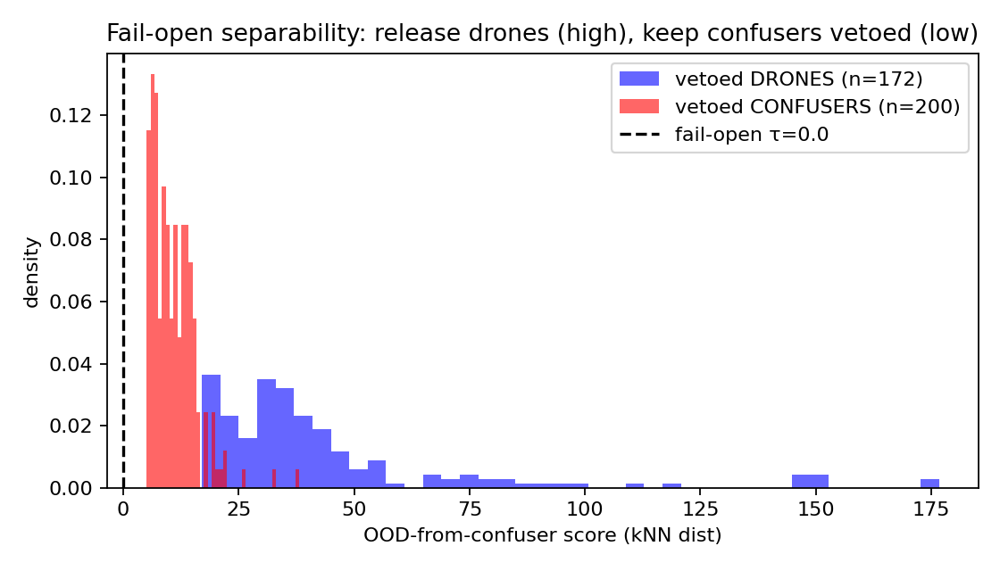
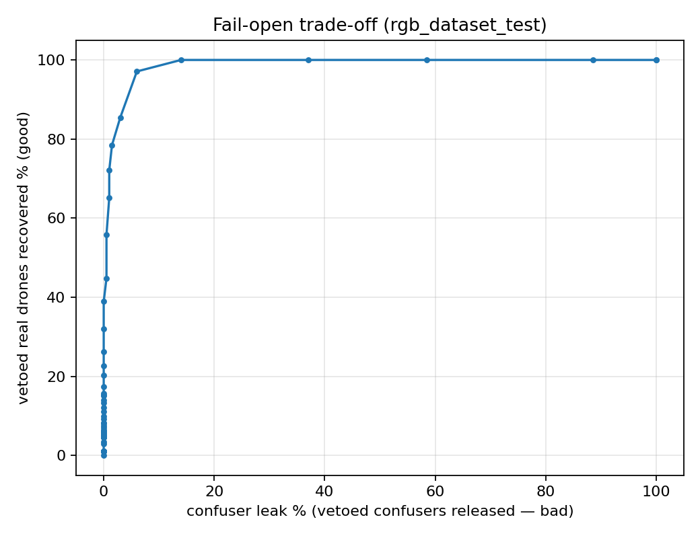

# Why mlp_v5 Drops Recall — MRI Diagnosis + Prescribed Fix

**Date:** 2026-06-01 · **Scripts:** `eval/diagnose_mlp_recall_drop.py`, `eval/_veto_vs_confuser.py` · **Data:** offline pipeline caches (`eval/results/_offline_pipeline/cache/*.pkl`, 517-D features per detection). **CPU-only, offline** (no detector re-run).

## Question
The V5 verifier suppresses false positives well but **costs recall** on some surfaces (rgb_dataset_test R 0.89→0.69). *Why*, measured statistically — and can the statistics prescribe a fix?

## Method
From the cached features, find detections that **match a GT drone** (= real drones), split into **KEPT** (mlp P≥0.25) vs **FALSELY-VETOED** (P<0.25 = recall loss), then run `mri.stats` (ANOVA-F, per-feature AUROC, LDA) on the two groups in the 517-D space. Then measure whether the vetoed drones overlap **confusers** (determines if the loss is structural or a coverage gap).

## Result 1 — who gets vetoed
| surface | real drones | falsely vetoed | recall loss |
|---|---|---|---|
| rgb_dataset_test | 772 | 172 | **22.3%** |
| svanström | 392 | 30 | 7.7% |
| selcom_val | 139 | 0 | 0% |

**The vetoed drones are NOT low-confidence** — `conf` mean is identical (Δ=0.000). The hypothesis "it kills low-conf detections" is **false**. What distinguishes them:
- **Smaller**: `log_area` kept −0.075 vs vetoed −0.180 (Δ+0.105; svanström Δ+0.188).
- **Distinct deep-feature signature**: top discriminators are YOLO **p3/p5 neurons**, single-neuron **AUROC ≈ 0.89**.

> **Caveat:** the `LDA=1.000` separability is **high-dimensional overfit** (517 features, ~770 samples — LDA separates anything in that regime). The honest signal is the **per-neuron AUROC ≈ 0.89** — strong, not perfect.

## Result 2 — are the vetoed drones confuser-like? (fix feasibility)
Standardised feature space, vs the confuser detections (`rgb_confuser`):

| measure | kept drones | vetoed drones |
|---|---|---|
| centroid distance → confusers | 11.05 | **16.48** (farther) |
| separability from confusers (mean top-20 AUROC) | 0.862 | **0.876** (cleaner) |
| centroid distance → kept-drone cluster | — | 15.37 |

**The vetoed drones are an OOD outlier cluster — far from confusers AND far from the MLP's training-drone distribution.** They are *at least as separable from confusers as the kept drones are.* So the MLP vetoes them because they **don't look like its training drones**, not because they look like birds.

## Verdict
The recall drop is a **coverage gap of out-of-distribution real drones** (small, atypical signature), **not** a structural drone/confuser overlap. Therefore it is **recoverable**.

## Prescribed fixes (both statistics-supported)
1. **Targeted drone-diversity re-mine** (proper). Add the *vetoed OOD signatures* to MLP training. **Low FP risk** precisely because these drones are far from confusers (centroid 16.48 vs 11.05). This is the RGB analog of the IR fix that *worked* (`ir-recall-fixed-by-drone-diversity`, recall-safe). It also explains why the earlier **`remine_rgb` failed** (`v5-rgbds-ceiling`, −2.1pp): it added *broad in-domain* rgb_dataset drones, not the *targeted outlier cluster* — dilution, not coverage.
2. **Size-aware threshold** (cheap, no retrain). `log_area` separates kept/vetoed but `conf` does not → lower the MLP keep-threshold for small boxes. Partial but free.

## Result 3 — the fix, tested: FAIL-OPEN (OOD-abstain) works
Script `eval/test_failopen_verifier.py`. Rule: the verifier abstains→**keeps** a detection when it is OOD-from-confusers (kNN distance to the confuser distribution > τ); it only vetoes when confidently *near* a confuser. Tested on the falsely-vetoed real drones (want to release) vs the correctly-vetoed confusers (want to keep vetoed):

| acceptable confuser leak | τ | falsely-vetoed drones recovered |
|---|---|---|
| ≤2% | 21.9 | 83.1% (143/172) |
| ≤5% | 19.3 | **91.3% (157/172)** |
| ≤10% | 15.8 | 100% (172/172) |

OOD-from-confuser median: vetoed-**drones 34.4** vs vetoed-**confusers 9.8** — cleanly separated. In absolute terms, ~5% leak ≈ **10 extra confuser FPs across 2,633 images** to recover **157 real drones** (recall ~0.69→~0.89). 

### PRE vs POST (apply the gate, score with score_detections) — and the catch
`eval/eval_failopen_prepost.py`, τ calibrated to 5% leak on `rgb_confuser`:

| surface | variant | P | R | F1 |
|---|---|---|---|---|
| rgb_dataset_test | bare | 0.958 | 0.888 | 0.922 |
| | mlp_v5 | 0.979 | 0.694 | 0.812 |
| | **mlp_v5+failopen** | 0.959 | **0.870** | **0.912** |
| svanström | mlp_v5 | 0.887 | 0.843 | 0.865 |
| | **mlp_v5+failopen** | **0.631** | 0.857 | 0.727 |
| rgb_confuser (FP) | mlp_v5 → +failopen | | | 16 → 26 FP |

**Verdict: fail-open is CONDITIONAL, not universal.** It recovers the recall drop on `rgb_dataset_test` (R 0.694→0.870, F1 0.812→0.912, +10 confuser FPs) — but on **svanström it craters precision 0.887→0.631 (FP 45→211)**, because svanström's clutter FPs are themselves *OOD from the rgb_confuser calibration set*, so the OOD-abstain rule wrongly releases them. **A single global OOD threshold does not transfer across surfaces** — this is the measured form of the "novel confusers far from calibration slip through" drawback.

**Revised recommendation:** prefer the **size-aware threshold** (the `log_area` signal is clean and does NOT blanket-release clutter) or a **targeted drone-diversity re-mine**, over blanket fail-open. Fail-open is viable only with **per-surface/scene-calibrated τ** (or restricted to benchmark-style, low-clutter data). The engine hook `_mlp_gate_open` (`pyside_engine.py`) is where any gated variant would live. The ~9% confuser-overlapping tail is irreducible regardless.

Figures: `docs/analysis/images/failopen_pca.png`, `failopen_ood_hist.png`, `failopen_tradeoff.png`.

## Why this matters for the thesis
A clean demonstration that **MRI statistics don't just explain a failure — they localise it (OOD small drones, far from confusers), prescribe the fix (targeted diversity re-mine), and explain a prior failed attempt (untargeted re-mine).** Symmetric to the IR story, where the same diagnosis led to the deployed recall-safe aligned verifier.

## Delivered
- `docs/analysis/2026-06-01_mlp_v5_recall_drop_mri.md` (this)
- `eval/diagnose_mlp_recall_drop.py`, `eval/_veto_vs_confuser.py`
- Related: `2026-06-01_statistical_feature_selection_STUDY.md`, ledger `v5-rgbds-ceiling`, `ir-recall-fixed-by-drone-diversity`
