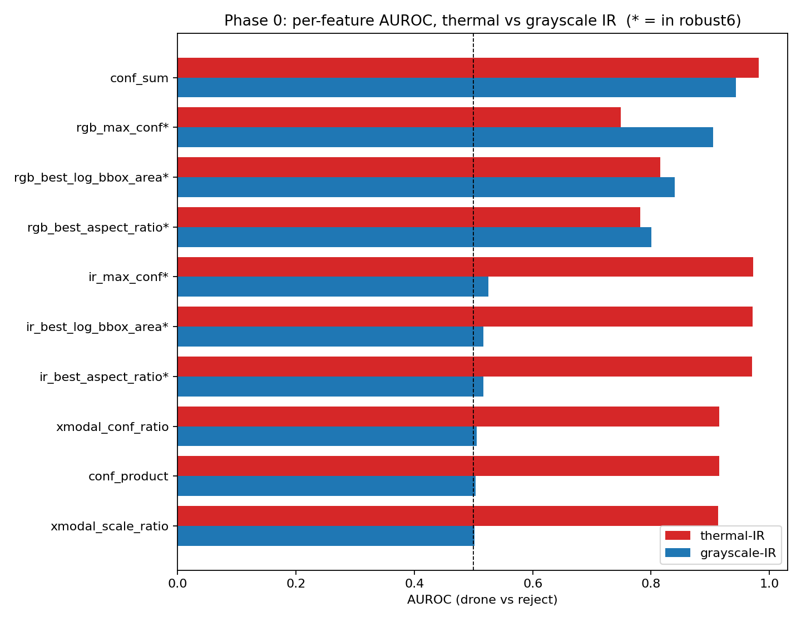
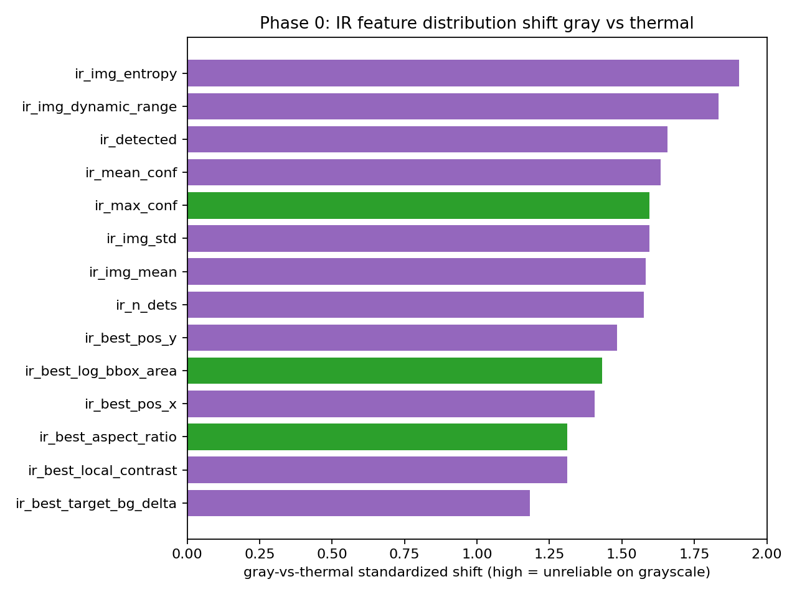
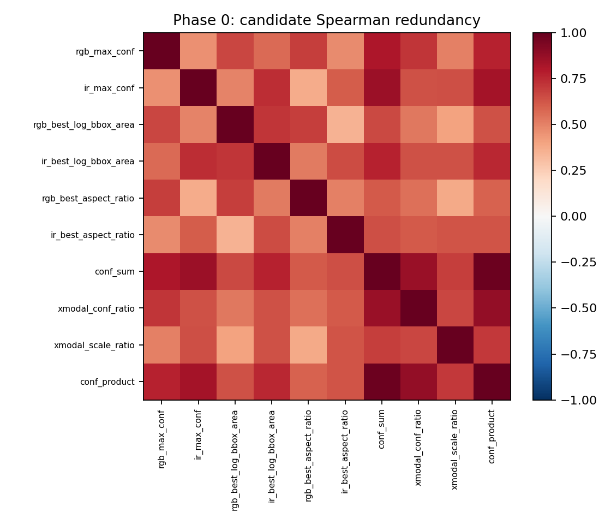

# robust6 Phase 0 — Regime-Aware Statistics (Results)

**Date:** 2026-06-01 · **Plan:** `2026-06-01_robust6_reliability_investigation_plan.md` · **Script:**
`classifier/fusion_feature_stats.py --phase0` · **Data:** `fusion_dataset_full56.csv` (65,192 rows: thermal-IR
56,713 / grayscale-IR 8,479; trust labels both=42850, reject=16386, trust_ir=3356, **trust_rgb=2600 = 4%**).
**Output:** `classifier/fusion_models/optimal_v1/feature_stats_regime.csv`.
Statistics only — **zero training**. This gates which Phase 1 feature sets are worth a fit.

## Headline: H2 is refuted, and the real root cause is now measured

I expected cross-modal *ratios* (`xmodal_conf_ratio`) to be regime-robust (encode "IR weak → trust RGB"). **They
are not.** They collapse on grayscale exactly like the raw IR features, because they still contain the IR term.
But Phase 0 found the actual answer, which is better.

### 1. The entire IR feature family is chance-level on grayscale
Every IR feature drops from AUROC ≈ 0.97 (thermal) to ≈ 0.51 (grayscale) — a coin flip:

| feature | AUROC thermal | AUROC grayscale | in robust6 |
|---|---|---|---|
| `ir_max_conf` | 0.973 | **0.525** | ✅ |
| `ir_best_log_bbox_area` | 0.972 | **0.516** | ✅ |
| `ir_best_aspect_ratio` | 0.970 | **0.516** | ✅ |
| `xmodal_conf_ratio` | 0.915 | **0.506** | ❌ |
| `xmodal_scale_ratio` | 0.913 | **0.501** | ❌ |
| `conf_product` | 0.915 | **0.504** | ❌ |

**This is the root cause of robust6's grayscale recall collapse, now quantified:** 3 of robust6's 6 features (the
IR half) carry *zero* signal on grayscale, and so do the cross-modal ratios. The classifier is forced to make a
4-way trust decision with half its inputs being noise → it over-rejects.

### 2. What actually survives grayscale — only RGB + `conf_sum`
| feature | AUROC thermal | AUROC grayscale | drop |
|---|---|---|---|
| **`conf_sum`** | 0.982 | **0.944** | **−0.038** |
| `rgb_max_conf` | 0.749 | **0.905** | improves |
| `rgb_best_log_bbox_area` | 0.815 | 0.840 | improves |
| `rgb_best_aspect_ratio` | 0.782 | 0.800 | improves |

`conf_sum` is the **one cross-modal feature that is regime-robust** — additive aggregation degrades gracefully when
the IR term dies, so it keeps the RGB signal. Everything else that survives is already RGB.

### 3. Distribution shift confirms it (CORAL-style z-shift)
IR confidence/geometry features shift ~1.4–1.7 standardized units gray-vs-thermal; their grayscale AUROC sits at
chance. (`ir_img_entropy/std/dynamic_range` shift most but were never in robust6.)

### 4. The single-modality routing drivers are *difference* features, not ratios
For the starved `trust_rgb` (4%) and `trust_ir` decisions, the strongest single features are **`conf_diff`,
`area_diff`, `aspect_ratio_diff`, `pos_euclidean_diff`** (trust_ir AUROC 0.87–0.95) — **none in robust6**. The
*ratio* features I had flagged are weaker here. (Caveat: these diffs also contain IR terms, so they too will weaken
on grayscale; they help *thermal* routing, not the grayscale hole.)

### 5. Redundancy + incremental separability
- Spearman vs robust6: `conf_sum` 0.85, `conf_product` 0.83, `xmodal_conf_ratio` 0.71 — correlated but not pure
  duplicates.
- **Held-out (grouped) LDA: adding any single candidate to robust6 moves accuracy by +0.0000**; `xmodal_core`
  (drop RGB geometry, swap in cross-modal trio) +0.0010. *Linearly*, the candidates are redundant. This weakly
  argues against expecting big gains — but LDA is linear and pooled, so it can't see the *regime-conditional* value
  of `conf_sum` (grayscale) that AUROC exposes. Treat as: no free linear lunch, decide on the regime evidence.

## Decision — what Phase 0 gates into Phase 1

| candidate set | proceed? | why |
|---|---|---|
| `robust6 + conf_sum` | **YES** | only regime-robust cross-modal feature (gray AUROC 0.944); cheap, free |
| `robust6 + {xmodal ratios}` | **NO** | refuted — ratios collapse on grayscale (AUROC ~0.50), redundant linearly |
| `xmodal_core` (swap RGB geom → cross-modal) | **NO** | the swapped-in trio is the part that dies on grayscale |
| **regime-routed / RGB-only-on-gray** | **YES (promote)** | the data proves IR inputs are noise on gray → the fix is *architectural*, not a feature |

## Verdict
**The grayscale recall hole is not a missing feature — it is that robust6 feeds 3 dead (chance-level) IR inputs
into the trust decision on grayscale.** Two evidence-backed moves:
1. **Add `conf_sum`** to robust6 (`robust7`) — the one cross-modal feature that survives both regimes. Low cost,
   defensible, test in Phase 1.
2. **Route on regime** (promote Step 5 of the state doc to primary): on grayscale, the trust classifier should run
   on an RGB-only feature subset (or be bypassed to filter-only, which the 5000-frame ablation already shows is best
   on svan_gray, F1 0.891). The ratios are a dead end.

This is a clean, honest negative-plus-positive result: my regime-robust-ratio hypothesis was wrong, and the
statistics named the right fix before any training was spent.

## Delivered
- `docs/analysis/2026-06-01_robust6_phase0_results.md` (this doc)
- `classifier/fusion_models/optimal_v1/feature_stats_regime.csv`
- Plots: `docs/analysis/images/fusion_regime_auroc.png`, `fusion_regime_zshift.png`, `fusion_candidate_corr.png`
- Script: `classifier/fusion_feature_stats.py --phase0` (extended canonical script)
