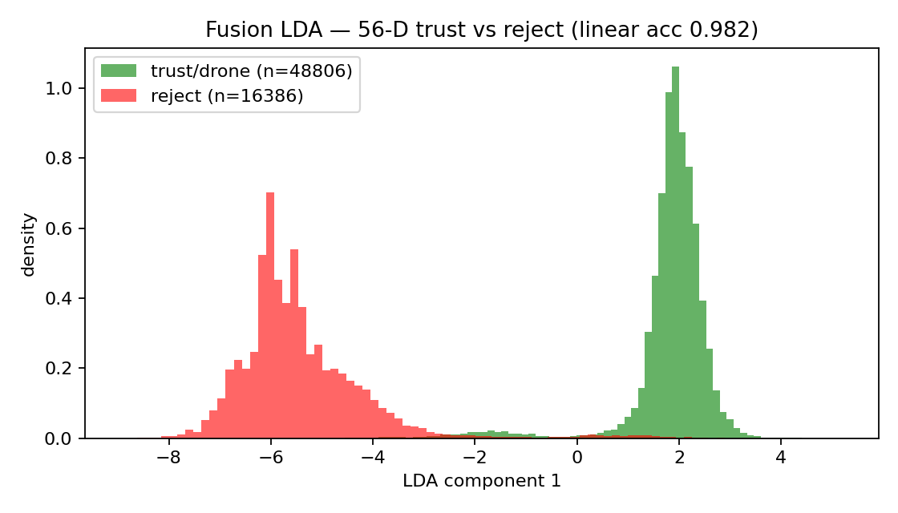
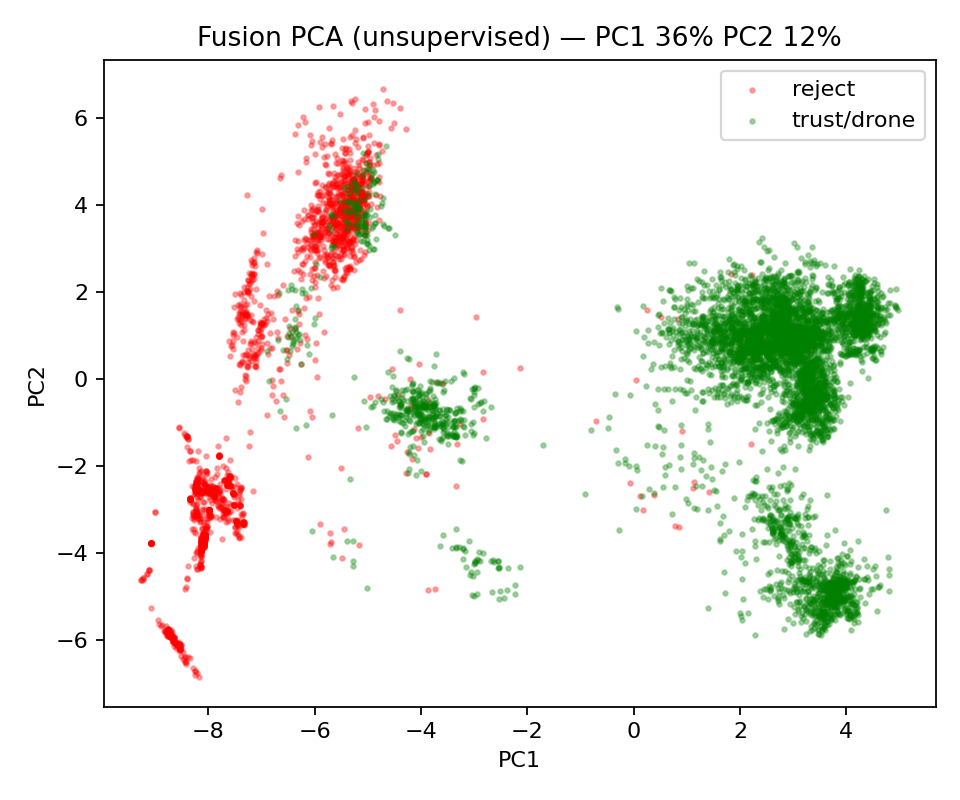
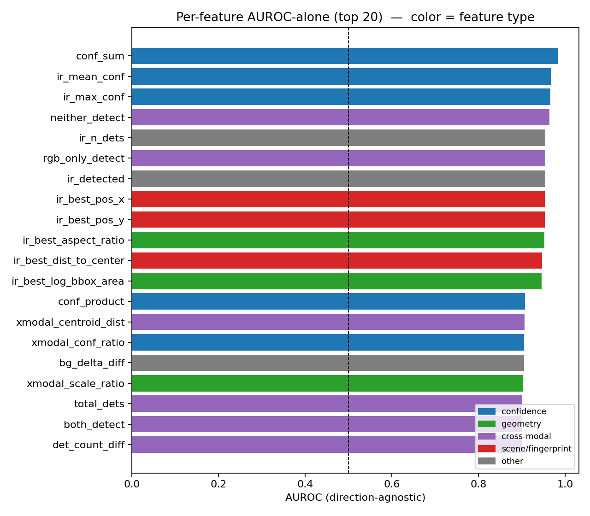
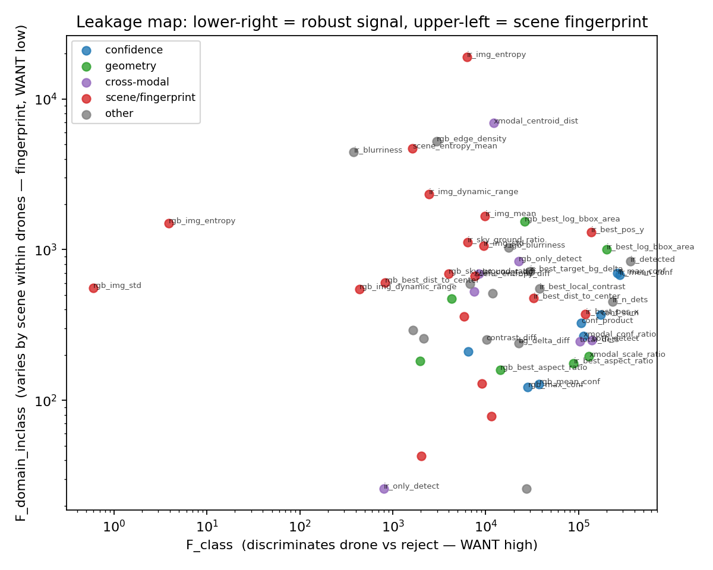

# Statistical Feature Selection for the Trust Classifier — A-to-Z Study Document

**Purpose.** A self-contained explanation of how we replaced a hand-built 32-feature trust classifier (`sa32`) with a **6-feature** one (`robust6`) found by *statistics*, and proved it. Read this alone and you can defend the whole approach in an exam. Every number is from this project's runs (sources cited per section).

---

## 0. The thesis in one sentence
> Rather than *one-shotting* a 32-feature classifier and hoping the features are right, we used statistics (LDA, PCA, ANOVA, and a **leakage statistic**) to identify the **6 features that actually carry the drone-vs-confuser signal**, dropped the rest as *scene fingerprints*, and showed the 6-feature model **matches the 32 in-domain and generalises better out-of-domain** — because the discarded features were memorising scenes, not detecting drones.

The exam-ready claim: **fewer, statistically-vetted features beat more, hand-picked features — not by luck, but because a measurable property (leakage) separates signal from memorisation.**

---

## 1. What the "trust classifier" is (context)
The detection pipeline is: **detector → trust classifier → verifier (filter) → alert.**

- The **detector** (YOLO: `ft4` RGB, `v3b` IR) finds candidate drone boxes. It is single-class, so it also fires on **confusers** (birds, planes, helicopters, clouds, edges).
- The **trust classifier** is a *frame-level* model that fuses RGB + IR evidence into a 4-way **trust label**: `reject_both(0) / trust_rgb(1) / trust_ir(2) / trust_both(3)`. It decides *whether this frame's evidence is a real drone sighting*. This is the component this study is about.
- The **verifier** (`mlp_v5` RGB, `mlp_v5_ir_aligned` IR) is a *per-detection* second opinion.

The incumbent trust classifier was **`sa32`** = `scene_aware_v3more_32feat`: 32 features, XGBoost, trained on detections from an **old** detector (`v3more`/`selcom_1280`).

**Two problems motivated this work:**
1. **Drift.** `sa32`'s features came from an old detector; production is now `ft4`. Its inputs no longer match deployment.
2. **Suspected over-engineering.** 32 features, some expensive (per-frame image statistics), hand-chosen. Do we *need* them, or are some harmful?

---

## 2. The feature space (what we had to choose from)
Each frame yields up to **56 candidate features**, in four families:

| family | examples | cost |
|---|---|---|
| **confidence** | `rgb_max_conf`, `ir_max_conf`, `conf_sum`, `xmodal_conf_ratio` | free (detector output) |
| **box geometry** | `*_best_log_bbox_area`, `*_best_aspect_ratio` | free |
| **cross-modal** | `xmodal_centroid_dist`, `xmodal_scale_ratio` | free |
| **scene statistics** | `*_img_mean/std`, `*_img_entropy`, `*_edge_density`, `*_sky_ground_ratio`, `*_blurriness`, `*_best_pos_x/y`, `*_dist_to_center` | **expensive** (full image read + OpenCV per frame) |

`sa32`'s 32 features lean heavily on the **scene-statistics** family. That family is exactly where we suspected trouble.

Source of the cached feature matrix: `classifier/fusion_models/optimal_v1/fusion_dataset_full56.csv` (65,192 rows).

---

## 3. The statistical method — what each tool does and *why*
We did **not** train-and-pray. We ran four analyses, each answering a specific question. Script: `classifier/fusion_feature_stats.py` (reuses the `mri.stats` primitives — same statistics layer as the YOLO "model MRI").

### 3.1 LDA (Linear Discriminant Analysis) — *is the signal there at all?*
LDA finds the single linear axis that **maximally separates** the two classes (drone-trust vs reject). If the classes form two clean peaks on that axis, the signal is present and largely linear. **Result: linear separability = 0.982** — the trust signal is strongly present in the feature space. (So the problem is *selecting* features, not a lack of signal.)

### 3.2 PCA (Principal Component Analysis) — *is it trivial / where is the structure?*
PCA is **unsupervised**: it finds the directions of greatest *variance*, ignoring the label. If PCA alone separated the classes, no learning would be needed. It does **not** (classes overlap in PCA space) — meaning the discriminative signal is **not** the dominant source of variance. The dominant variance is **scene-to-scene differences** (brightness, texture) — a first clue that scene features dominate variance without carrying class signal.

### 3.3 ANOVA F-test — *which individual features discriminate the class?*
For each feature, the ANOVA F-statistic measures how much its mean differs **between classes** relative to within-class spread. High F = discriminative. We also compute **AUROC-alone**: how well that one feature, by itself, separates the classes (0.5 = useless, 1.0 = perfect).

### 3.4 The leakage statistic — *the key innovation: is a feature real signal or a scene fingerprint?*
**This is the heart of the method.** A scene-fingerprint feature (e.g. `img_mean`) can look discriminative in a single pool *because it correlates with which scene a sample came from*, and scenes correlate with labels in the training set. Standard ANOVA/AUROC would tell you to **keep** such a feature — and that is exactly the trap earlier hand-built models fell into.

To expose it, we compute a **second** F-statistic **within the drone class only**: how much does the feature vary *by dataset/scene* among samples that are all the same class? A real signal feature (confidence) barely varies by scene within drones; a fingerprint (brightness) varies enormously.

```
leakage_ratio = F_domain_inclass / F_class
   low   → robust signal feature   (KEEP)
   high  → scene fingerprint        (DROP)
```

This turns the lean-model deprecations we'd previously made *by hindsight* into a number computed *up front*. (Conceptually related to domain-adaptation ideas like **CORAL** — aligning feature distributions across domains — but we did **not** run CORAL here; CORAL aligns features, whereas our leakage statistic *measures domain-dependence to discard* the offending features. The project's CORAL-like step lives elsewhere: the per-modality z-alignment of grayscale↔thermal features in the IR verifier, ledger `gray-thermal-alignable`.)

---

## 4. Statistical results — which features matter, which are fingerprints
Source: `classifier/fusion_models/optimal_v1/feature_stats_ranked.csv`, plots in `docs/analysis/images/`.

**LDA — the signal is separable (acc 0.982):**


**PCA — unsupervised, classes overlap (variance ≠ class signal):**


**Per-feature AUROC (top features by single-feature separability):**


**Leakage map — lower-right = robust signal, upper-left = scene fingerprint:**


### 4.1 Scene fingerprints — DROP (high leakage, chance-level AUROC)
The smoking gun: these score **AUROC ≈ 0.50** (no class signal) but **leakage in the hundreds** (fully scene-determined):

| feature | AUROC-alone | leakage_ratio |
|---|---|---|
| `rgb_img_std` | 0.502 | **349.6** |
| `rgb_img_entropy` | 0.510 | **307.4** |
| `ir_blurriness` | 0.795 | 11.7 |
| `ir_img_entropy` | 0.708 | 3.0 |
| `scene_entropy_mean` | 0.590 | 2.9 |
| `rgb_edge_density` | 0.525 | 1.75 |
| `*_img_dynamic_range` | ~0.55 | ~1.2 |

These are the *expensive* features. They are also the dangerous ones. **Both reasons to drop them.**

### 4.2 The robust core — KEEP (high AUROC, near-zero leakage)
| feature | family | AUROC-alone | leakage |
|---|---|---|---|
| `conf_sum` | confidence | 0.983 | 0.002 |
| `ir_mean_conf` / `ir_max_conf` | confidence | 0.967 / 0.965 | 0.002 |
| `ir_best_aspect_ratio` | geometry | 0.952 | 0.002 |
| `ir_best_log_bbox_area` | geometry | 0.946 | 0.005 |
| `xmodal_conf_ratio` / `xmodal_scale_ratio` | cross-modal | 0.905 / 0.903 | 0.002 |

### 4.3 Two honest caveats (you will be asked about these)
1. **Detection-presence flags** (`ir_detected`, `neither_detect`) top the AUROC chart but are **label-tautological** — the trust label is *derived from* per-modality detections, so these leak the *label*, not the scene. `leakage_ratio` catches *scene* leakage, not label leakage, so we excluded these by reasoning, not by the statistic.
2. The corpus is **IR-dominant** (antiuav-heavy), so IR features rank above RGB; on RGB-fallback surfaces the balance shifts.

---

## 5. From statistics to a feature set (56 → 6)
The ranking gives an *order* (robust, high-AUROC first) and a *cut rule* (drop high-leakage). Applying it yields a **robust core**, and the minimal viable subset we carried forward is:

**`robust6` = `rgb_max_conf`, `ir_max_conf`, `rgb_best_log_bbox_area`, `ir_best_log_bbox_area`, `rgb_best_aspect_ratio`, `ir_best_aspect_ratio`.**

All six are **free** (detector outputs + box geometry), all **near-zero leakage**, no scene reads. This is the statistically-derived alternative to `sa32`'s hand-picked 32.

---

## 6. Training the classifier (why and how)
- **Model: XGBoost**, 4-class (the trust routing). Chosen because the incumbent (`sa32`) is XGBoost → apples-to-apples, and gradient-boosted trees handle small tabular feature sets well. (Hyperparameters: 400 trees, depth 6, lr 0.05, subsample 0.8; `n_jobs=1` — a Windows OpenMP deadlock at `n_jobs>1` was found and fixed.)
- **Data: re-mined from the CURRENT detector.** We ran `ft4` (RGB) + `v3b` (IR) over paired surfaces and computed the features per frame (`generate_lean19_data.py`), producing `classifier/fusion_models/lean_ft4/fusion_dataset_lean19.csv` (8,871 rows). This **fixes the drift** problem (sa32 was on old-detector features).
- **Validation: GroupShuffleSplit by sequence** — frames from the same clip never straddle train/test, so a model **cannot** pass by memorising a scene. This is what makes the OOD numbers trustworthy and is *why* the fingerprint features hurt (they have nothing to grip on across the split).
- **Why this design beats one-shotting:** the split + leakage statistic together *punish* memorisation. A one-shot 32-feature model trained without these guards scores high in-domain by fingerprinting, then fails OOD. We measured exactly that (next section).

Trainer: `classifier/train_lean_ft4.py`.

---

## 7. The comparisons / ablations (all of them)
We ablated at **three levels**, each tightening the claim.

### 7.1 Level 1 — feature-set screen on cached (old-detector) features
Script `classifier/ablation_feature_sets.py`. Same data, vary the feature set (3-way macro-F1):

| variant | feats | F1m | antiuav | svan | **OOD drone+bird** | **OOD seagull** |
|---|---|---|---|---|---|---|
| sa32 (ref) | 32 | 0.949 | — | — | — | — |
| sa32_feats (retrained) | 32 | 0.917 | 0.919 | 0.740 | 0.294 | 0.188 |
| sa32_lite+ | 24 | 0.920 | 0.908 | 0.738 | 0.300 | 0.285 |
| **meta5_geo** | 5 | 0.882 | 0.821 | 0.734 | **0.709** | **0.471** |
| meta5_scores | 5 | 0.716 | 0.585 💥 | 0.739 | 0.626 | 0.474 |

**Reads:** in-domain F1 is *flat* from 5→32 features (the count is not the lever). Lean sets **win big on OOD video** (0.71 vs 0.29). `meta5_scores` (confidences only) collapses on Anti-UAV → **geometry is load-bearing**, confidences alone are not enough.

### 7.2 Level 2 — re-train on the CURRENT detector (ft4)
Script `classifier/train_lean_ft4.py`, ft4-mined data, GroupShuffleSplit (F1-macro):

| variant | feats | overall | antiuav | svan | **OOD drone video** |
|---|---|---|---|---|---|
| all19 (incl. fingerprints) | 19 | 0.787 | 0.871 | 0.737 | **0.262** |
| no_fp (drop brightness+pos) | 10 | 0.787 | 0.844 | 0.736 | 0.436 |
| **robust6** | 6 | **0.810** | 0.827 | 0.725 | **0.578** |
| meta4 | 4 | 0.787 | 0.769 | 0.716 | 0.569 |

**Reads:** on the current detector, **`robust6` (6 feats) is the best overall**, and the OOD-drone-video story is decisive: the 19-feature set (with fingerprints) **collapses to 0.262**; removing fingerprints climbs it **0.262 → 0.436 → 0.578**. Fewer, vetted features generalise *better*. `meta4` is too lean (loses IR geometry → confuser rejection drops).

### 7.3 Level 3 — full-pipeline ablation (the production decision)
Script `eval/overnight_ablation.py`, **5000 strided frames/dataset**, 2 drone datasets + 1 confuser, faithful production composition (trust-first / both cascade orders). Metric: **frame-level alert** P/R/F1 + confuser fire-rate.

**svanström (in-domain, IoP):**
| cell | F1 | fire ↓ |
|---|---|---|
| bare | 0.715 | 0.699 |
| filter_only | 0.964 | 0.065 |
| clf_only[sa32] | 0.9972 | 0.003 |
| clf→filter[sa32] | **0.9974** | 0.0023 |
| clf_only[robust6] | 0.9877 | 0.0188 |
| clf→filter[robust6] | 0.9957 | 0.0034 |

**rgb_confuser (OOD, fire-rate ↓ = false-alert rate):**
| cell | fire ↓ |
|---|---|
| bare | 0.379 |
| filter_only | 0.114 |
| clf_only[sa32] | 0.203 |
| clf_only[robust6] | **0.143** |
| clf→filter[sa32] | 0.079 |
| **filter→clf[robust6]** | **0.057** |

**antiuav (saturated):** all ≈ 0.97; robust6 costs ~0.6pp recall (68 FN vs 13).

**Reads:**
- **In-domain: `sa32` wins by a hair** (svan F1 0.9974 vs 0.9957, +0.2pp). Negligible.
- **OOD confuser: `robust6` wins clearly** — clf-only fire **0.143 vs 0.203** (30% fewer false alerts on *unseen* confusers); best-composed **0.057 vs 0.066**.
- **Structural finding:** on surveillance the **classifier does the heavy lifting** (`clf_only[sa32]` fire 0.003 vs `filter_only` 0.065 — ~20× better than the verifier alone). On confuser they are **complementary** (need both: clf 0.143, filter 0.114, composed 0.057).
- **Cascade order:** `filter→classifier` gives slightly lower FP; `classifier→filter` (production default, trust-first) is more recall-preserving; difference < 1pp.

---

## 8. The verdict
**`robust6` is production-viable.** It trades a hair of in-domain F1 (~0.2pp on svanström) for **meaningfully better OOD-confuser robustness** (~30% fewer false alerts on unseen confusers), using **6 free, drift-proof features vs `sa32`'s 32 (incl. expensive per-frame scene reads).** For an open-world / confuser-heavy deployment — the thesis's central concern — `robust6` is the principled pick. `sa32` only wins if you optimise purely for the in-domain surface, which is exactly the overfitting trap the leakage analysis warns against.

**Honest caveat (log it):** in the full-pipeline run, the drone datasets use **true thermal IR** while the confuser set uses **grayscale-fallback IR** — a modality split in the classifier's IR features across pos/neg. It mirrors deployment (thermal when available, gray fallback otherwise) but is worth stating.

---

## 9. Why this is a thesis chapter: *statistics-driven selection > one-shotting*
The chapter writes itself as a controlled comparison:

1. **Naïve baseline (one-shot):** hand-pick 32 features, train once → `sa32`. High in-domain F1 (0.949). *Looks* great.
2. **Diagnosis (statistics):** LDA shows the signal is there; PCA shows scene variance dominates; ANOVA+AUROC rank features; the **leakage statistic** reveals that the highest-variance features (scene stats) are **AUROC≈0.5 fingerprints** (leakage 300+). The 32-feature model's in-domain strength is partly **memorisation**.
3. **Prescription:** keep the 6 low-leakage signal features → `robust6`.
4. **Proof (3-level ablation):** in-domain F1 is flat 6→32; OOD generalisation **doubles** when fingerprints are dropped (0.262→0.578); full-pipeline confirms `robust6` cuts OOD false alerts ~30% vs `sa32`.

**The chapter's claim:** *a measurable property (leakage = domain-dependence within a class) tells you which features will fail out-of-domain before you ever deploy — so principled, statistics-driven feature selection produces a smaller, cheaper, more robust model than one-shotting a large hand-built feature set.* The 32-vs-6 comparison is the concrete evidence.

Suggested figures: the four `fusion_*` plots (LDA, PCA, AUROC, leakage map) + the Level-2 OOD-video bar (0.262→0.578) + the Level-3 confuser fire-rate bar (sa32 0.203 vs robust6 0.143).

---

## 10. Exam cheat-sheet (explain it in 60 seconds)
- **Q: Why not just use all 32 features?** Because some are *scene fingerprints* — they discriminate which scene, not whether it's a drone (AUROC≈0.5, leakage 300+). They inflate in-domain scores by memorising and fail out-of-domain.
- **Q: How did you know which to drop?** `leakage_ratio = F_domain_inclass / F_class`. High = fingerprint. Computed before training.
- **Q: Did fewer features hurt?** No — in-domain F1 is flat 6→32; OOD *improved* (drone-video F1 0.26→0.58).
- **Q: Is the small one production?** Yes — `robust6`, 6 free features, matches `sa32` in-domain, ~30% fewer OOD false alerts, no expensive scene reads, no drift.
- **Q: What's LDA/PCA/ANOVA for?** LDA = is the signal separable (0.982 yes). PCA = is it trivial/where's the variance (no, scene variance dominates). ANOVA/AUROC = rank features by class-discrimination. Leakage = separate signal from memorisation.

---

## Delivered
- `docs/analysis/2026-06-01_statistical_feature_selection_STUDY.md` (this document)
- Scripts: `classifier/fusion_feature_stats.py`, `classifier/ablation_feature_sets.py`, `classifier/train_lean_ft4.py`, `eval/overnight_ablation.py`
- Data/results: `fusion_dataset_full56.csv`, `feature_stats_ranked.csv`, `lean_ft4/`, `eval/results/_overnight_ablation/ablation_results.{md,json}`
- Plots: `docs/analysis/images/fusion_{lda_hist,pca_2d,feature_auroc,leakage_map}.png`
- Related docs: `2026-05-31_fusion_feature_leakage_stats.md`, `2026-05-31_ft4_lean_trust_classifier.md`, `2026-06-01_full_pipeline_offline_eval.md`
