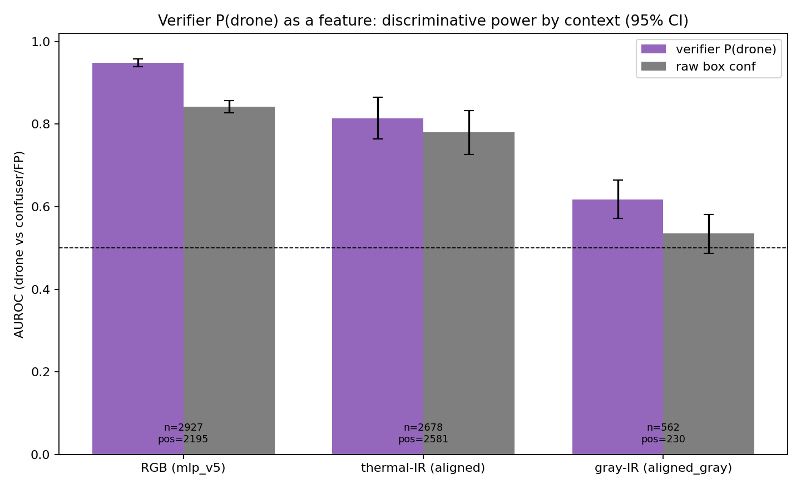

# Verifier-Score-as-Feature — Phase 0 (Results)

**Date:** 2026-06-01 · **Idea (user):** the verifier MLP is "hooked to YOLO's brain" (reads P3/P5 backbone
features) — can its **P(drone)** be an input *feature* for the trust classifier, and does it survive grayscale
where the raw IR box features collapsed to chance? · **Script:** `classifier/verifier_as_feature_stats.py` ·
**Data:** offline detection caches `eval/results/_offline_pipeline/cache/*.pkl` (6,167 dets, 11 surfaces).
**Zero GPU** — ran the already-trained verifiers over cached backbone features on CPU.
**Method discipline:** statistics before training (`feedback_statistics_before_training`).

## What we measured
For every cached detection: verifier **P(drone)** (from the 517-D backbone vector, via the modality's verifier),
raw box **conf**, and a **drone(1)/confuser-or-FP(0)** label by GT match. Then AUROC(verifier) vs AUROC(conf) per
verifier context, with bootstrap 95% CIs.

| context | n | pos | neg | **AUROC verifier** | 95% CI | AUROC conf | 95% CI | lift | ρ(verif,conf) |
|---|---|---|---|---|---|---|---|---|---|
| **RGB (mlp_v5)** | 2927 | 2195 | 732 | **0.949** | [0.939, 0.957] | 0.842 | [0.827, 0.857] | **+0.107** | 0.638 |
| thermal-IR (aligned) | 2678 | 2581 | 97 | 0.813 | [0.764, 0.865] | 0.779 | [0.727, 0.833] | +0.034 | 0.141 |
| gray-IR (aligned_gray) | 562 | 230 | 332 | 0.618 | [0.571, 0.664] | 0.535 | [0.487, 0.581] | +0.083 | 0.115 |

Per-surface (de-pooled, sanity that the RGB number isn't one easy surface):

| surface | context | AUROC verifier | surface | context | AUROC verifier |
|---|---|---|---|---|---|
| svanstrom | RGB | **0.970** | ir_dset_final | thermal-IR | 0.760 |
| antiuav_rgb | RGB | 0.890 | antiuav_ir | thermal-IR | 0.742 |
| selcom_val | RGB | 0.799 | ir_video | thermal-IR | 0.600 |
| rgb_dataset_test | RGB | 0.760 | **gray_svan** | gray-IR | **0.615** |

## Reads — the idea is validated, but the value has a precise shape

**1. The RGB verifier score is a strong, non-redundant feature. ✅** Pooled AUROC **0.949** vs raw conf 0.842
(**+0.107, CIs disjoint → significant**), and on the confuser-decision surface (svanström: real drones vs svan
false boxes) it hits **0.970**. ρ=0.64 with conf means correlated-but-not-redundant — it adds 0.107 AUROC *beyond*
what robust6's `rgb_max_conf` already gives. This is a top-tier classifier feature.

**2. The IR verifier is weak — thermal mediocre, grayscale only marginally above chance.** Thermal-IR per-surface
is 0.60–0.76 (the pooled 0.813 is inflated by cross-surface mixing; the negative pool is only 97 — thermal IR is
already clean, so a verifier feature has little to add). Gray-IR is **0.618** — it **beats raw conf (0.535, which
is chance — confirming the earlier `ir_max_conf` gray collapse to ~0.51)**, and its CI lower bound (0.571) clears
0.5, so it carries *some* real grayscale signal. But 0.618 is weak, and the gray verifier-vs-conf lift (+0.083) has
slightly overlapping CIs (0.571 vs 0.581) → suggestive, not conclusive.

**3. The grayscale-fix mechanism — and it's not what we guessed.** We do NOT fix grayscale by rescuing the IR
branch (the gray-IR verifier is too weak). We fix it because **on a grayscale-fallback frame the RGB branch is
still ordinary RGB**, so the **strong rgb_verifier score (0.949) is fully available.** Giving the trust classifier
`rgb_verifier_pdrone` hands it a reliable RGB signal to trust *when its IR features are dead* — that is what plugs
robust6's grayscale recall hole. RGB carries grayscale frames; the IR verifier adds a little on top.

## Caveats (honest)
- **Pooled > per-surface** by ~0.05–0.10 (cross-surface mixing: all drones rank above all confusers more easily
  than within one scene). The operationally relevant confuser-rejection number is the within-confuser-surface one
  (svan 0.970) — still strong.
- **In-sample risk:** `mlp_v5` may have seen selcom/svan-like data in training → its RGB AUROC could be optimistic.
  **Phase 1's GroupShuffleSplit (held-out clips) is the real test.**
- **Gray pool small** (n=562, pos=230) → wide CIs; treat the gray lift as indicative.
- Detection-level AUROC is a *proxy* for the per-frame fusion-feature value; Phase 1 confirms it inside the actual
  4-class classifier.

## Cascade-order note (carries the user's constraint)
Using the verifier **score as a feature is not "filter-then-classifier."** Filtering is a *decision* (dropping
dets); feeding the score is *evidence*. The verifier runs once; its score informs the classifier, and the
**classifier→filter decision order is preserved** (we still filter after). Phase 3 will explicitly test both orders
and confirm classifier→filter stays best with the new feature (the ablation showed filter→classifier is worse).

## Decision — what Phase 0 gates into Phase 1
| feature added to robust6 | proceed? | evidence |
|---|---|---|
| `conf_sum` (prior Phase 0) | **YES** | regime-robust (gray AUROC 0.944) |
| **`rgb_verifier_pdrone`** | **YES — strongest** | AUROC 0.949, +0.107 over conf, significant, non-redundant |
| `ir_verifier_pdrone` | **YES (low cost)** | best available gray-IR signal (0.618 > chance conf 0.535); weak but free |

**Phase 1 candidate sets to train + grouped-CV:** `robust6+conf_sum`, `robust6+conf_sum+rgb_verifier`,
`robust6+conf_sum+rgb_verifier+ir_verifier`. **Prediction:** `rgb_verifier_pdrone` + `conf_sum` are the pair that
lifts grayscale recall without costing confuser robustness.

**Phase 1 setup cost (flag):** the fusion training data needs per-frame verifier scores merged in — a one-time
detector+P3/P5-hook pass over the `lean_ft4` fusion frames (the lean caches store box features, not the 517-D
backbone vector). That's the only GPU step.

## Delivered
- `docs/analysis/2026-06-01_verifier_as_feature_phase0.md` (this doc)
- `classifier/verifier_as_feature_stats.py` (new, zero-GPU; reuses offline caches + `MLPv4Verifier`)
- `classifier/fusion_models/optimal_v1/verifier_feature_stats.csv` (per-det), `verifier_feature_auroc.csv` (summary)
- Plot: `docs/analysis/images/verifier_feature_auroc.png`
