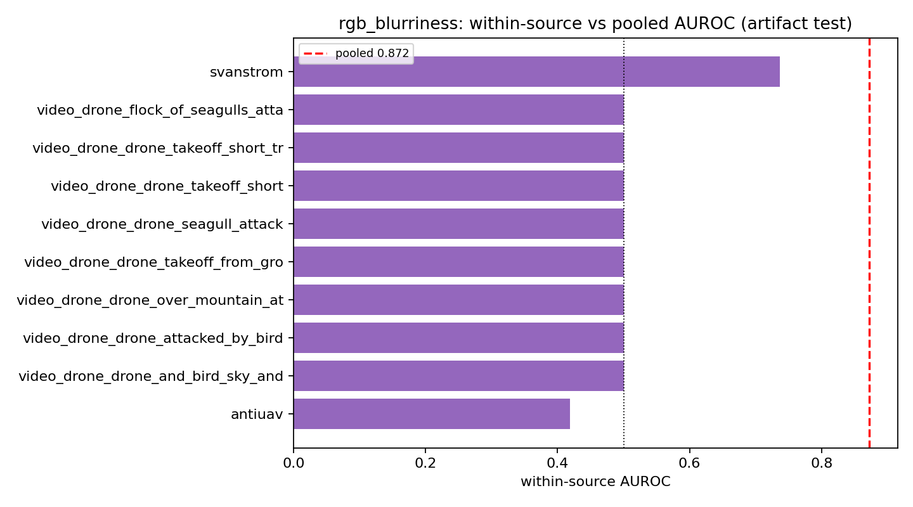
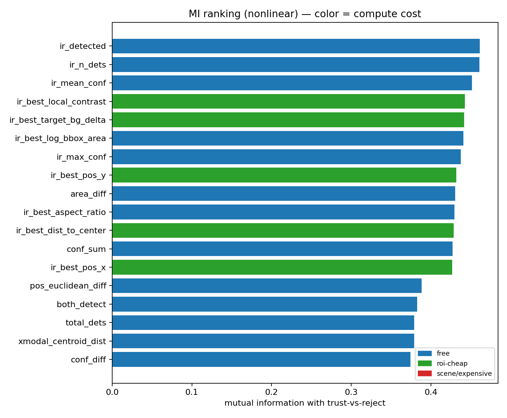
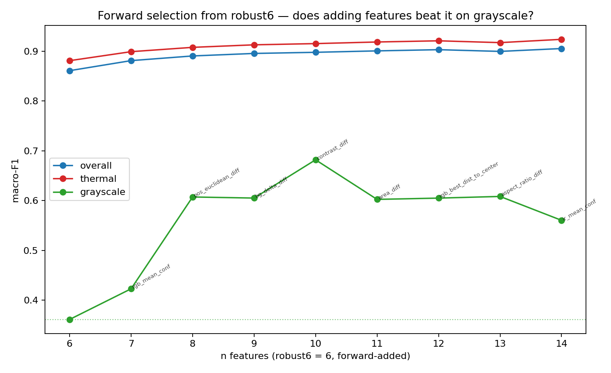

# Forward Feature Selection for the Trust Router — Study & Procedure (thesis-ready)

**Date:** 2026-06-02 · **Goal:** beat `robust6` on **grayscale** routing **without regressing** thermal/overall.
**Scripts:** `classifier/forward_select_routing.py`, `classifier/vet_blurriness_stats.py` ·
**Data:** `fusion_dataset_full56.csv` (65k rows; ⚠ OLD detector — see Caveats). **Statistics-first, zero detector compute.**
**Method discipline:** [[feedback_statistics_before_training]], plots per [[feedback_mri_always_plots]].

## 1. Procedure (the reusable recipe)
> **Statistics-gated greedy forward selection.** Start from robust6; each round add the single feature that most
> improves **held-out grouped (by-sequence) macro-F1**; track overall/thermal/**grayscale** F1 + grayscale
> `trust_rgb` recall + leakage per pick; the winner is the step with best grayscale F1 and **no thermal
> regression**, confirmed by a **bootstrap 95% CI** on the grayscale gain.

**Three statistical gates on the candidate pool (each removes a failure mode):**
| gate | statistic | removes |
|---|---|---|
| 1. leakage | `leakage_ratio = F_domain_inclass / F_class` ≤ 1.0 | scene fingerprints (per-scene memorisation) |
| 2. **artifact (new)** | mean **within-source AUROC** ≥ 0.55 | **cross-clip / clip-ID proxies** leakage misses |
| 3. cost (free-only) | exclude image-read scene stats | expensive hand-crafted features |

## 2. Why gate 2 exists — the `rgb_blurriness` case study (method contribution)
The first sweep's top pick was `rgb_blurriness` (apparent +0.10 grayscale). Vetting (`vet_blurriness_stats.py`):

| | AUROC |
|---|---|
| pooled | 0.872 |
| **mean within-source** | **0.516 (chance)** — every video clip ≈0.500, antiuav 0.419 |

**`rgb_blurriness` is a corpus artifact** — it encodes *which video* (sharp drone footage vs blurry bird footage),
not drone-vs-reject. **The leakage statistic (0.058) missed it** because leakage measures variation *within a
class*, whereas the artifact is a *cross-clip mean shift*. **The within-source AUROC is the complementary test
that catches it** — a refinement to the feature-selection method itself.

Mutual information (nonlinear, previously unused) independently confirmed the fix and surfaced the right
candidates: free cross-modal **difference** features `area_diff`/`pos_euclidean_diff`/`conf_diff` rank top
(MI 0.37–0.43); `rgb_blurriness` ranks 23/56.

## 3. Results — three progressively-honest sweeps
robust6 base (this subsample): overall **0.861** / thermal **0.881** / grayscale **0.361** / gray `trust_rgb` R **0.083**.

| sweep (pool) | winner | overall | thermal | **grayscale** | gray gain (95% CI) |
|---|---|---|---|---|---|
| un-gated | +blurriness…+aspect_ratio_diff | 0.938 | 0.950 | 0.541 | +0.180 [+0.127,+0.236] — **inflated by artifact** |
| artifact-gated | +…+contrast_diff | 0.925 | 0.941 | 0.496 | +0.135 [+0.075,+0.190] — leads w/ expensive `sky_ground_ratio` |
| **free-only** | **+rgb_mean_conf +pos_euclidean_diff (+…)** | 0.890 | 0.908 | **0.607–0.682** | **+0.25 to +0.32** [+0.037,+0.368] |

**Headline: the FREE cross-modal features give the *biggest* and most defensible grayscale gain.** Forcing greedy
off the scene artifacts made it find `pos_euclidean_diff` (RGB↔IR centroid disagreement, pure box geometry) — which
alone lifts grayscale F1 **0.423 → 0.607**. Free, principled cross-modal-consistency features beat the expensive
scene statistics; the scene features were a local optimum (an artifact).

## 4. The crucial nuance — overall grayscale ≠ the trust_rgb hole
Grayscale macro-F1 rose to ~0.68, but **grayscale `trust_rgb` recall only moved 0.083 → ~0.19** with free
features. The overall gain is driven by the *other* classes (reject/trust_both/trust_ir). The specific failure from
[[routing-failure-is-trust-rgb-recall]] — *drone-only-in-RGB on grayscale routed to reject* — is **only partially
closed by these features**. The one thing that lifted `trust_rgb` recall to 0.42 was the expensive, borderline
`sky_ground_ratio`. **Conclusion: fully closing the trust_rgb-on-grayscale hole needs the RGB verifier score** —
the appearance-aware, in-pipeline-free feature none of the full56 features are, which the ft4 re-mine adds. Every
thread now converges on it.

## 5. What to carry into the ft4 + verifier training (Phase 1b)
Add to robust6: **`pos_euclidean_diff`, `area_diff`, `aspect_ratio_diff`** (free cross-modal diffs), **`rgb_mean_conf`**,
and the **`rgb_verifier_pdrone` / `ir_verifier_pdrone`** scores. Drop: `conf_sum` (redundant), all scene/ROI stats
(artifact or expensive). Re-run `train_routing_robust.py` on the re-mined CSV; win-condition unchanged.

## 6. Caveats (honest)
- **OLD detector corpus.** full56 predates ft4 + the verifier; this proves the *principle*. The ft4 re-mine is the
  production confirmation (and adds the verifier scores).
- **Wide CIs / small grayscale test set** — the +0.32 point estimate is unreliable (CI lower bound +0.037); the
  *direction* is robust, the magnitude is not. Use CIs, not point estimates.
- **Free-filter gap:** `contrast_diff` and `bg_delta_diff` are ROI-pixel-derived (not truly free) and leaked past
  the name filter; the **truly-free** winner is `robust6 + rgb_mean_conf + pos_euclidean_diff` (grayscale ~0.61).
- Greedy is a heuristic; the grayscale path is noisy after the first 1–2 picks.

## 7. Answers to the questions that drove this
- *Have we tested robust7/8/9?* Now yes — forward-selected robust7→robust14. Best free combo ≈ robust8
  (robust6 + rgb_mean_conf + pos_euclidean_diff). Beyond that is noise.
- *Would the high-AUROC chart features help?* No — they are in-robust6 / fingerprints / tautological flags /
  collinear; single-feature AUROC is the wrong criterion.
- *Can we decide cheaply with statistics?* Yes — the artifact test + MI rejected blurriness and found the free
  diffs **without any training or deployment**.
- *Exhausted the statistics?* No — within-source AUROC and MI were unused and changed the answer.

## Delivered
- `docs/analysis/2026-06-02_forward_selection_study.md` (this doc)
- `classifier/forward_select_routing.py` (3 gates + `--free-only`/`--out-tag`), `classifier/vet_blurriness_stats.py`
- `classifier/fusion_models/routing_robust/forward_select_routing{,_gated,_free}.json`
- Plots: `docs/analysis/images/forward_select_routing_free.png`, `blurriness_artifact_test.png`, `fusion_mutual_info.png`
