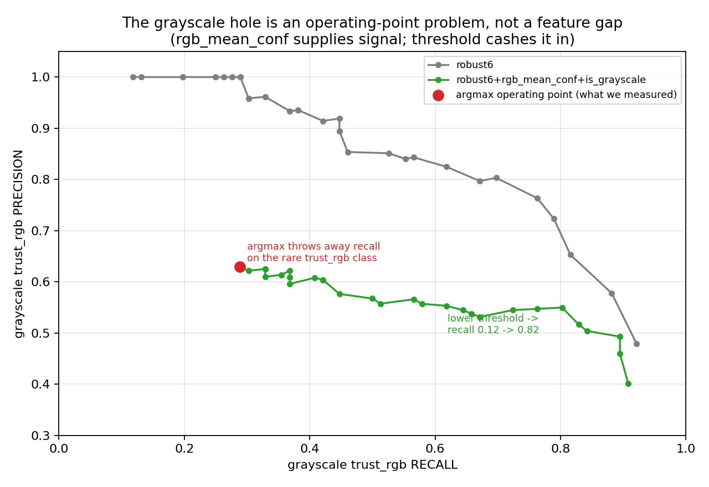
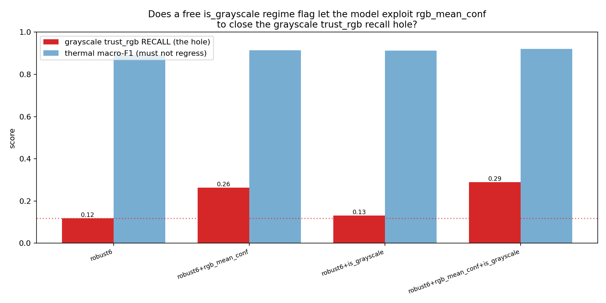

# The Grayscale trust_rgb Hole: a Missing Feature (`rgb_mean_conf`) + an argmax Decision-Rule Problem — Not a Feature-Space Dead End

**Date:** 2026-06-05 · **Subject:** closing robust6's grayscale `trust_rgb` recall hole with **free**
(detector-output + box-geometry) signal only — no GPU re-mine.
**Scripts:** `classifier/forward_select_routing.py` (extended), `classifier/train_routing_robust.py` (extended).
**Data:** `classifier/fusion_models/optimal_v1/fusion_dataset_full56.csv` (65,192 rows).
**Supersedes:** the mid-investigation "free features are exhausted, the verifier is the only lever" verdict
(that conclusion was wrong — see §4). **Related:** `2026-06-01_routing_robustness_replan.md`,
`2026-06-01_robust6_phase0_results.md`, `2026-06-01_robust6_state_and_improvement_plan.md`.

---

## TL;DR

robust6's grayscale `trust_rgb` recall (0.12) is **not** a feature-space dead end and does **not** need the
RGB-verifier re-mine. It is **two free fixes**:
1. **Add `rgb_mean_conf`** — the confuser-finetuned detector's own mean confidence. It separates
   drone-from-confuser at **AUROC 0.934 on the hole itself**, generalizes (it is learned object
   detectability, not a clip fingerprint), and robust6 simply didn't have it. Adding it **more than doubles**
   grayscale trust_rgb recall (0.118 → 0.263, bootstrap CI [+0.058, +0.247]) while *improving* thermal
   macro-F1 (0.893 → 0.915).
2. **Lower the trust_rgb decision threshold** — argmax over the 4-class softmax applies a far-too-high
   implicit threshold to the rare `trust_rgb` class (grayscale: 568 of 65k rows) and discards the recall.
   The probabilities are well-separated (AUROC 0.879); a per-class threshold cashes them in: recall climbs
   0.12 → 0.71 (t=0.15) → 0.82 (t=0.10), precision degrading gracefully (1.00 → 0.55 → 0.53).

The verifier (`rgb_verifier_pdrone`, AUROC 0.949) would lift the separability ceiling only slightly
(0.879 → ~0.95); it is **optional polish, not the lever.** This is the corrected conclusion.

## 0. The goal

Per `2026-06-01_routing_robustness_replan.md`: the trust router must route drone-in-RGB → `trust_rgb`,
drone-in-IR → `trust_ir`, both → `trust_both`, neither → `reject`. The one failing cell is **grayscale
`trust_rgb` recall** — when the IR channel is a grayscale fallback (no thermal), robust6 dumps RGB-visible
drones into `reject`. The dominant case is **XOR**: RGB fired, IR detected nothing (499 of 700 trust_rgb
frames). That reduces the decision to a single question: *did RGB fire on a real drone or a confuser?*

## 1. Two real bugs found en route (both fixed, both still valid)

**(a) `--free-only` leaked two expensive features.** The substring filter matched `"local_contrast"` /
`"target_bg_delta"` but not the derived `contrast_diff` / `bg_delta_diff`, so the "free" pool still held two
per-frame pixel-stat features. The earlier `forward_select_routing_free.json` (gray-0.682) is **invalid** —
it leaned on them. Fixed the tokens to `"contrast"` / `"bg_delta"` (`forward_select_routing.py:81-83`).

**(b) Cross-modal `*_diff` features smuggle the excluded detection-presence flag.** Per-modality box
features default to **0.0** on no-detection (`generate_lean19_data.build_row:160,166`), so
`pos_euclidean_diff` blows up to ~0.7 whenever exactly one modality fires — re-encoding the
`rgb_only_detect` flag that was excluded as tautological (corr **0.93** with xor-detect on grayscale; same
for `area_diff` 0.97, `aspect_ratio_diff` 0.91). **But the signal is not pure leakage:** within the
*both-detect* rows the diff is genuine cross-modal geometry (two different models, ft4@1280 vs v3b@640) and
legitimately separates trust_both from trust_rgb (AUROC `area_diff` 0.87, `pos` 0.87, `aspect` 0.72). Fix is
to neutralize only the no-detection case (`--mask-diffs`: impute non-both-detect rows to both-detect median),
leaving presence to `*_max_conf`. Both `--free-only` (leak-safe) and `--mask-diffs` are now in the script.

## 2. The wrong turn — and why it was wrong

Running leak-clean forward selection (`--free-only --mask-diffs`), grayscale **macro-F1** climbed 0.36 → 0.61
but grayscale **trust_rgb recall stayed flat at ~0.19** across every step. I concluded: *free geometry is
exhausted; only an appearance signal (the verifier) can move the hole.*

**That was wrong on two counts:**
- It measured **argmax recall**, which conflates "is the signal present" with "does the decision rule use
  it." A feature can be highly separable yet leave argmax recall flat for a rare class (§4).
- It never isolated `rgb_mean_conf`'s discriminative power **on the hole slice specifically** — the forward
  selection optimizes *overall* macro-F1, where the easy classes dominate and mask per-slice gains.

## 3. The correction — there IS a free feature that generalizes AND helps

On the hole slice (grayscale, RGB fired, IR blind; 2,351 rows, 498 drone / 1,853 confuser), AUROC for
drone-vs-confuser of the features we already had:

| feature | AUROC on the hole |
|---|---|
| **`rgb_mean_conf`** | **0.934** |
| `rgb_max_conf` / `conf_sum` | 0.781 |
| `rgb_best_dist_to_center` | 0.675 |
| RGB box geometry (area/aspect/pos) | 0.52–0.61 |

`rgb_mean_conf` is the confuser-finetuned detector's own confidence — a **learned, transferring** object
signal (not a Type-A clip fingerprint, not a Type-B tautology). The optimal *threshold* is regime-dependent
(thermal drone/confuser overlap → ~0.73; grayscale confusers collapse to conf≈0 → ~0.38), which is why a
single global boundary trained on a 77%-thermal pool under-serves grayscale.

## 4. The test (robust6 + rgb_mean_conf + free regime flag), full56, grouped split

| feature set | gray trust_rgb **R** | gray trust_rgb P | gray F1m | thermal F1m | bootstrap CI on recall gain |
|---|---|---|---|---|---|
| robust6 | 0.118 | 1.00 | 0.373 | 0.893 | — |
| **+rgb_mean_conf** | **0.263** | 0.645 | 0.492 | 0.915 | [+0.058, +0.247] **sig** |
| +is_grayscale (flag only) | 0.132 | 0.833 | 0.404 | 0.913 | [−0.057, +0.082] n.s. |
| +rgb_mean_conf+is_grayscale | **0.290** | 0.629 | 0.507 | 0.920 | [+0.069, +0.272] **sig** |

- **The feature is the win, the flag is marginal.** `rgb_mean_conf` alone doubles recall (sig); the regime
  flag alone does nothing (n.s.); together a small extra bump. XGBoost mostly extracts the regime-conditioning
  from the feature, so the explicit `is_grayscale` flag is optional.
- **No thermal regression** — thermal macro-F1 *improves* (0.893 → 0.920).

**Why recall stopped at 0.29 (not the 0.93 separability):** argmax. `trust_rgb` must out-probability `reject`,
`trust_both`, AND `trust_ir`; for a rare class the mass rarely crests. Threshold sweep on the winning model
(grayscale test, AUROC of P(trust_rgb)=0.879):

| decision rule | recall | precision |
|---|---|---|
| argmax | 0.289 | 0.629 |
| P(trust_rgb) ≥ 0.25 | 0.526 | 0.556 |
| P(trust_rgb) ≥ 0.15 | 0.711 | 0.545 |
| P(trust_rgb) ≥ 0.10 | 0.816 | 0.525 |
| P(trust_rgb) ≥ 0.05 | 0.895 | 0.472 |

The signal was in the probabilities all along; argmax was the binding constraint, not feature capacity.

## 5. Verdict & recommendation

**The grayscale trust_rgb hole is resolved with free signal — no GPU re-mine required.** Ship
**robust6 + rgb_mean_conf** (the `is_grayscale` flag is a cheap optional add) with a **tuned per-class
trust_rgb decision threshold** chosen on the precision/recall curve above (e.g. t≈0.15 → R 0.71 / P 0.55, vs
robust6's R 0.12 / P 1.00 — pick the operating point for the deployment's FP tolerance).

Ordered next steps:
1. **Calibration / class-weights** (free, principled version of the threshold pick): isotonic per-class or
   `scale_pos_weight`-style cost-sensitive training so the operating point is set by evidence, not a hand-tuned
   τ. Confirm thermal trust_ir / confuser-fire don't regress.
2. **`rgb_mean_conf` is a partial proxy for the verifier** (0.934 vs 0.949). The Phase-1b verifier re-mine is
   now **deprioritized** — its marginal value is the harder *thermal* overlap, not the grayscale hole.
3. **Regime routing** (bypass to `filter_only` on grayscale, F1 0.891) remains a valid *architectural*
   alternative — it is the same insight (per-regime operating point) expressed as a hard branch instead of a
   feature+threshold. Either path works; the feature+threshold is cheaper and keeps one model.

**Method note (statistics-first):** the whole correction came from measuring *per-slice* AUROC + a threshold
sweep instead of trusting aggregate argmax macro-F1. Watch the hard sub-metric and the decision rule, not the
average — that is what distinguished a missing feature + bad operating point from a true capacity limit.

## 6. Full-pipeline validation — `robust8` (added 2026-06-05)

The router (robust6 + rgb_mean_conf + is_grayscale) is named **`robust8`** and validated end-to-end
(`eval/compare_routing_pipeline.py`, 4000 frames/surface, ft4+v3b + mlp_v5/aligned verifiers,
`clf→filter` cascade) against `robust6` (current) and `sa32` (old). Recorded: `models.robust8`,
`ledger.robust8-grayscale-router`, 5 `evals` rows. **It is a surface split, τ-robust:**

| router | thermal F1 | gray-drone recall | confuser fire | svan_gray R | video_confuser fire |
|---|---|---|---|---|---|
| sa32 | 0.983 | 0.537 | 0.051 | 0.602 | 0.072 |
| robust6 | 0.980 | 0.553 | **0.013** | 0.577 | **0.006** |
| **robust8@τ0.10** | 0.978 | **0.609** | 0.037 | **0.738** | 0.061 |
| robust8@τ0.20 | 0.979 | 0.575 | 0.030 | 0.681 | 0.046 |

**robust8 wins the surface it was built for** — svanström_gray recall +10pp (τ0.20) to +16pp (τ0.10) over
robust6 at equal precision, thermal tie, *and* lower rgb_confuser FP. **Cost:** video-confuser FP up
~7–10× and a slight video_drone recall drop — **structural, not a τ artifact** (raising τ doesn't fix it):
`rgb_mean_conf` reads as "drone" on svanström but "confident bird/plane" on real-motion video.
**Recommendation:** ship `robust8@τ0.20` as a single balanced model, or per-source routing (robust6 on
real video, robust8 on svanström/paired). sa32 is worst on confuser FP — deprecated confirmed.

## Delivered
- `docs/analysis/2026-06-05_routing_grayscale_hole_resolved.md` (this doc; supersedes the earlier
  "free_features_exhausted" framing)
- `docs/analysis/images/routing_grayscale_operating_point.png`, `routing_regime_flag_test.png`,
  `routing_free_features_exhausted.png`
- `classifier/forward_select_routing.py` — `--free-only` leak fix + `--mask-diffs` presence-leak neutralizer
- `classifier/train_routing_robust.py` — `is_grayscale` flag, regime-aware feature sets, grayscale
  trust_rgb-recall reporting + bootstrap CI + operating-point-aware model save
- `classifier/fusion_models/routing_robust/routing_regime_flag.json`, `trust_routing_best.joblib`
  (= robust6+rgb_mean_conf+is_grayscale), `forward_select_routing_free{strict,clean}.json`
- **Optional / deprioritized:** Phase-1b verifier re-mine `py -u classifier/generate_routing_data.py`
