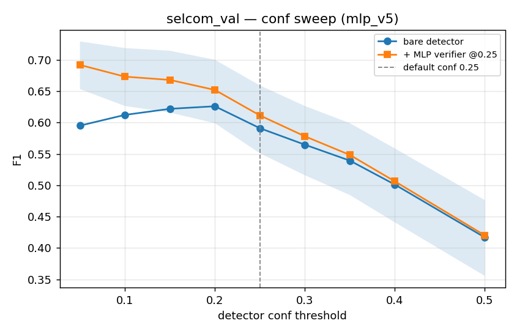
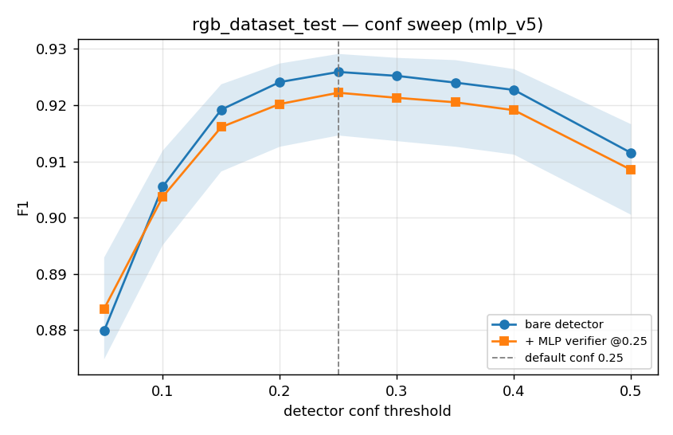
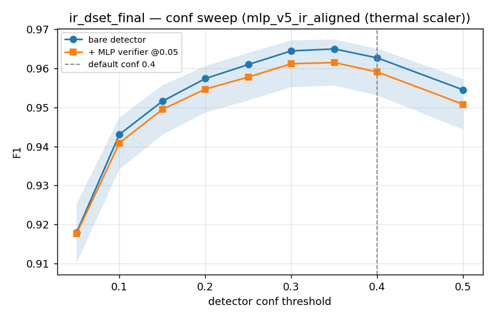
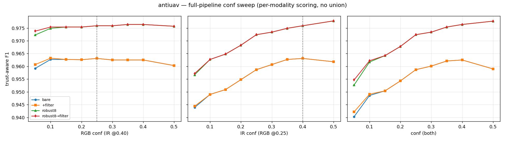
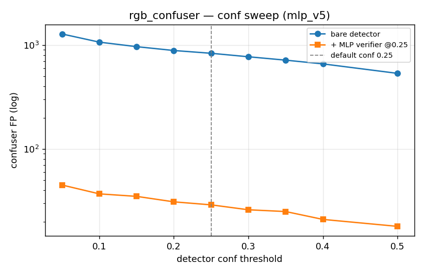
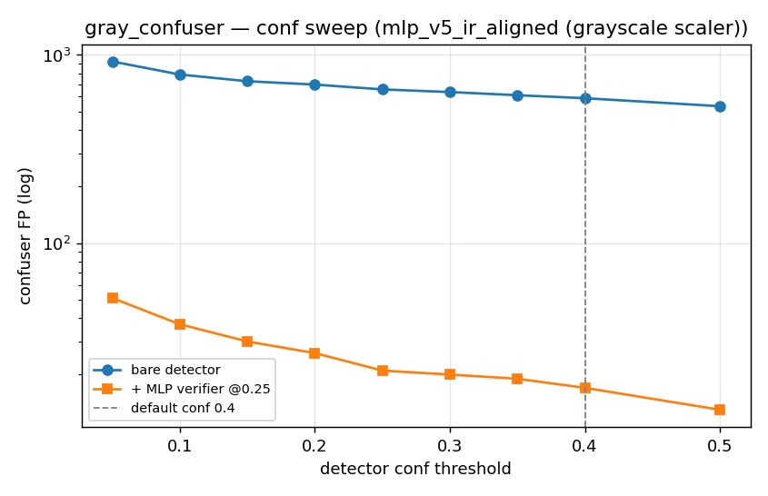
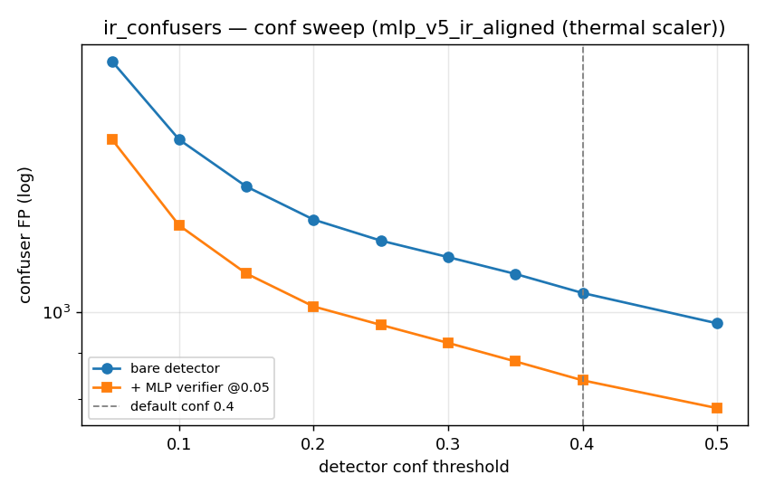
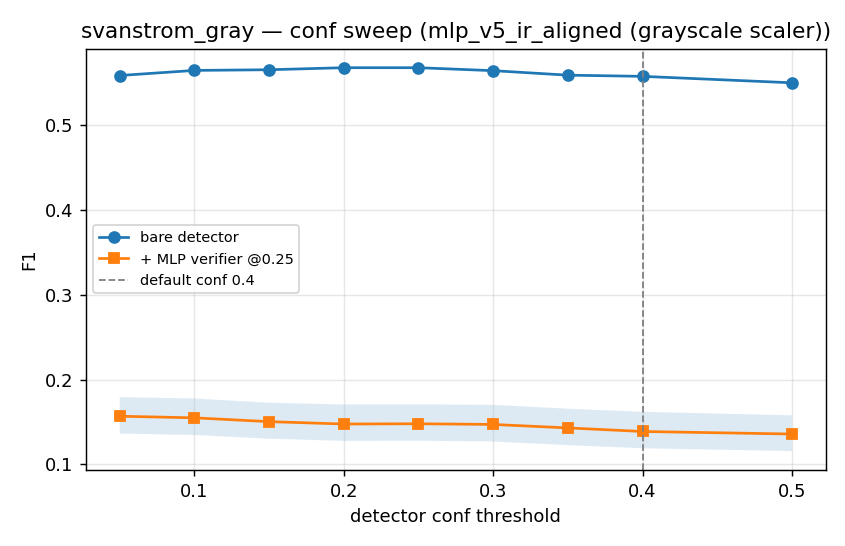

# Confidence sweep × MLP verifier: does "more recall + filter" beat the production defaults?

**Date:** 2026-06-11
**Question:** Lowering the detector confidence floor buys recall but floods FP. Can the MLP
verifier absorb that flood, so that a low-conf + filter operating point beats the production
defaults (`rgb_conf=0.25`, `ir_conf=0.40`, from `ir_gui/fusion_settings.json`)?
**Method:** One-time low-conf re-detect (floor 0.05, `--no-patch`) into `thesis_eval/cache_conf005/`
via `pipeline_cache_unified.py --conf 0.05`, then zero-GPU sweep replay
(`thesis_eval/conf_sweep_replay.py`): conf grid 0.05–0.50 × {bare, +MLP verifier} per surface,
verifier-threshold side grid {0.10, 0.15, 0.25, 0.40, 0.60}, Anti-UAV full pipeline
(bare → +filter → robust8 → robust8→filter, trust-aware per-modality scoring, robust8 f8 rows
recomputed from the conf-masked detections) on three slices (RGB sweep @IR 0.40, IR sweep
@RGB 0.25, diagonal). 95% bootstrap CIs (frame resample, 1000 iters).
**Validation:** at the 0.25 floor the replay reproduces the locked Tier-1 numbers exactly
(selcom bare F1 0.5911; rgb_confuser 835→29 FP; svanstrom_gray filt 0.139 ≈ Tier-1 0.1388).

Full tables: `thesis_eval/results/conf_sweep/conf_sweep_results.{md,json}`.

---

## Verdict by surface

| Surface | Hypothesis works? | Best point | vs default | Takeaway |
|---|---|---|---|---|
| **selcom_val** (OOD hard RGB) | **YES — headline** | conf **0.05** + mlp_v5@0.25 → **F1 0.692** | bare@0.25 = 0.591 (**+10.1pp**), filt@0.25 = 0.612 (+8.1pp) | Recall 0.451→**0.678** (+22.7pp); filter lifts precision 0.53→0.71. Monotone: every step down in conf helps. |
| rgb_dataset_test (in-domain RGB) | **NO** | bare@0.25 = 0.926 (the default) | filter costs **−11.7pp** at any conf | The known v5 in-domain carve-out, reproduced. Keep bare + default. |
| ir_dset_final (IR drones) | marginal | bare@0.30–0.35 = 0.965 | bare@0.40 = 0.963 (+0.2pp, inside CI) | Slight room to drop IR 0.40→0.35; aligned filter is ≈neutral (−0.3pp). |
| **antiuav** (paired, full pipeline) | **NO — saturated** | robust8→filter, defaults = 0.976 | max anywhere 0.978 (IR@0.5), CIs all overlap | Defaults are already optimal; lowering either conf only hurts (IR@0.05 → 0.957). |
| **rgb_confuser** | filter holds | conf 0.05+filter: 1281→**45 FP** (96.5% suppr.) | default+filter = 29 FP | Recall-mode costs only +16 FP / fire 1.1%→1.6%. Low conf is SAFE on RGB confusers. |
| gray_confuser | filter holds | conf 0.05+filter: 923→**51 FP** | default+filter = 17 FP | aligned_gray suppresses 94.5% even at floor conf. |
| ir_confusers (thermal) | **NO** | — | filter removes only ~18–20% at any conf | Bare FP balloons 1051→1911 when IR drops 0.40→0.05 and the thermal filter can't absorb it. Don't lower IR conf. |
| svanstrom_gray (gray drones) | **NO — filter broken here** | bare@0.20–0.25 = 0.568 | filter F1 0.13 (recall 0.62→**0.075**) | aligned_gray over-vetoes real drones at every threshold (matches Tier-1; thr 0.02 still R 0.27). Pre-existing open thread, not a sweep artifact. |

## The headline finding (selcom)

| conf | bare P/R/F1 | +mlp_v5 P/R/F1 |
|---|---|---|
| 0.25 (default) | 0.858 / 0.451 / 0.591 | 0.950 / 0.451 / 0.612 |
| 0.10 | 0.658 / 0.573 / 0.612 | 0.816 / 0.573 / 0.673 |
| **0.05** | 0.531 / 0.678 / 0.595 | **0.707 / 0.678 / 0.692** [0.654–0.730] |

The filter is **recall-transparent on selcom** (R identical bare vs filtered at every conf) while
restoring most of the precision lost to the low floor — exactly the mechanism the hypothesis
predicted. At conf 0.05 the verifier-thr grid peaks at 0.6 → **0.696** (thr barely matters, 0.649–0.696).
CI caveat: new best [0.654–0.730] vs default-filtered [0.551–0.659] — overlap is marginal;
vs default-bare 0.591 the gain is clean.

## Why no single global setting falls out

The same low-conf+filter move that gains +10pp on selcom loses −12.5pp on in-domain RGB
(filt@0.05 = 0.801 vs bare@0.25 = 0.926), because the v5 carve-out (verifier kills in-domain
recall) dominates there. The recall+filter regime is an **OOD/hard-domain operating mode**, not a
global default:

- **OOD / hard RGB (selcom-like):** rgb_conf 0.05–0.10 + mlp_v5 → +8–10pp F1, confuser-safe (45 FP).
- **In-domain RGB:** keep bare @0.25 (no filter).
- **IR (thermal):** keep 0.40 (0.35 acceptable); never lower — thermal filter too weak to absorb FP.
- **Paired Anti-UAV pipeline:** keep defaults; the dataset is saturated (robust8→filter 0.976).
- **Grayscale:** confuser side excellent; drone side blocked by the aligned_gray over-veto (open).

## Figures

## Caveats

- Anti-UAV n=500 (user-requested screening size); all other surfaces match Tier-1 n (even-strided).
- Low-conf cache built with `--no-patch` → patch-verifier cells are not in this sweep (MLP only).
- svanstrom_gray "n_source 28710" vs Tier-1 "4000 of 4000": the Tier-1 meta under-reported
  n_source for pre-listed pair iterators; frame sets are the same even-stride sample.
- robust8 labels recomputed from conf-masked f8 rows (pixel-free cols, parity asserted) — the
  classifier sees the same feature regime it was trained on only at 0.25; treat sub-0.25
  classifier cells as the deployed-behavior estimate, not a retraining claim.

## Delivered

- `C:\Users\User\Desktop\UNISA projects\Drone detection\es proj 3 thesis workspace\ES_Drone_Detection\thesis_eval\conf_sweep_replay.py` (new, recorded)
- `C:\Users\User\Desktop\UNISA projects\Drone detection\es proj 3 thesis workspace\ES_Drone_Detection\thesis_eval\pipeline_cache_unified.py` (extended: `--conf`, `--cache-dir`, `--no-patch`)
- `C:\Users\User\Desktop\UNISA projects\Drone detection\es proj 3 thesis workspace\ES_Drone_Detection\thesis_eval\cache_conf005\` (8 surfaces, floor 0.05)
- `C:\Users\User\Desktop\UNISA projects\Drone detection\es proj 3 thesis workspace\ES_Drone_Detection\thesis_eval\results\conf_sweep\conf_sweep_results.md` + `.json`
- `C:\Users\User\Desktop\UNISA projects\Drone detection\es proj 3 thesis workspace\ES_Drone_Detection\docs\analysis\images\conf_sweep\*.png` (8 figures)
- This document.
