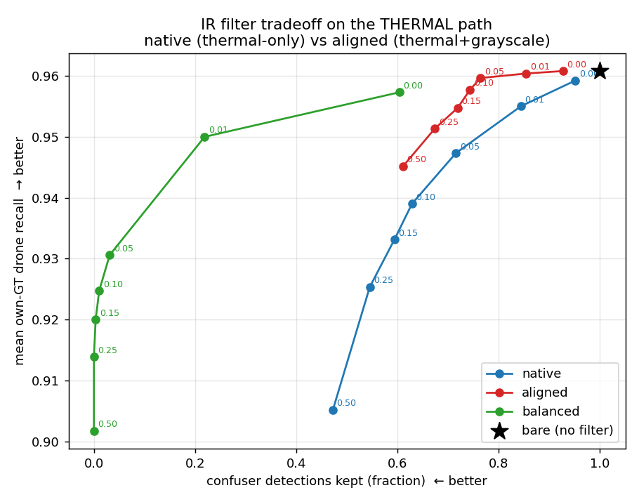
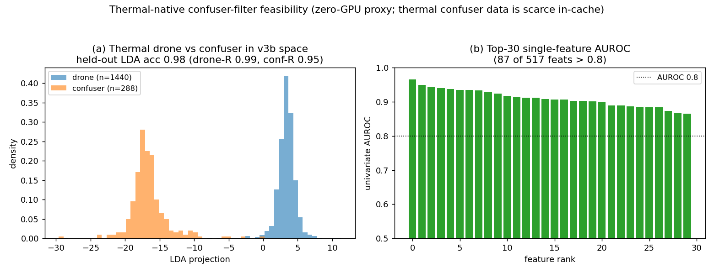

# IR filter: is it redundant? does grayscale ruin it? is the native filter better?

**Date:** 2026-06-17 · **Scope:** trust-aware / own-GT, THERMAL path only · **Status:**
diagnose + recommend (no reship). Recommendation: **keep the aligned filter.**

## Questions (from the user) → answers
1. **Is the IR (aligned) filter redundant on thermal?** **No** — bare keeps 100 % of thermal
   confuser detections; the filters remove **24–53 %**. But the absolute thermal confuser problem
   is **small** (288 confuser detections / 1000 imgs = 0.288 halluc/img bare, **~76 % airplane**),
   and the residual is dominated by **thermal airplanes** the filter is OOD to (per
   `notes_round1_results.json`: airplane fire only 0.352→0.278).
2. **Does adding grayscale ruin the thermal filter? / Is the native filter better?** **No, and no
   at any sensible operating point.** The grayscale-aligned filter is **more recall-safe** and at
   matched recall removes **≥ as many** confusers. Native only removes more confusers by
   **sacrificing ≥4 pp drone recall**.
3. **Is a thermal-native filter feasible?** **Yes in principle** (thermal feature space separates
   drone vs confuser, held-out LDA 98 %), but the confuser data is **scarce** and the problem is
   **small** → **low priority** unless thermal-airplane FPs specifically matter.

## Setup
`eval/ir_native_vs_aligned_offline.py` (zero-GPU) replays both filters over the cached thermal
surfaces, feeding RAW v3b 517-D features to each (each applies its own internal scaler), swept over
P(drone) thresholds so the two are compared on the **same recall-vs-confuser-fire tradeoff**:
- **native** = `eval/results/_v5_ir_p3p5_v3b/classifiers/mlp_v5_ir.pt` (thermal-only distill)
- **aligned** = `models/verifiers/ir_aligned/mlp_aligned.pt` (thermal + grayscale-harvested
  confusers, per-modality z-aligned — the shipped filter)
- Drone surfaces (own-GT recall): antiuav_ir, ir_dset_final, svanstrom_ir, ir_video.
  Confuser surface (kept-fraction): ir_confusers.

## Result — tradeoff (own-GT)
| variant | mean drone R | confuser kept |
|---|---|---|
| bare (no filter) | **0.961** | 1.000 |
| native @0.05 | 0.947 | 0.715 |
| native @0.25 | 0.925 | 0.545 |
| native @0.50 | 0.905 | 0.472 |
| aligned @0.05 | 0.960 | 0.764 |
| aligned @0.25 | 0.951 | 0.674 |
| aligned @0.50 | **0.945** | 0.611 |

Readings:
- **At matched recall** (R≈0.947): aligned@0.40 keeps **0.632** confusers vs native@0.05 **0.715**
  — aligned removes *more* confusers at the same recall.
- **At matched confuser-kept** (≈0.715): aligned@0.15 gives R **0.955** vs native@0.05 **0.947** —
  aligned keeps *more* drones at the same confuser cost.
- Aligned stays **recall-safe everywhere** (per-surface worst: ir_dset_final 0.917 @0.50 vs bare
  0.969). Native's recall cost concentrates on **ir_dset_final** (0.969→**0.834** @0.50, −13.5 pp)
  and antiuav_ir (−7.3 pp). svanstrom_ir / ir_video are untouched by both.
- So **grayscale-harvesting did not degrade the thermal filter** — it made it *more* recall-safe
  while staying competitive on confuser removal. Native only "wins" in an aggressive low-recall
  regime (confuser-kept 0.47 @ R 0.905) that trades away drone recall we want to keep.

This ties to the MRI z-shift result (`mri/modality_align.py`): the gray↔thermal gap is a per-
feature affine offset, so per-modality z-scoring lets gray-harvested confusers train a thermal-
deployable boundary without dragging the thermal drone manifold — exactly the recall-safety seen
above.

## Thermal-native feasibility (zero-GPU proxy)
`mri/diagnose_thermal_native_feasibility.py`: thermal drone feats (GT-matched, n=2934) vs thermal
confuser feats (ir_confusers, n=**288**, ~76 % airplane) in v3b space:
- univariate AUROC **max 0.966**; **87/517** features >0.8; 218 >0.7.
- **held-out** LDA (70/30): test acc **0.981** (drone-recall 0.986, confuser-recall 0.954).

So thermal feature space **does** separate drone from confuser — a thermal-native filter is
feasible. **But:** (i) the in-cache thermal confuser data is scarce (288 dets — this is a data-
limited proxy; the larger labelled set `G:/drone/IR_confusers` = airplane 4281 / bird 1200 / heli
457 needs GPU feature extraction), and (ii) the absolute thermal confuser problem is small and the
aligned filter already halves it recall-safely. **Net: feasible, low priority.**

## Recommendation
- **Keep the aligned filter** as the shipped IR verifier. It is not redundant (halves thermal
  confuser fire), grayscale-harvesting did not hurt it (it is the *more* recall-safe of the two),
  and the native filter is not better at deployment-relevant operating points.
- The only residual weakness is **thermal airplanes** (neither filter fully removes them).

## GPU follow-ups (PROPOSE only — gated on user; not run)
1. **Clean same-recipe A/B** (confirms the native-vs-aligned proxy above with identical training):
   `py -m mri.train_aligned --no-gray` (thermal-only counterfactual, CBAM held out), then
   `mri.cli --holdout-eval` on CBAM. Payoff: a like-for-like "did grayscale help/hurt" number.
2. **Thermal-native filter on the labelled crops** (only if thermal-airplane FP becomes a priority):
   extract v3b feats from `G:/drone/IR_confusers` (5,938 crops, by prefix) + train a thermal-native
   confuser filter; compare airplane-fire vs aligned. Feasibility signal supports it (held-out LDA
   0.98), but expected absolute gain is small.

## Delivered
- `C:\Users\User\Desktop\UNISA projects\Drone detection\es proj 3 thesis workspace\ES_Drone_Thesis\eval\ir_native_vs_aligned_offline.py` (new; reuses pipeline_eval_offline machinery)
- `C:\Users\User\Desktop\UNISA projects\Drone detection\es proj 3 thesis workspace\ES_Drone_Thesis\mri\diagnose_thermal_native_feasibility.py` (new)
- `C:\Users\User\Desktop\UNISA projects\Drone detection\es proj 3 thesis workspace\ES_Drone_Thesis\eval\results\_offline_pipeline\ir_native_vs_aligned.{md,json}`
- `C:\Users\User\Desktop\UNISA projects\Drone detection\es proj 3 thesis workspace\ES_Drone_Thesis\docs\analysis\2026-06-17_ir_thermal_native_feasibility.json`
- `C:\Users\User\Desktop\UNISA projects\Drone detection\es proj 3 thesis workspace\ES_Drone_Thesis\docs\analysis\images\2026-06-17_ir_native_vs_aligned.png`
- `C:\Users\User\Desktop\UNISA projects\Drone detection\es proj 3 thesis workspace\ES_Drone_Thesis\docs\analysis\images\2026-06-17_ir_thermal_native_feasibility.png`
- `C:\Users\User\Desktop\UNISA projects\Drone detection\es proj 3 thesis workspace\ES_Drone_Thesis\docs\analysis\2026-06-17_ir_filter_native_vs_aligned.md` (this file)
