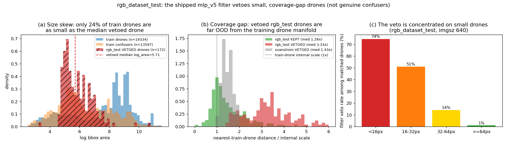

# Why the RGB filter (mlp_v5) vetoes real drones on rgb_dataset_test — mechanism + fix

**Date:** 2026-06-17 · **Scope:** trust-aware / own-GT only (a filter only removes
detections; it cannot raise recall). **Status:** mechanism nailed (zero-GPU); fix is a
size×source-balanced retrain (GPU, gated on user).

## TL;DR
The shipped RGB filter `mlp_v5` (accept if P(drone) ≥ 0.25) vetoes **22.3 % of real drone
detections on rgb_dataset_test** (172/772) — almost all of them **small** drones (sub-16 px
veto **74 %**). The vetoed drones are **not confuser-like**; they are a **coverage gap**: they
sit **3.33× the internal train-drone scale** away from any training drone (vs 1.26× for the
kept drones, and 1.43× for Svanström's vetoed tail), in a region of feature space whose nearest
training neighbours are **55 % confusers**. Root cause: the filter's distill corpus collected
rgb_dataset drones via an **8000-drone quota with an alphabetical, stride-8 scan**, which
front-loaded large/easy early-alphabet drones and **under-covered the small-drone tail** (e.g.
`wosdetc`, which sorts late and is small-drone heavy). It is **not** a raw-count shortage —
rgb_dataset is already ~49 % of all training drones. **imgsz is refuted** (1280 is *worse*).
**Fix:** re-mine + retrain with the corpus **balanced jointly by source × drone-size**
(confusers protected) so the small-drone manifold is populated. This is the user-approved lever.

## The regression (recap, own-GT)
- rgb_dataset_test: filter costs −11.7 pp F1; sub-16 px recall 0.782 → 0.256 (thesis numbers).
- Filter TP-veto rate by surface: **rgb_dataset_test 22.3 %**, Svanström 7.7 %, Selcom 0 %
  (Selcom is in the filter's training corpus).

## Mechanism — coverage gap, not confuser-like
`eval/diagnose_rgbtest_veto_mechanism.py` splits GT-matched real-drone detections into KEPT
(P≥0.25) vs VETOED and locates each group in the filter's **scaled training manifold**
(train manifold: 19,334 drones / 13,597 confusers; median internal train-drone NN dist 7.79):

| group | n | conf | log_area | dist→drone | dist→confuser | closer-to-confuser | 20-NN confuser-frac | **nearest-train-drone (ratio)** |
|---|---|---|---|---|---|---|---|---|
| rgb_test **KEPT** | 600 | 0.786 | 8.27 | 23.2 | 26.1 | 16 % | 12 % | 9.85 (**1.26×**) |
| rgb_test **VETOED** | 172 | 0.676 | 5.88 | 38.6 | 40.2 | 11 % | **55 %** | 25.91 (**3.33×**) |
| svanstrom KEPT | 362 | 0.732 | 5.07 | 20.4 | 19.4 | 69 % | 13 % | 0.00 (0.00×, in-corpus) |
| svanstrom VETOED | 30 | 0.612 | 4.49 | 17.6 | 16.8 | 67 % | 62 % | 11.13 (**1.43×**) |

Reading:
- The vetoed rgb_test drones are **far from BOTH** class centroids and **3.33× OOD** from the
  training drone manifold — an appearance the filter barely saw. (Svanström's vetoed tail is
  only 1.43× OOD, and its KEPT drones are *in* the corpus at 0.00×.) → **mechanism (b), coverage
  gap**, not (a) "confuser-like drones the boundary correctly clips".
- In that under-covered region the nearest training samples are **55 % confusers**, so the
  precision-tuned boundary defaults to "reject" there. The vetoed drones *resemble the trained
  hard-neg confusers* only because the region was populated by confusers, not drones.

## Root cause — a size×source coverage skew in the distill corpus
Parent distill recipe (`_v5_p3p5_ft4_distill/training_meta.json`, read from the frozen old dir):
rgb_dataset contributed **9,500 drones** (`rgb_dataset_train` **8,000 — hit its quota exactly** +
`rgb_dataset_val` 1,500) of the 19,334 training drones = **~49 %**. So count is not the problem.
The collector (`collect_from_source`) scans `sorted(images)` at **stride 8** and stops adding
drones once the **8,000 quota** is met. rgb_dataset_test is a heterogeneous union (anti, wosdetc,
anti-muav-roboflow, AirBird, mav_vid, FBD-SV_bird, dut, BDD, VIRAT, UA-DETRAC); the small-drone-
heavy sources sort late, so the 8,000 collected drones are **front-loaded onto early-alphabet,
larger drones** and the small tail is starved.

The size distribution proves the skew (from the shipped corpus, meta-first `log_area`):
- Only **24.2 %** of training drones are as small as the **median vetoed drone** (log_area 5.71),
  vs **43.8 %** of training **confusers**. → At the size of the drones being vetoed, the training
  data is **confuser-dominated**, so the boundary there is owned by "reject".
- Per-size filter veto rate among detector-matched drones (imgsz 640):
  **<16 px 74 %**, 16–32 px 51 %, 32–64 px 14 %, ≥64 px 1 %.

## imgsz is refuted (do NOT add a "filter trained at 1280" caveat)
`eval/diagnose_rgbtest_imgsz_640_vs_1280.py` (`2026-06-17_rgbtest_imgsz_640_vs_1280.json`): going
640→1280 makes the filter **worse** — filter-kept recall 372/512 → 295/510 matched; the *extra*
veto lands on **large** drones (≥64 px veto 1.0 % → 24.6 %), while detector recall is flat. The
RGB test set is already high-res, so resolution is not the lever. The thesis prose attributing
the drop to small-drone/domain coverage (no imgsz claim) is correct.

## Verdict & fix
**Verdict:** (b) coverage gap from a size×source skew in the distill corpus — the filter never
populated the small-drone manifold for rgb_dataset, so it rejects there. Confirmed by OOD ratio
(3.33×), the size distribution (24 % drone vs 44 % confuser at the vetoed size), and per-size veto
(74 % sub-16 px).

**Fix (user-approved lever, GPU — gated):** re-mine + retrain `mlp_v5` with the drone corpus
**balanced jointly by (source × size-bucket)**, oversampling the small/late-alphabet tail
(wosdetc et al.), with the **confuser corpus protected** (kept, capped, not diluted) so precision
on rgb_confuser / rgb_bird_confuser holds. **Acceptance bar:** recover rgb_dataset_test drone
recall toward detector level while holding confuser-FP rejection and Svanström/Selcom. The
balanced distill builder + the exact GPU command are in
`2026-06-17_rgbtest_filter_regression_FIX.md` (see Phase 3 hand-off).

## Delivered
- `C:\Users\User\Desktop\UNISA projects\Drone detection\es proj 3 thesis workspace\ES_Drone_Thesis\eval\diagnose_rgbtest_veto_mechanism.py` (mechanism; ready, meta-first)
- `C:\Users\User\Desktop\UNISA projects\Drone detection\es proj 3 thesis workspace\ES_Drone_Thesis\eval\diagnose_rgbtest_veto_figures.py` (figures + stats; new)
- `C:\Users\User\Desktop\UNISA projects\Drone detection\es proj 3 thesis workspace\ES_Drone_Thesis\docs\analysis\images\2026-06-17_rgbtest_veto_mechanism.png`
- `C:\Users\User\Desktop\UNISA projects\Drone detection\es proj 3 thesis workspace\ES_Drone_Thesis\docs\analysis\2026-06-17_rgbtest_veto_stats.json`
- `C:\Users\User\Desktop\UNISA projects\Drone detection\es proj 3 thesis workspace\ES_Drone_Thesis\docs\analysis\2026-06-17_rgbtest_filter_regression.md` (this file)
- Source evidence (read-only): `ES_Drone_Detection\eval\results\_v5_p3p5_ft4_distill\training_meta.json` (parent per-source counts)
