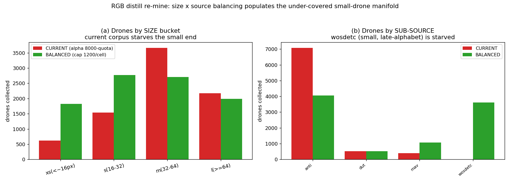

# FIX hand-off: size×source-balanced re-mine of the RGB filter (GPU — user runs)

**Date:** 2026-06-17 · Pairs with `2026-06-17_rgbtest_filter_regression.md` (the diagnosis).
**Scope:** own-GT. **You run the GPU job; everything here is authored + dry-run-verified zero-GPU.**

## The fix in one line
Re-mine the RGB filter distill corpus with rgb_dataset **drones balanced jointly by
(sub-source × detection size-bucket)** so the under-covered small-drone manifold is populated,
**leaving the confuser corpus and all other sources unchanged**, then retrain → `mlp_v5_balanced.pt`.

## Why (dry-run evidence, zero-GPU — `eval/rgbtest_balanced_quota_dryrun.py`)
The shipped corpus's rgb_dataset drones came from an alphabetical, stride-8, **8000-drone quota**.
Alphabetical order is `AirBird, BDD100K, FBD, UA, VIRAT, anti, dut, mav, wosdetc` (the uppercase
bird/vehicle sets carry ~0 drone GT). So the 8000 fill on **anti (7079) + dut (525) + mav (396)**
and **never reach `wosdetc`** — the largest small-drone source.

| sub-source | drone supply | CURRENT (8000-quota) | BALANCED (cap 1200/cell) |
|---|---|---|---|
| anti | 7079 | **7079** | 4065 |
| dut | 525 | 525 | 525 |
| mav | 1078 | 396 | 1078 |
| **wosdetc** | 5943 | **0** | **3618** |

| size bucket | supply | CURRENT | BALANCED |
|---|---|---|---|
| xs (<~16px) | 2654 | **618** (23%) | **1821** |
| s (16–32) | 4303 | 1542 | 2768 |
| m (32–64) | 4946 | 3663 | 2710 |
| l (≥64) | 2722 | 2177 | 1987 |
| **total** | 14625 | 8000 | 9286 |

Balancing triples the xs drones (618→1821), brings wosdetc 0→3618, caps anti's dominance, and keeps
the total comparable (so the confuser ratio is not diluted). This directly fills the 3.33×-OOD,
55%-confuser-neighbourhood region the filter was vetoing.



## Run it (GPU)
```powershell
py eval/distill_v5_balanced_remine.py                 # full re-mine + train (full stride-8 scan of rgb_dataset)
#   options: --per-cell-cap 1200 (default) ; --quick (smoke ~10 min)
```
- Reuses the production recipe (FT4 R3 detector, p3@2×2 + p5@1×1 = 517-D, focal+BN MLP, 5-fold CV
  best) via `distill_v5_p3p5_ft4` primitives — **only** the rgb_dataset drone collection changed.
- Confusers: **protected** — rgb_dataset confuser mining (flat 3000) and the full OOD hard-neg
  corpus (rgb_confusers_merged, rgb_video AIRPLANE/BIRD/HELI, etc.) are mined exactly as production.
- Output: `eval/results/_v5_balanced_remine/classifiers/mlp_v5_balanced.pt` (+ `training_data.npz`,
  `training_meta.json` with per-cell counts). Drop-in checkpoint schema (GUI/eval load unchanged).
- Cost: a full stride-8 scan of rgb_dataset (~17k imgs) + the other sources ≈ comparable to the
  original distill's Phase-1 (tens of minutes on GPU), then a few minutes to train.

## Acceptance bar (verify zero-GPU after the run)
Goal: **recover rgb_dataset_test drone recall toward detector level while holding confuser-FP
rejection** (rgb_confuser, rgb_bird_confuser) and Svanström/Selcom.
1. Re-run the mechanism diagnostic against the new weight (point `MLP_V5` in
   `eval/diagnose_rgbtest_veto_mechanism.py` at `…/_v5_balanced_remine/classifiers/mlp_v5_balanced.pt`):
   the rgb_test VETOED group's OOD ratio and veto rate should drop sharply (target sub-16px veto
   ≪ 74%).
2. Re-run the offline verifier matrix (`eval/pipeline_eval_offline.py` with the new weight wired as
   the RGB MLP) on rgb_dataset_test + rgb_confuser + rgb_bird_confuser + svanstrom + selcom; confirm
   rgb_dataset_test F1/recall up, confuser halluc/img **not worse**, svan/selcom non-regressed.
3. Only if (1)+(2) pass: promote `mlp_v5_balanced.pt` → `models/verifiers/rgb_v5/` and update the
   GUI/eval pointer. (Reship is a separate, user-gated step.)
If the bar isn't met, tune `--per-cell-cap` (higher = more small-drone emphasis) and/or add a
small-drone sample weight, and repeat.

## Delivered
- `…\ES_Drone_Thesis\eval\rgbtest_balanced_quota_dryrun.py` (zero-GPU dry-run; new)
- `…\ES_Drone_Thesis\eval\distill_v5_balanced_remine.py` (GPU re-mine + train; new, reuses distill primitives)
- `…\ES_Drone_Thesis\docs\analysis\images\2026-06-17_rgbtest_balanced_quota.png`
- `…\ES_Drone_Thesis\docs\analysis\2026-06-17_rgbtest_balanced_quota.json`
- `…\ES_Drone_Thesis\docs\analysis\2026-06-17_rgbtest_filter_regression_FIX.md` (this file)
