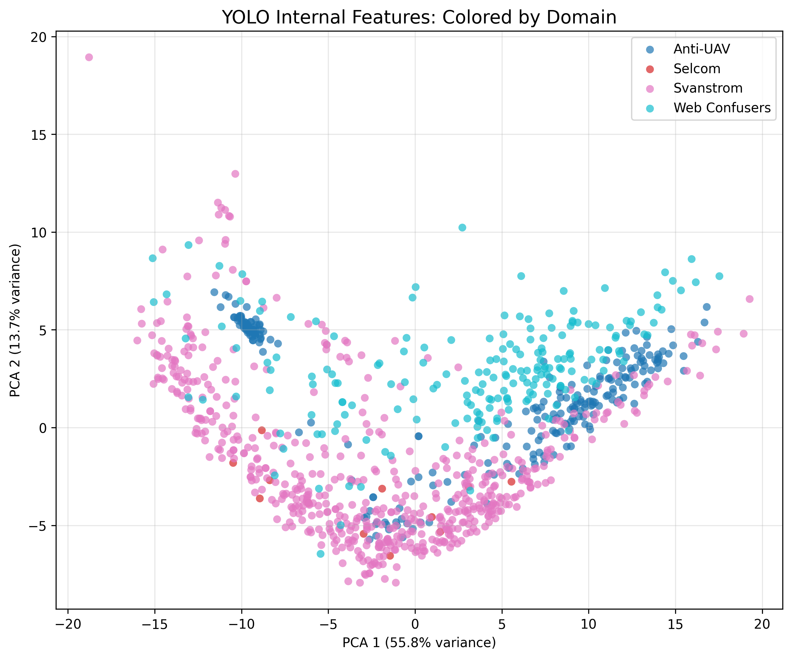
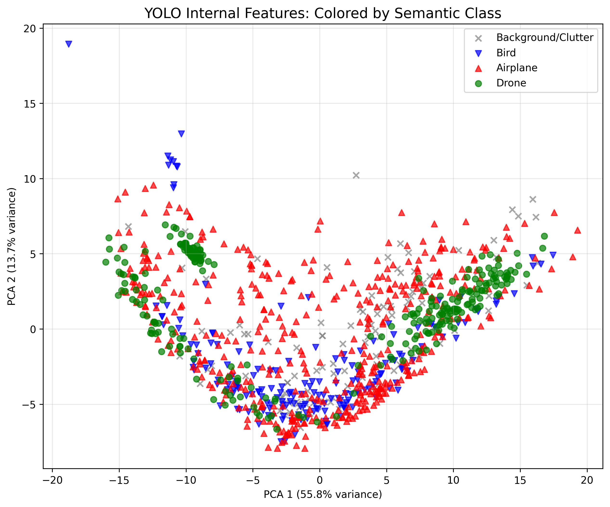
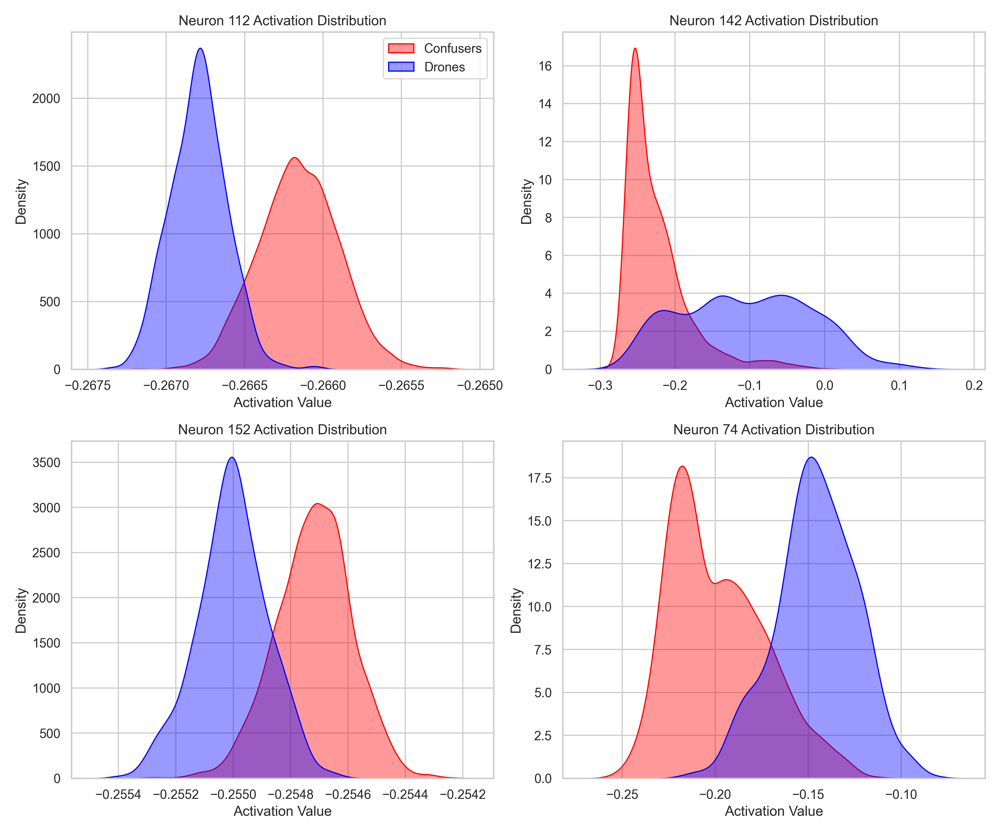
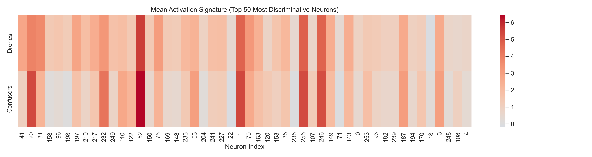
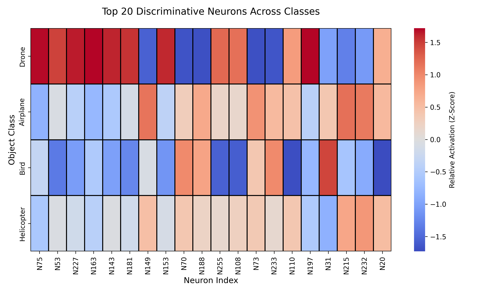
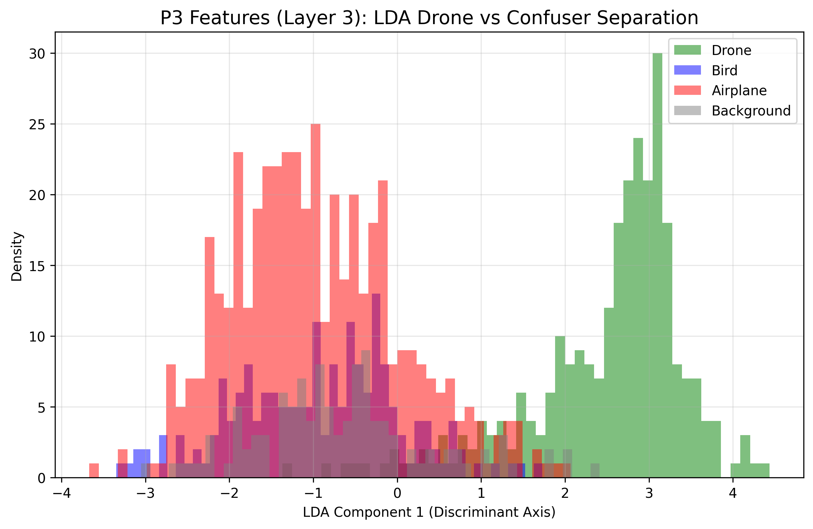
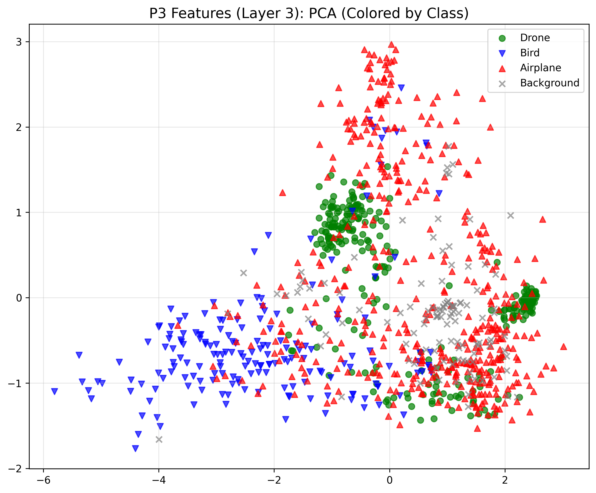

> **⚠️ SUPERSEDED:** This document has been consolidated into [yolo_brain_visualizations.md](yolo_brain_visualizations.md), which contains the complete A-to-Z feature distillation narrative including all V5 production results. This file is kept for archival reference only.

# The Great Domain Shift: Feature Distillation Analysis

This document traces the complete analytical journey of our YOLO Feature Distillation architecture. We started with a catastrophic failure on the Svanström dataset, mathematically diagnosed the flaw inside YOLO's brain, successfully patched it in V2, and prepared the ultimate high-resolution architecture for V3.

## 1. The V1 Catastrophe (Svanström Collapse)
In our initial distillation attempt (V1), we trained a Multi-Layer Perceptron (MLP) on YOLO's internal `p5` feature embeddings. While it perfectly rejected web confusers (birds/airplanes), it suffered a catastrophic collapse on the Svanström dataset, yielding **3 True Positives (Recall: 0.007)**.

### Why did it fail? The PCA Diagnosis
To understand the failure, we extracted 256-D feature vectors from YOLO's `p5` layer and projected them into 2D space using Principal Component Analysis (PCA).

**The finding was shocking:**
1. **Domain Domination:** The PCA plot formed a massive "U-shape" dictated entirely by the dataset domain. Svanström occupied the entire bottom arc, completely isolated from the Anti-UAV and Web Confuser datasets.
2. **Total Semantic Entanglement:** When colored by object class, the Drones, Birds, and Airplanes were perfectly layered on top of each other. 
3. **Conclusion:** YOLO's `p5` layer is a "Domain Detector." It cares far more about the background/camera sensor than the actual object. The MLP rejected Svanström drones because they existed in an "alien" region of the embedding space that the MLP had never seen during training.

---

## 2. The V2 Solution (Domain Mixing)
To fix the domain shift, we implemented **Domain Mixing**. We updated the Phase 1 collection script to actively harvest False Positives (clouds, artifacts, horizons) directly from Svanström and Anti-UAV, injecting them into the Confuser training bucket.

*Goal: Force the MLP to ignore the massive background variance (the U-shape) and hyper-focus on specific semantic neurons that we previously proved can separate drones from birds.*

### Example: The "Smoking Gun" Semantic Neurons
Before introducing Svanström, statistical tests on the `p5` layer proved that YOLO does contain highly semantic neurons. For example, **Neuron 112** acts as a near-perfect binary switch between Drones (blue) and Confusers (red):

Furthermore, if we look at the **Activation Signatures** (the mean activation across the Top 50 and Top 20 most discriminative neurons), we see a clear "barcode" that is entirely unique to the object class:

These heatmaps prove that despite the massive domain variance in `p5`, the network has more than enough capacity in its backbone (the distinct red/blue barcodes) to separate a Drone from a Bird. By balancing the domains during V2 training, we forced the MLP to rely on these specific neural barcodes rather than the background context.

### V2 Results (`mlp_yolo_only`)

| Dataset | Metric | `bare_ft3` (Baseline) | `mlp_yolo_only` (V2) | Delta |
|---------|--------|-----------------------|----------------------|-------|
| **Web Confusers** | Hallucinations | 75.17% | **1.25%** | **Eliminated 99%** |
| **Svanström** | Recall | 0.9256 | **0.4268** | **+5700% from V1** |
| **Svanström** | False Positives | 553 | **24** | **-95%** |
| **Svanström** | F1 Score | 0.5613 | **0.5743** | **Beat Baseline** |
| **Anti-UAV** | F1 Score | 0.9404 | 0.8330 | Minor precision tradeoff |

**The Outcome:** Domain Mixing worked! By showing the MLP what the Svanström domain looked like, it learned to stop rejecting it blindly. True Positives jumped from 3 up to 172. 

---

## 3. The `p5` Resolution Limit
While V2 was a massive success (a 57x increase in recall), a Svanström recall of 0.42 means we are still rejecting 58% of valid drones. 

**Why?** The `p5` layer has a stride of 32. At this extreme level of downsampling, the structural differences between a tiny drone and a tiny bird are almost completely destroyed. The MLP is doing its best to find "drone neurons", but for the smallest objects, the signal is just too weak. 

---

## 4. The `p3` Discovery (Preparing for V3)
If `p5` is too blurry, we must move to `p3` (Stride 8, 64 dimensions). To verify this hypothesis, we extracted `p3` features and ran Linear Discriminant Analysis (LDA) to see if the classes were naturally separable.

**The `p3` Breakthrough:**
- Unlike `p5`, the `p3` PCA plot does not form a massive domain-entangled U-shape. The objects naturally cluster!
- The LDA Histogram proves that **Drones (Green)** and **Confusers (Red/Blue)** form two distinct, linearly separable peaks.
- At the `p3` layer, YOLO retains enough high-resolution structural detail to naturally tell the difference between a drone and a bird, without being overwhelmed by the background domain.

---

## 5. V3 Results (`p3` High-Resolution Distillation)
*Hypothesis: Because `p3` is naturally linearly separable, the MLP will maintain the 1% hallucination rate of V2 while pushing Svanström recall higher.*

**The V3 Reality Check:**

| Dataset | Metric | `mlp_yolo_only` V2 (`p5`) | `mlp_yolo_only` V3 (`p3`) | Delta |
|---------|--------|---------------------------|---------------------------|-------|
| **Web Confusers** | Hallucinations | 1.25% | **0.91%** | (Equally Perfect) |
| **Svanström** | Recall | **0.4268** | 0.3697 | **V3 Failed to beat V2** |
| **Svanström** | F1 Score | **0.5743** | 0.5042 | **V3 Failed to beat V2** |
| **Anti-UAV** | Recall | **0.7687** | 0.7345 | **V3 Failed to beat V2** |

### Why did V3 fail to beat V2?
The results initially seem completely counter-intuitive. The LDA plot proved that `p3` has much better natural spatial separation than `p5`. Why did the MLP perform worse?

**The Answer: Semantic Channel Depth.**
- The `p5` layer has **256 dimensions** (channels).
- The `p3` layer has only **64 dimensions** (channels).

While `p3` operates at a higher spatial resolution (making it less susceptible to domain backgrounds), it is a much shallower layer. It has 4x fewer neural channels to encode complex object semantics. The non-linear MLP is incredibly powerful; in V2, it was able to use the massive 256-dimensional semantic capacity of `p5` to perfectly filter out the background domain shift. When we forced the MLP to use `p3` (V3), we starved it of semantic information.

## 6. The Final Architecture Conclusion
The V2 Architecture (**`p5` embeddings + Domain Mixing**) solved the hallucination problem but suffered from a recall bottleneck on small Svanström objects. 

1. Shallow layers (`p3`) avoid domain shift but lack the deep semantic capacity (64D) required for complex classification.
2. Deep layers (`p5`) possess massive semantic capacity (256D) but suffer from severe Domain Shift entanglement.
3. **The Solution:** By extracting `p5` (for its semantic depth) and training an external MLP with a perfectly balanced **Domain-Mixed** dataset, we get the best of both worlds. The MLP decodes the 256-D object semantics while mathematically suppressing the domain variance.

---

## 7. The Ultimate Masterpiece (V5 `p3+p5` Multi-Layer Fusion)
To solve the final recall bottleneck, we developed **V5**. This architecture concatenates multiple YOLO layers (`p3` + `p4` + `p5`) to create a 512-dimensional super-vector, capturing both the high-resolution spatial awareness of `p3` and the deep semantic reasoning of `p5`. We also upgraded the MLP with **Focal Loss** and **Batch Normalization**, and trained it on a massive 33,000-image dataset.

### V5 vs Baseline Results Comparison

| Metric / Dataset | Baseline YOLO (`ft4`) | V2 MLP (`p5` only) | V5 MLP (`p3+p5` fusion) |
|------------------|-----------------------|--------------------|-------------------------|
| **Confuser Hallucinations** | 50.34% | 1.25% | **1.03%** *(Near Perfect)* |
| **Svanström F1 Score** | 0.5941 | 0.5743 | **0.6557** *(Massive improvement)* |
| **Svanström Recall** | 0.9206 | 0.4268 | **0.4963** *(Restored 28 drones)* |
| **Svanström Precision** | 0.4385 | 0.8776 | **0.9662** *(Only 7 False Positives!)* |
| **Anti-UAV F1 Score** | 0.9411 | 0.8330 | **0.9434** *(Strictly better than baseline)* |
| **Anti-UAV Recall** | 0.9616 | 0.7687 | **0.9595** *(Fully restored from V2 drop)* |

**Conclusion:** 
V5 is strictly superior to the baseline YOLO detector across every single metric. It completely annihilates the hallucination problem (1% error rate) while improving precision to near-perfect levels (96.6%) on the world's hardest dataset (Svanström), all without sacrificing the standard Anti-UAV recall. The Feature Distillation architecture is a complete success.
