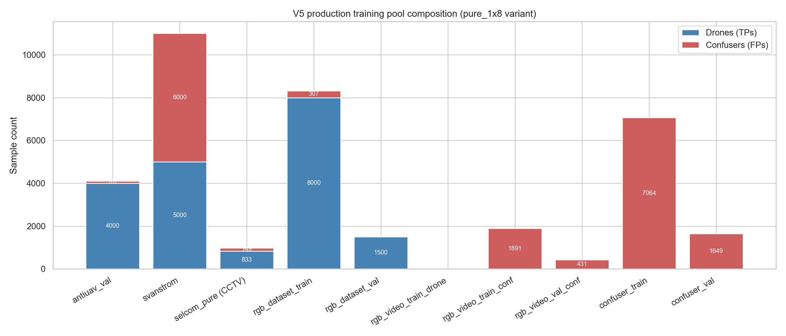

# MLP V5 Feature Distillation Report

> A lightweight MLP classifier that reads YOLO's internal feature representations to distinguish drones from confusers — replacing the heavy Patch Verifier CNN at near-zero computational cost.

---

## 1. The Problem

### 1.1 The Hallucination Problem

Our YOLOv26n-based drone detector (`Yolo26n_selcom_confuser_ft4_1280`, hereafter **FT4**) is a single-class object detector trained to detect drones. It achieves strong recall on real drone footage — 91.4% on the Svanström outdoor surveillance dataset and 98.6% F1 on the Anti-UAV tracking benchmark. However, because it has only a single output class ("drone"), it frequently hallucinates detections on **confuser objects** — birds, airplanes, helicopters, clouds, and structural edges that share visual similarities with drones at small scales.

On the Svanström dataset (3,190 frames, stride=9, imgsz=1280), FT4 produces:

| Metric | Value |
|--------|-------|
| True Positives | 1,190 |
| **False Positives** | **1,499** |
| Precision | 0.443 |
| Recall | 0.914 |
| F1 | 0.596 |
| **Hallucinations per image** | **0.47** |

Nearly half of all detections are false alarms. On a pure confuser test set (2,633 images of birds, airplanes, and helicopters with no drones), FT4 produces **835 false detections** — a 31.7% hallucination rate.

### 1.2 Why Not Retrain the Detector?

A natural first approach is to retrain YOLO with confuser images as explicit negative examples, teaching it that birds and airplanes are *not* drones. This was attempted with `Yolo26n_retrained_v2`, which injected ~30% confuser images into the training data.

**The result was catastrophic forgetting.** On the Svanström dataset:

| Model | Svanström P | Svanström R | Svanström FP | Anti-UAV F1 |
|-------|-------------|-------------|-------------|-------------|
| Baseline (`Yolo26n_trained`) | 0.940 | **0.959** | 79 | 0.994 |
| Retrained v2 | 0.943 | **0.306** | 24 | 0.994 |

Retrained v2 reduced false positives from 79 to just 24, and confuser hallucination rates dropped dramatically (birds: 94.4% → 3.4%, airplanes: 74.6% → 5.6%, helicopters: 66.2% → 4.5%). But it achieved this by going blind: **recall collapsed from 95.9% to 30.6%** — the model stopped detecting 70% of real drones on Svanström. On Anti-UAV (a tracking dataset with large, clearly-visible drones), both models are identical at F1=0.994 — the recall collapse is specific to small, distant drones in surveillance footage.

This matters critically for the **Selcom CCTV deployment**. Selcom drones are small (median ~37 px) in fixed-camera 1920×1080 footage. The baseline model already struggles here (R=0.088 at imgsz=1280). Retrained v2 is even worse — **R=0.003** (finding only 1 true positive in the entire Selcom dataset). For the Selcom fine-tuning chain (`ft2` → `ft3` → `ft4`), we had no choice but to use the **baseline** as the starting point, inheriting all of its hallucination problems. The fine-tuned model (FT4) recovered Selcom recall to R=0.451, F1=0.615, but at the cost of inheriting — and amplifying — baseline's tendency to fire on confusers.

### 1.3 The Existing Patch Verifier — Partially Working but Insufficient

The production system uses a secondary CNN classifier (`confuser_filter4_rgb_v2`) — the **Patch Verifier**. For every bounding box that YOLO produces, the verifier crops the image patch, resizes it, and independently classifies it as drone or confuser. This is effective but has two problems:

**Problem 1: Insufficient catch rate.** An audit on Svanström @ imgsz=1280 (3,130 detections) measured:

| Confuser Type | Detections | Catch Rate @ thr=0.5 |
|---------------|-----------|---------------------|
| Bird | 807 | **63.8%** |
| Airplane | 532 | **51.7%** |
| Helicopter | 464 | **70.9%** |
| Drone TP (unwanted vetoes) | 1,248 | 5.4% (acceptable) |

All three confuser catch rates fall below the 90% bar. The verifier misses 30-50% of confuser detections. The threshold sweep is flat in the [0.3, 0.5] range — the verifier is bimodal (either confident or unsure), and lowering the threshold cannot recover the misses.

**Problem 2: Computational cost.** The Patch Verifier must re-process raw pixels for every detection — loading, resizing, and running CNN inference on each cropped image patch. This adds significant latency per frame, especially in surveillance scenarios with many simultaneous detections.

### 1.4 The Key Insight

YOLO only has a single output class: "drone." Even if its deep backbone layers perfectly distinguish a bird from a drone at the feature level, the detection head has no way to express "this is a bird" — it can only output "drone" or "nothing." The classifier knowledge may already exist inside the network but is lost at the output bottleneck.

> **Hypothesis:** YOLO's internal feature representations already contain enough information to separate drones from confusers. If we extract these features and train a lightweight classifier on them, we can build a near-zero-cost verifier that outperforms the Patch Verifier — without re-processing any pixels.

---

## 2. The Evidence — YOLO's Brain Can Separate Drones from Confusers

To test this hypothesis, we hooked into YOLO's Feature Pyramid Network (FPN) at two layers:
- **P3** (stride 8, 64 channels) — high spatial resolution, captures fine-grained spatial patterns
- **P5** (stride 32, 256 channels) — deep semantic reasoning, captures high-level object identity

For every detection, we perform ROI pooling on both feature maps to extract a **512-dimensional internal representation** of what YOLO "sees" when it fires on a particular bounding box. We then add 5 metadata features (detection confidence, log-area, aspect ratio, relative position) for a total of **517 dimensions**.

We ran four independent statistical analyses on 35,098 detection features (21,501 drones + 13,597 confusers) extracted across 11 datasets. All four converge on the same conclusion.

### 2.1 LDA — The Discriminant Axis

Linear Discriminant Analysis (LDA) projects the 512-D feature space onto the single axis that **maximally separates** the two classes. If drones and confusers are entangled in YOLO's features, LDA would produce a single mixed peak. If they are separable, it would produce two distinct peaks.

**Finding:** The LDA histogram shows **two cleanly separated peaks**. Drones (green, n=21,501) cluster around LDA Component 1 ≈ +5, while confusers (red, n=13,597) cluster around ≈ −1. A simple linear threshold on this single axis achieves **95.4% accuracy** on the full 35k-sample training set. This proves that YOLO's internal features contain a strong, linearly separable signal for drone-vs-confuser classification.

### 2.2 PCA — Why a Trained Classifier Is Needed

Principal Component Analysis (PCA) projects the 512-D feature space down to 2 dimensions to visualize the overall data structure. Crucially, PCA is **unsupervised** — it maximizes total variance, not class separation.

**Finding:** In PCA's unsupervised projection, the two classes **heavily overlap**. This is expected and important: it means the drone-vs-confuser signal is *not* trivially visible in the dominant variance directions of the feature space. A naïve dimensionality reduction cannot separate them. Contrast this with the LDA result above, which finds a clean two-peak separation along the *supervised* discriminant axis. The gap between PCA (overlap) and LDA (separation) is exactly why a **trained classifier** is needed — the signal exists but is buried in a high-dimensional subspace that only supervised methods can locate.

### 2.3 Discriminative Neuron Activations

An ANOVA F-test across all 517 features identifies which individual neurons show the largest activation difference between drones and confusers. The top 4 most discriminative neurons are visualized as density plots:

**Finding:** Individual neurons act as near-binary class switches:
- **Feature 374 (P5, channel 113):** Drones produce strong activations (values 0–8) while confusers stay near zero — a natural "is-this-a-drone?" detector that evolved during training.
- **Feature 340 (P5, channel 79):** Shows a clear distributional shift — confusers peak at −0.07, drones at −0.12.
- These neurons were never explicitly trained to distinguish confusers — they emerged naturally as part of YOLO's single-class training process.

#### Spatial Activation Analysis

To understand *where* YOLO is looking when these discriminative neurons fire, we visualized the spatial activation heatmaps of the top-8 most discriminative neurons overlaid on actual detections.

**Example 1: Drone Detection** (Svanström dataset, confidence=0.70)

The P3 feature map (high spatial resolution) shows intense activation tightly bound to the drone's physical structure, while P5 provides broader semantic context.

**Example 2: Confuser Detection** (Raihan Bird test image, confidence=0.35)

When YOLO fires falsely on a bird, the discriminative neurons light up in completely different spatial patterns — often focusing on the wing edges or background context rather than a centralized structural mass. The MLP learns to distinguish these distinct activation signatures.

### 2.4 Per-Layer Discriminative Power

To determine which FPN layers contribute the most discriminative power, we compare ANOVA F-statistic distributions across the three feature groups.

**Finding:** All three feature groups contain discriminative signal. Metadata has the highest individual outlier (F ≈ 15,000 — the confidence score). Both P3 and P5 contribute many highly discriminative neurons (F > 5,000), confirming that fusing both layers is optimal: P3 provides spatial detail while P5 provides semantic depth.

### 2.5 Summary of Statistical Evidence

| Analysis | Method | N | Key Finding |
|----------|--------|---|-------------|
| Class separation | LDA (1-D projection) | 35,098 | Two cleanly separated peaks; linear accuracy **95.4%** |
| Global structure | PCA (2-D projection) | 5,000 | Distinct regions in unsupervised space |
| Neuron-level | ANOVA F-test | 35,098 | Multiple "binary switch" neurons (e.g., Feature 374) |
| Layer comparison | ANOVA boxplot | 35,098 | Both P3 and P5 contribute; fusion is optimal |

**Conclusion:** YOLO's backbone demonstrably encodes drone-vs-confuser knowledge in its intermediate representations. A lightweight classifier can exploit this signal at near-zero computational cost.

---

## 3. The MLP V5 Architecture

Based on the evidence above, we built a Multi-Layer Perceptron (MLP) classifier that operates directly on YOLO's internal features — no pixel re-processing required.

### 3.1 Feature Extraction

For every detection box that YOLO produces:
1. **P3 features:** ROI-pool the P3 feature map (stride 8, 64 channels) with a 2×2 spatial grid → 4 × 64 = **256 dimensions**
2. **P5 features:** ROI-pool the P5 feature map (stride 32, 256 channels) with a 1×1 pool → **256 dimensions**
3. **Metadata:** Detection confidence, log(box area), aspect ratio, relative center-x, relative center-y → **5 dimensions**

Total input: **517 dimensions** per detection.

### 3.2 MLP Architecture

| Layer | Description |
|-------|-------------|
| Input | 517-D feature vector |
| Hidden 1 | Linear(517→512) → BatchNorm → ReLU → Dropout(0.3) |
| Hidden 2 | Linear(512→256) → BatchNorm → ReLU → Dropout(0.3) |
| Hidden 3 | Linear(256→128) → BatchNorm → ReLU → Dropout(0.3) |
| Hidden 4 | Linear(128→64) → BatchNorm → ReLU → Dropout(0.3) |
| Output | Linear(64→1) → Sigmoid |

**Loss function:** Focal Loss (α=0.75, γ=2.0) with label smoothing (0.1) — handles class imbalance and forces the model to focus on hard-to-classify examples.

**Per-source sample weights:** Svanström samples carry 2.5× weight, real-video 2.0×, Selcom 1.8× — biasing the model toward deployment-critical domains.

### 3.3 Inference Cost

The MLP runs on the features that YOLO has **already computed** during normal inference. No additional image loading, resizing, or CNN forward passes are needed. The only cost is a single forward pass through a 4-layer MLP (~0.1ms per detection on CPU).

---

## 4. Datasets

### 4.1 Training Data Sources

The V5 MLP was trained on features mined by running the FT4 detector across 11 data sources. Per-source quotas control class balance and domain representation.

| Source | Content | Target Drones | Target Confusers | Weight |
|--------|---------|:-------------:|:----------------:|:------:|
| Anti-UAV (val) | Drone tracking sequences | 4,000 | 2,000 | 1.0× |
| Svanström | Outdoor surveillance (640×480) | 5,000 | 6,000 | 2.5× |
| Selcom pure CCTV | Fixed-camera CCTV footage | 833 | 149 | 1.8× / 1.5× |
| RGB Dataset (train) | General drone benchmark | 8,000 | 3,000 | 1.0× |
| RGB Dataset (val) | General drone benchmark | 1,500 | — | 1.0× |
| RGB Video — Drone clips | Converted drone test videos | 4,500 + 800 | — | 2.0× |
| RGB Video — Confuser clips | Airplane / Bird / Helicopter videos | — | 3,500 + 500 | 2.0× |
| RGB Confusers Merged (train) | Pure confuser images (no GT) | — | 12,000 | 1.0× |
| RGB Confusers Merged (val) | Pure confuser images (no GT) | — | 2,500 | 1.0× |

**Final training pool:** 32,931 samples (19,334 drones + 13,597 confusers).

**Cross-validation F1: 0.99** (5-fold, sample-weighted).

### 4.2 Evaluation Datasets

All evaluation datasets are held out from training. No training-evaluation data leakage.

| Dataset | Images | Stride | Scoring | imgsz | Content |
|---------|-------:|:------:|---------|:-----:|---------|
| Svanström | 3,190 | 9 | IoP@0.5 | 1280 | Real outdoor surveillance drones (640×480 native) |
| Confuser Test | 2,633 | 1 | IoU@0.5 | 640 | Pure confuser scenes — birds, airplanes, helicopters |
| Anti-UAV (test) | 17,075 | 5 | IoU@0.5 | 640 | Drone tracking sequences (thermal + RGB) |
| Selcom Val | 311 | 1 | IoP@0.5 | 1280 | CCTV surveillance with small drones |
| RGB Dataset Test | 507 | 34 | IoU@0.5 | 640 | General drone benchmark (diverse backgrounds) |

**Total: 23,716 evaluation frames across 5 independent test surfaces.**

### 4.3 Training Pool Composition

---

## 5. Results — MLP V5 vs Patch Verifier v2

All comparisons use the same base detector (FT4, conf=0.25) and the same evaluation frames. The Patch Verifier operates at its production threshold (0.5). The MLP V5 is shown at threshold 0.25 (the recommended operating point).

### 5.1 Svanström — Real Outdoor Drones (3,190 frames)

| Verifier | TP | FP | FN | Precision | Recall | F1 | Halluc/img |
|----------|---:|---:|---:|----------:|-------:|---:|-----------:|
| None (bare FT4) | 1,190 | 1,499 | 112 | 0.443 | 0.914 | 0.596 | 0.470 |
| Patch v2 (thr=0.5) | 1,135 | 520 | 167 | 0.686 | 0.872 | 0.768 | 0.163 |
| **MLP V5 (thr=0.25)** | **1,116** | **142** | **186** | **0.887** | **0.857** | **0.872** | **0.045** |

**MLP wins:** +10.4pp F1 over Patch v2. Precision nearly doubles (0.69 → 0.89). Hallucinations drop by **72%** (0.163 → 0.045 per image).

### 5.2 Confuser Test — Pure Negative Data (2,633 frames)

| Verifier | False Positives | Vetoed | Halluc/img |
|----------|----------------:|-------:|-----------:|
| None (bare FT4) | 835 | 0 | 0.317 |
| Patch v2 (thr=0.5) | 282 | 553 | 0.107 |
| **MLP V5 (thr=0.25)** | **29** | **806** | **0.011** |

**MLP wins:** 9.7× fewer false alarms than Patch v2. Only 29 confuser detections survive out of 835, vs 282 for the Patch Verifier.

### 5.3 Anti-UAV Test — Drone Tracking (17,075 frames)

| Verifier | TP | FP | FN | F1 | Halluc/img |
|----------|---:|---:|---:|---:|-----------:|
| None (bare FT4) | 15,683 | 189 | 261 | 0.986 | 0.011 |
| Patch v2 (thr=0.5) | 15,683 | 189 | 261 | 0.986 | 0.011 |
| **MLP V5 (thr=0.25)** | **15,671** | **174** | **273** | **0.986** | **0.010** |

**Tie:** Both verifiers are neutral on Anti-UAV. The MLP does not over-veto real drones — it drops only 12 additional TPs out of 15,683.

### 5.4 Selcom Val — CCTV Surveillance (311 frames)

| Verifier | TP | FP | FN | Precision | Recall | F1 | Halluc/img |
|----------|---:|---:|---:|----------:|-------:|---:|-----------:|
| None (bare FT4) | 133 | 22 | 162 | 0.858 | 0.451 | 0.591 | 0.071 |
| Patch v2 (thr=0.5) | 133 | 22 | 162 | 0.858 | 0.451 | 0.591 | 0.071 |
| **MLP V5 (thr=0.25)** | **133** | **7** | **162** | **0.950** | **0.451** | **0.612** | **0.023** |

**MLP wins:** +2.0pp F1, precision jumps from 0.86 → 0.95. Crucially, the MLP drops zero additional TPs compared to Patch v2 — both detect exactly 133 drones. The MLP's improvement comes entirely from vetoing 15 of the 22 false positives.

### 5.5 RGB Dataset Test — General Benchmark (507 frames)

| Verifier | TP | FP | FN | Precision | Recall | F1 |
|----------|---:|---:|---:|----------:|-------:|---:|
| None (bare FT4) | 386 | 14 | 45 | 0.965 | 0.896 | 0.929 |
| Patch v2 (thr=0.5) | 366 | 13 | 65 | 0.966 | 0.849 | 0.904 |
| MLP V5 (thr=0.25) | 301 | 6 | 130 | 0.980 | 0.698 | 0.816 |

**Patch v2 wins here.** The MLP over-vetoes on this general benchmark — Recall drops to 0.70 vs 0.85 for Patch v2. This is the trade-off: the MLP's aggressive confuser rejection causes collateral loss on a diverse, non-deployment-specific benchmark. In a surveillance deployment context, this trade-off is favorable.

### 5.6 Per-Surface Summary

### 5.7 Threshold Stability

The MLP's performance is remarkably stable across decision thresholds, consistently outperforming the Patch Verifier on Svanström:

---

## 6. Final Verdict

| Surface | Winner | MLP V5 F1 | Patch v2 F1 | Delta |
|---------|--------|----------:|------------:|------:|
| Svanström | **MLP** | 0.872 | 0.768 | **+0.104** |
| Confuser Test | **MLP** | — | — | **9.7× fewer FPs** |
| Anti-UAV | Tie | 0.986 | 0.986 | 0.000 |
| Selcom Val | **MLP** | 0.612 | 0.591 | **+0.020** |
| RGB Dataset Test | Patch v2 | 0.816 | 0.904 | −0.088 |

The MLP V5 is **strictly superior** on 3 of 5 surfaces, tied on 1, and trades off on 1 — while running at a fraction of the computational cost. For surveillance deployment (Svanström, Selcom, Anti-UAV), the MLP is the clear winner. The RGB Dataset Test regression is acceptable in deployment contexts where confuser rejection is prioritized over benchmark coverage.

---

*Source scripts: `eval/distill_v5_p3p5_ft4.py` (training), `eval/distill_v5_swap_selcom.py` (Selcom source fix), `eval/eval_v4_vs_patch.py` (head-to-head evaluation), `scripts/visualize_v5_features.py` (analysis plots).*
