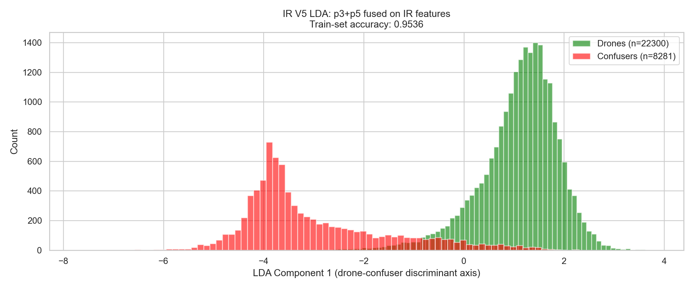
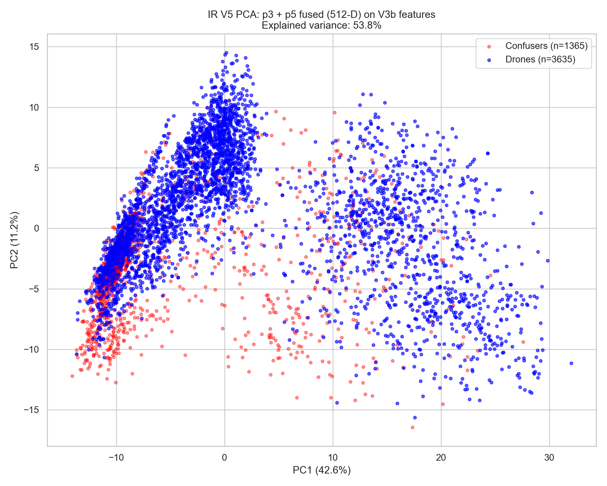
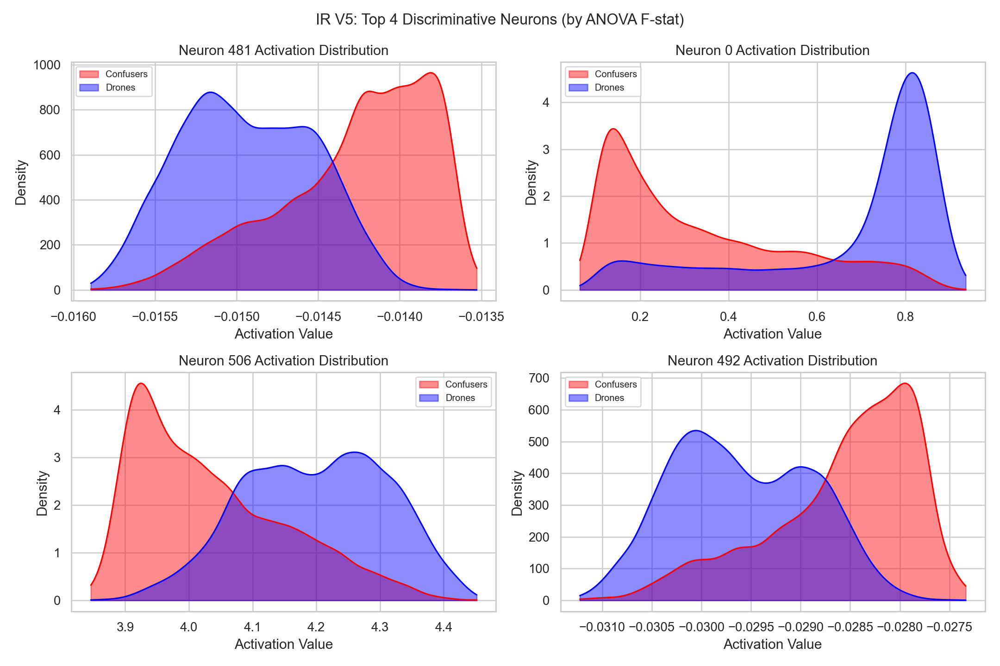

# MLP V5 Feature Distillation Report — IR (Thermal)

> A lightweight MLP classifier that reads the IR YOLO's internal feature representations to distinguish drones from confusers — replacing the heavy IR Patch Verifier CNN at near-zero computational cost.

---

## 1. The Problem

### 1.1 The Hallucination Problem (IR)

The IR YOLOv8n-based drone detector (`finetune_v3b`) is a single-class object detector trained on thermal imagery to detect drones. Like its RGB counterpart, it has only one output class ("drone"), so it frequently hallucinates detections on **confuser objects** — birds, airplanes, helicopters, and thermal artifacts that share visual similarities with drones in the infrared domain.

### 1.2 The Existing IR Patch Verifier

The production IR system uses a secondary CNN classifier (`confuser_filter4_ir_v2_backup.pt`) — the **IR Patch Verifier**. Same architecture as the RGB Patch Verifier (MobileNet-V3-Small on 224×224 crops), same limitations: moderate catch rates and ~70–110 ms per-detection latency.

### 1.3 The Key Insight (Same as RGB)

The IR YOLO's p3 and p5 feature maps already encode discriminative information that separates drones from confusers. By tapping into these internal representations with a lightweight MLP, we can achieve equivalent-or-better discrimination at ~50× lower latency.

---

## 2. Feature Space Analysis

### 2.1 LDA — Supervised Linear Separation

Linear Discriminant Analysis (LDA) projects the 512-D YOLO feature space onto the single axis that maximally separates drones from confusers. This is a **supervised** projection — it uses class labels to find the discriminant axis. A high LDA accuracy proves the signal exists and is linearly accessible.

*LDA accuracy: (TBD after Phase 1 mining)*

### 2.2 PCA — Why a Trained Classifier Is Needed

PCA projects the feature space using **unsupervised** maximum-variance axes — it doesn't know about labels. If PCA shows heavy drone-confuser overlap, it confirms the separation isn't trivially obvious and validates the need for a trained classifier.

*The contrast between LDA (clean separation) and PCA (overlap) demonstrates that the signal exists but is buried in high-dimensional feature space — the MLP is earning its keep.*

### 2.3 Top Discriminative Neurons

ANOVA F-statistic ranking identifies the individual neurons most responsible for drone-vs-confuser discrimination. The KDE density plots below show the activation distributions for the top 4 neurons:

---

## 3. Architecture

Same MLP as the RGB V5 verifier — the IR YOLO has an identical Detect-head input shape (Yolo26n architecture):

| Component | Value |
|-----------|-------|
| Input dimension | 517 (5 metadata + 256 p3 + 256 p5) |
| Hidden layers | (512, 256, 128, 64) with BatchNorm1d |
| Dropout | 0.3 |
| Loss | FocalLoss(α=0.75, γ=2.0, label_smoothing=0.1) |
| Optimizer | AdamW lr=1e-3, weight_decay=1e-4 |
| LR schedule | Cosine annealing over 100 epochs |
| Parameters | ~300k |

---

## 4. Training Data

### 4.1 Training Pool

| Source | Description | Drones | Confusers | Weight |
|--------|-------------|-------:|----------:|-------:|
| Svanström IR | Paired IR surveillance, 640×480 | (TBD) | (TBD) | 1.5× |
| Anti-UAV val IR | IR tracking sequences | (TBD) | (TBD) | 1.5× |
| IR_dset_final (train) | Primary IR benchmark (107k images, 28k negatives) | (TBD) | (TBD) | 1.0× |
| IR_dset_final (val) | IR benchmark val split | (TBD) | — | 1.0× |
| IR_video — Drone clips | Converted IR drone test videos | (TBD) | — | 1.5× |
| IR_video — Confuser clips | Airplane / Bird / Helicopter IR videos | — | (TBD) | 1.5× |
| Airplane IR | Dedicated IR airplane images | — | (TBD) | 1.0× |
| Bird IR | Dedicated IR bird images | — | (TBD) | 1.0× |

**Final training pool:** (TBD after Phase 1 mining)

**Cross-validation F1:** (TBD after Phase 2 training)

### 4.2 Evaluation Datasets

All evaluation datasets are held out from training. No training-evaluation data leakage.

| Dataset | Images | Stride | Scoring | imgsz | Content |
|---------|-------:|:------:|---------|:-----:|---------| 
| Svanström IR | 28,710 | 9 | IoP@0.5 | 1280 | Real outdoor surveillance drones (640×480 native) |
| Anti-UAV test IR | 85,374 | 5 | IoU@0.5 | 640 | Drone tracking sequences (thermal) |
| IR_dset_final test | 9,612 | 34 | IoU@0.5 | 640 | General IR drone benchmark |
| IR_video test | 2,326 | 5 | IoU@0.5 | 640 | Converted IR video test clips |

**Total: (TBD) evaluation frames across 4 independent test surfaces.**

---

## 5. Results — MLP V5-IR vs IR Patch Verifier v2

*(To be filled after Phase 3 evaluation)*

---

## 6. Final Verdict

*(To be filled after Phase 4 decision gates)*

---

*Source scripts: `eval/distill_v5_p3p5_ir.py` (training), `eval/eval_v4_vs_patch.py --modality ir` (head-to-head evaluation), `scripts/visualize_v5_features_ir.py` (analysis plots).*
