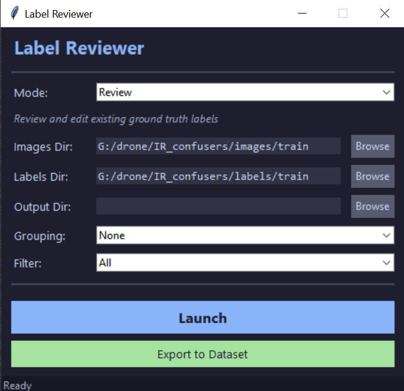
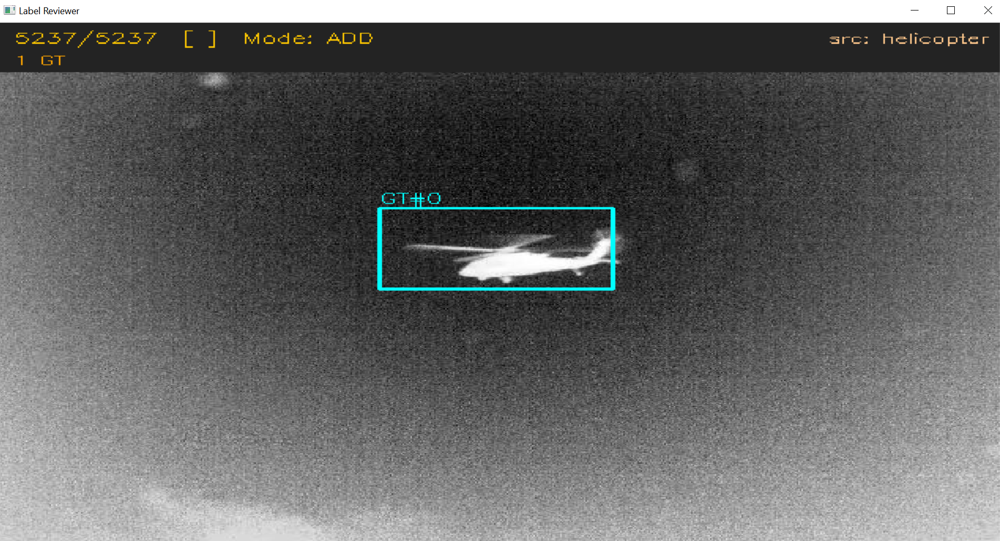

# label_reviewer/

The human-in-the-loop (HITL) label review tool used to build and clean the detection datasets. It runs the
current detector over a batch of frames, shows each frame with its predicted boxes, and lets a reviewer
accept, correct, add, or delete boxes. The accepted labels feed the next fine-tune, which is how the IR
detector progressed across its versions in the thesis.

## Run it

```
py label_reviewer/review_labels_gui.py
```

A Tkinter window opens (model weights are needed for the prediction step; weights are not published, contact
the author). Review sessions write their output under `label_reviewer/` and are excluded from the repo.

## Files

| File | Role |
|---|---|
| `review_labels_gui.py` | Entry point |
| `gui.py` | The Tkinter review window (canvas, box editing, navigation) |
| `core.py` | Review state, label IO, accept / correct / add / delete logic |
| `predictor.py` | Runs the detector to seed each frame's boxes |

## Setup window



## Review canvas


