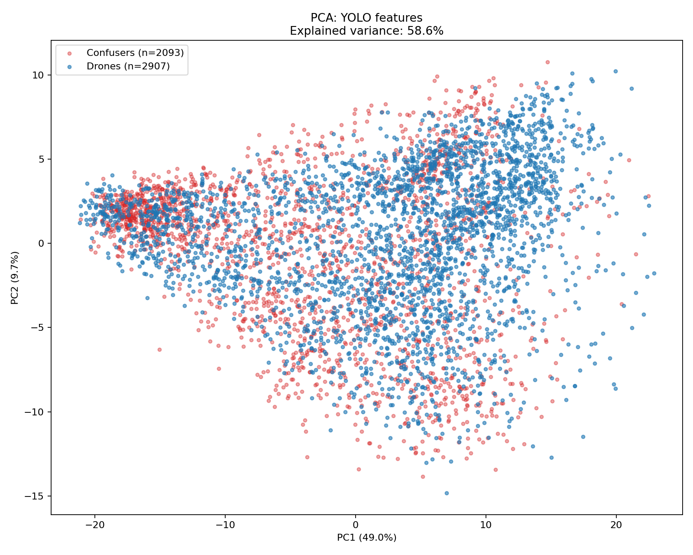
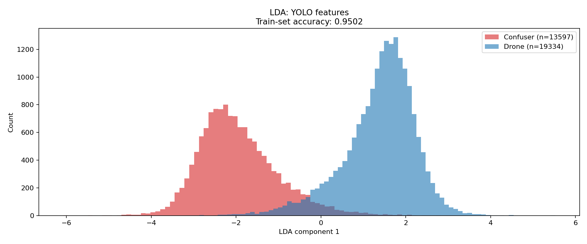
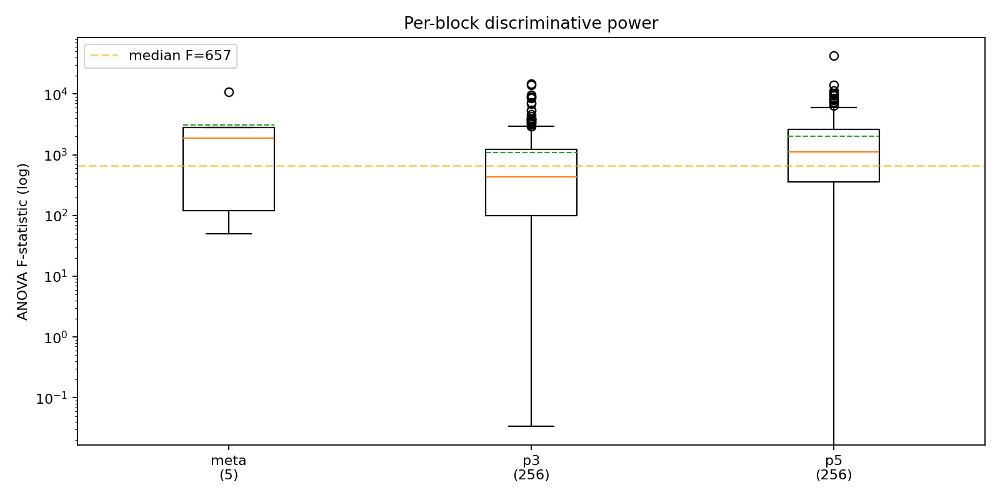
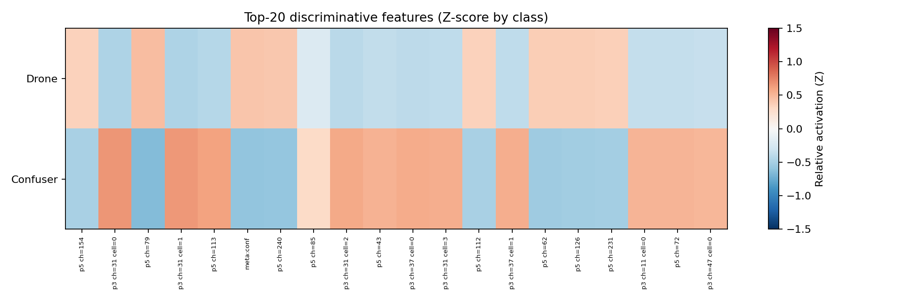
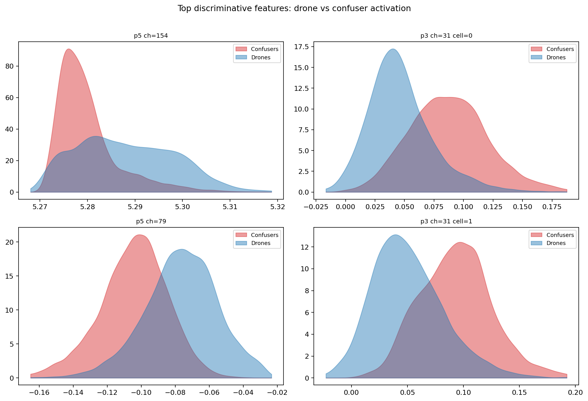
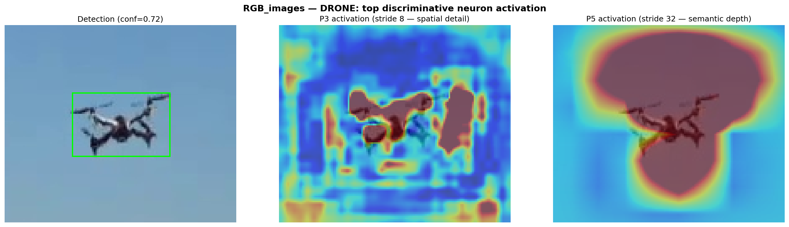
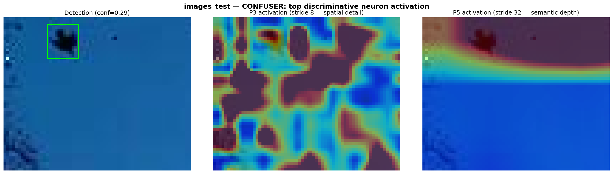
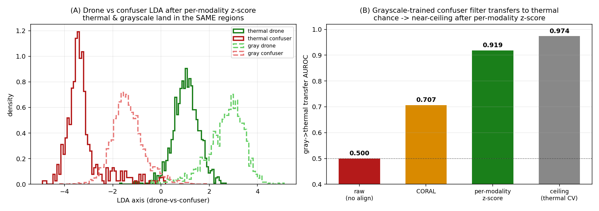

# Model MRI — a methodology for imaging a detector's internal feature space

## What it is and why it matters

**Model MRI** is a model-agnostic methodology for diagnosing whether an object
detector needs a downstream false-positive-reduction classifier — and, crucially,
whether one would actually work. You attach any [ultralytics](https://github.com/ultralytics/ultralytics)
detector plus two roles of image folders — a **positive** (target-class) set and one
or more **negative** (distractor) sets — and MRI runs the detector, extracts the FPN
features behind every detection, images that feature space statistically, and emits a
verdict. Feature dimensions are read from the model at runtime, so nothing is tied to
a particular architecture, input size, class set, or domain.

The vocabulary is deliberately generic. A **target** ("drone" in the code) is a
detection that matches a ground-truth box in a positive set; a **distractor**
("confuser") is a detection with no matching GT, or any detection in a negative set.
Drone-vs-bird detection is this thesis's worked case study, not the definition — read
"drone" as *the target class* and "confuser" as *a hard negative the detector fired
on*. The same machinery applies to any detector and any two folders of "things it
should fire on" / "things it shouldn't".

## How it works

The pipeline is five steps:

1. **Hook the detector head.** A Detect-head input hook captures the FPN maps
   (e.g. P3 at stride 8, P5 at stride 32) for each forward pass — model-agnostic, with
   channel dimensions read from the model at runtime.
2. **ROI-pool FPN features per detection.** Each detection's box is ROI-pooled across
   the chosen layers into a fixed-length embedding, concatenated with a few metadata
   scalars (confidence, geometry) — in the case study, a 517-D vector.
3. **Mine target vs distractor.** Detections in positive sets are matched to GT
   (IoU or IoP) and labelled target; unmatched detections and all negative-set
   detections are labelled distractor.
4. **Brain statistics.** Over the mined corpus MRI computes PCA, LDA separability,
   per-feature/per-layer ANOVA F, per-feature AUROC, and silhouette — answering "is
   the target/distractor signal present, and can a boundary split it?"
5. **Verdict (+ optional MLP).** The four-signal rule below produces one
   recommendation; optionally a focal-loss MLP is trained and cross-validated to
   estimate the real FP cut and recall cost, and saved as a callable artifact.

### The four-signal verdict

| Raw FP / hallucination rate | LDA separability | Recall cost | Verdict |
|---|---|---|---|
| ≤ threshold | — | — | **Not needed** — detector is already clean |
| high | high | low | **Recommended** — large FP cut, cheap |
| high | low | — | **Won't help** — features don't separate; fix the detector/data |
| high | high | high | **Marginal** — the FP cut trades real recall; read the curve |

## Example output

The figures below are from the worked drone case study. The first group asks
*can target and distractor be separated in feature space?*

The next group makes the statistics concrete by overlaying the discriminative
neurons spatially — crop, P3 (fine detail), P5 (semantic depth):

Finally, the cross-modal extension collapses two input modalities into one feature
space:

## A worked diagnosis

Two case-study runs illustrate both ends of the verdict space:

**Detector already clean (IR detector `finetune_v3b`, 7 datasets, 5 pos / 2 neg).**
Raw hallucination rate **1.8%/img** (below the 5% threshold), so the verdict is
**"No classifier needed."** Even so, the features were highly separable (LDA
**0.981**, projected FP cut 89%, recall cost 0.3%, raw drone F1 **0.864**) — MRI shows
*both* that the detector is clean and that a classifier *could* help if it ever
weren't. (Source: `mri/results/ir_v3b_report/report.md`.)

**Classifier clearly warranted (RGB detector, V5 distillation corpus, 32,931
detections = 19,334 targets + 13,597 distractors).** LDA separability **0.952**, MLP
5-fold CV F1 **0.9857 ± 0.0004**, out-of-fold recall cost **1.1%**, and the classifier
**rejects 97% of distractor detections while keeping 98.9% of true targets** — verdict
**"Classifier strongly recommended."** A notable by-product: the single strongest
discriminative feature is **P5 channel 154 (ANOVA F = 42,346)**, ~4× the confidence
score, correcting an earlier hand-written claim that confidence was the top signal.
(Source: `mri/docs/mlp_v5_report_regen.md`.)

## Scope and honesty

This is a **general methodology**, not a drone-only tool: it images any ultralytics
detector's feature space against any target/distractor folders and diagnoses the
need for, and viability of, an FP-reduction classifier. One honest caveat: the default
verdict uses **in-pool cross-validation, which is optimistic** — it cannot see the
out-of-distribution recall a verifier sacrifices at deployment (in this project a
CV-F1 of 0.987 still hid a verifier that was not deployable), so the `holdout` module
provides a held-out, per-surface gate for the shippable decision. The same feature-space
machinery also supports a forward-looking **cross-modal extension** — probe whether a
class is represented identically across two input modalities, align the per-feature
offset, and synthesize a verifier from cheaply-mined negatives in the other modality.

Model MRI is the **4th contribution** of this thesis, alongside the YOLO detectors,
the label reviewer, and the PySide GUI.
