# IR Drone Detection Dataset: `ir_dset_final`

## Overview

`ir_dset_final` is a large-scale infrared (IR) drone detection dataset built by merging multiple publicly available and custom-collected IR sources. The dataset is designed for training and evaluating YOLO-based single-class object detectors (class 0 = `drone`).

The dataset combines **positive** sources (containing drone annotations in YOLO format) with **hard negative** sources (drone-free scenes) to improve false-positive suppression. All images are thermal/IR.

---

## Dataset Construction

The final dataset is built incrementally from raw sources through a series of conversion, merging, and cleaning steps. Each numbered script in this directory handles one stage:

```
Original Sources                         Conversion Needed?
─────────────────                        ──────────────────
goldv2 (YOLO)  ──────────────┐
may22 (YOLO)  ───────────────┤
roboflow (COCO) ───[01]──────┤
                              ├──[02]──→ IR_dsetV3
smallobj (YOLO) ──────────────┤
ddetIR (YOLO) ────────────────┤
bird (YOLO) ──────────────────┤
                              ├──[03]──→ IR_dsetV4
3rd Anti-UAV (JSON) ─[04a]───┐
CST Anti-UAV (txt) ──[04b]───┤
                              ├──[05]──→ IR_dsetV5
Svanström (.mat/.mp4) ─[06a]─┐
                              ├──[06b]─→ IR_dsetV6
                                           │
czoom (from auv) ─────[07c]──────────────┤
sea (YOLO, negative) ────────────────────┤
flir (YOLO, negative) ───────────────────┤
ovh (YOLO, negative) ────────────────────┤
                                          │
                              [07b merge]─┤
                                          ↓
                              [09]──→ ir_dset_final
```

Starting from `IR_dsetV6` (8 sources, ~95K images), the final dataset adds CST Anti-UAV positives, crop-zoom augmented frames, and three dedicated negative-only sources — resulting in **129,130 images** across 13 source types.

---

## Sources

### Positive Sources (contain drone annotations)

| Source | Description | Images | Positive | Negative |
|--------|-------------|-------:|---------:|---------:|
| **Gold V2** | Hand-reviewed IR drone recordings | 3,687 | 3,399 | 288 |
| **May22** | IR thermal recordings (May 2022 session) | 2,411 | 2,058 | 353 |
| **Roboflow** | "Drone Detection in Various Environments" | 2,269 | 2,189 | 80 |
| **Small Objects** | Small-object IR drone clips | 11,246 | 9,966 | 1,280 |
| **DroneDetect IR** | DroneDetect dataset (IR subset) | 185 | 185 | 0 |
| **Bird** | Bird IR footage (negative for drones) | 1,582 | 0 | 1,582 |
| **3rd Anti-UAV** | 3rd Anti-UAV Challenge sequences | 32,132 | 29,140 | 2,992 |
| **Svanström** | Svanström IR — drones + hard negatives (airplanes, helicopters, birds) | 21,637 | 14,956 | 6,681 |
| **CST Anti-UAV** | CST Anti-UAV Challenge | 22,957 | 21,397 | 1,560 |
| **Other** | miscellaneous | 694 | 572 | 122 |

**Crop-Zoom Augmentation:** 9,808 images generated from Anti-UAV medium-large drone frames via crop-zoom augmentation (script `07c`). All positive.

### Negative-Only Sources (no drone annotations)

These sources contain zero drone annotations — every image has an empty label file. They reduce false positives by exposing the model to drone-free IR scenes:

| Source | Description | Images |
|--------|-------------|-------:|
| **Sea** | Marine/ocean thermal backgrounds (ships, waves) | 8,398 |
| **FLIR** | FLIR thermal street scenes (bikes, dogs, people, cars) | 6,360 |
| **Overhead** | Overhead satellite/aerial views (ovh1, ovh2) | 5,764 |

---

## Sample Images per Source

### Positive Sources

| Gold V2 (3,687) | May22 (2,411) | Roboflow (2,269) |
|:---:|:---:|:---:|
| 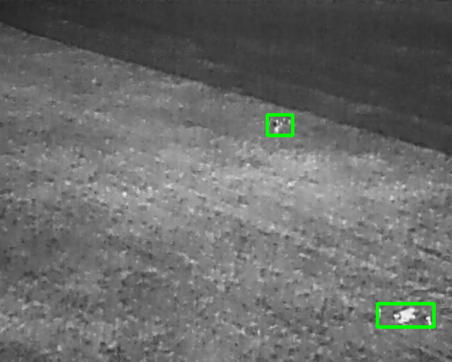 | 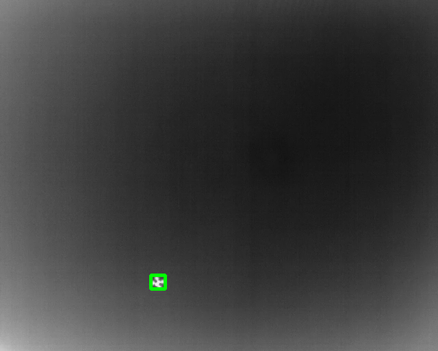 | 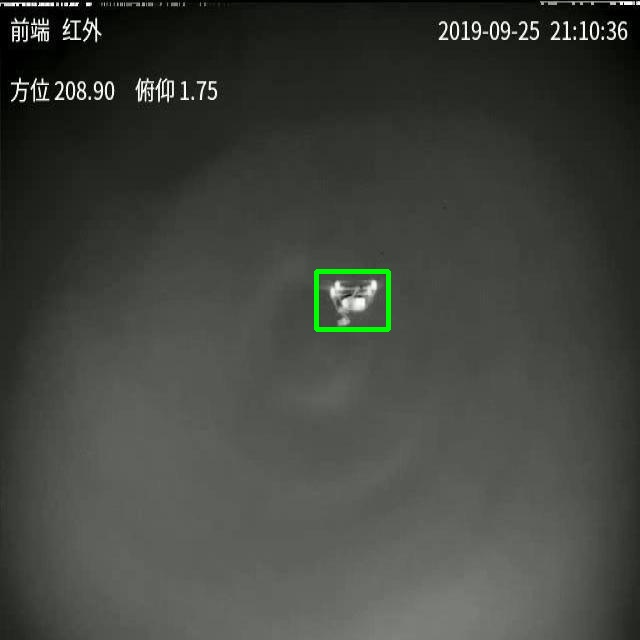 |

| Small Objects (11,246) | DroneDetect IR (185) | Bird (1,582) |
|:---:|:---:|:---:|
| 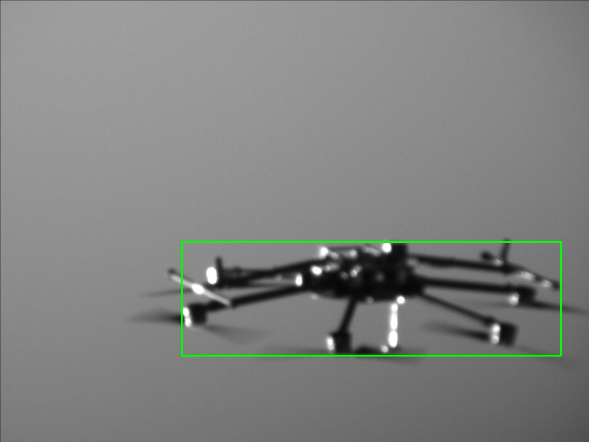 | 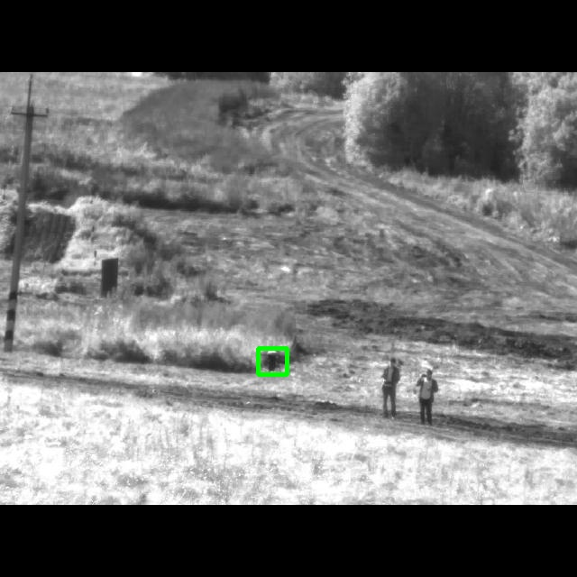 | 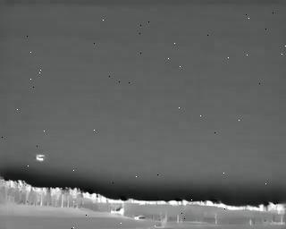 |

| 3rd Anti-UAV (32,132) | Svanström (21,637) | CST Anti-UAV (22,957) |
|:---:|:---:|:---:|
| 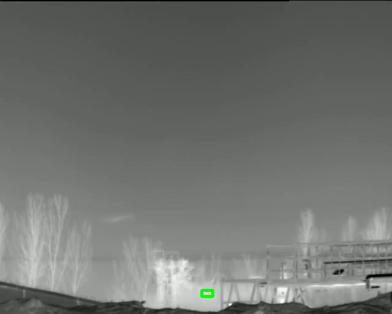 | 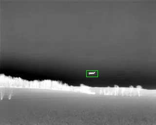 | 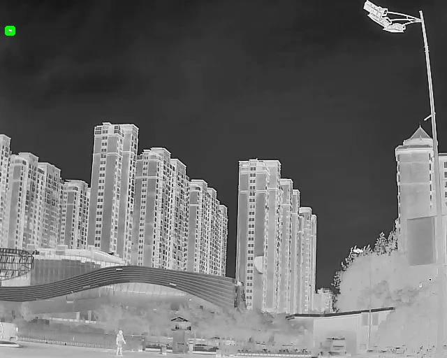 |

| Crop-Zoom (9,808) | Other (694) |
|:---:|:---:|
| 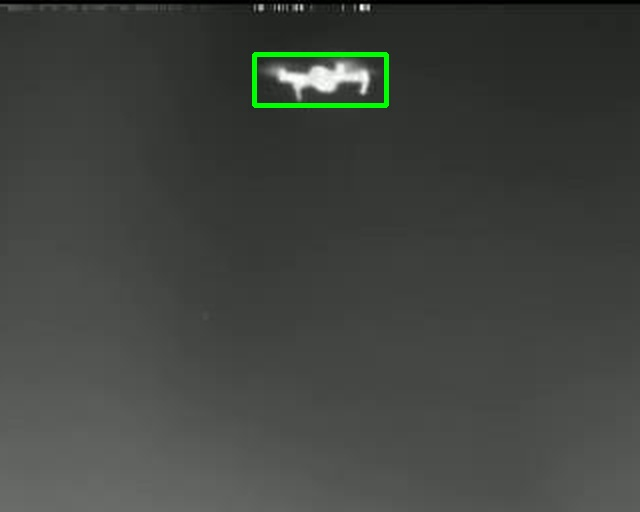 | 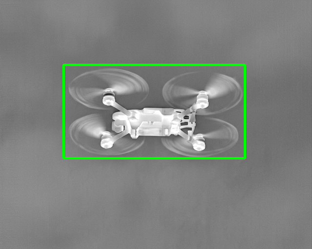 |

### Negative-Only Sources

| Sea [NEG] (8,398) | FLIR [NEG] (6,360) | Overhead [NEG] (5,764) |
|:---:|:---:|:---:|
| 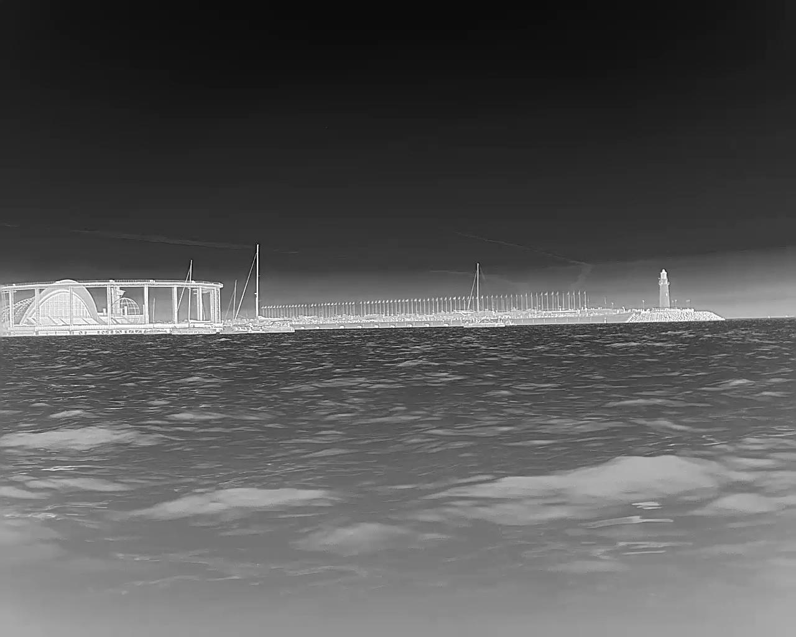 | 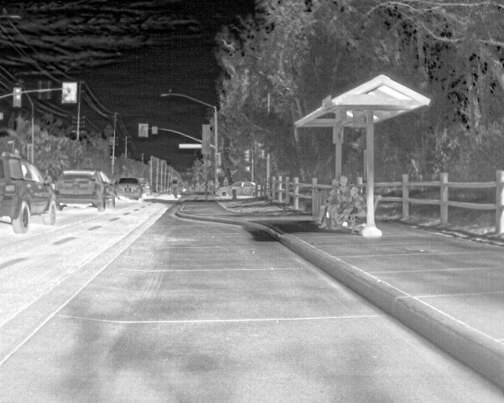 | 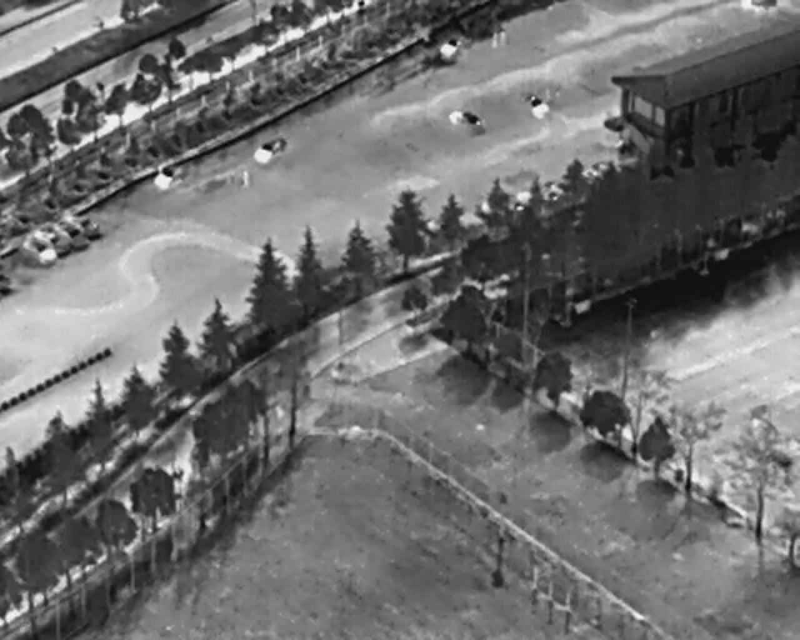 |

---

## Dataset Statistics

### Split Distribution

| Split | Images | Positive | Negative | Neg % |
|-------|-------:|---------:|---------:|------:|
| **Train** | 107,809 | 79,999 | 27,810 | 25.8% |
| **Val** | 11,709 | 7,414 | 4,295 | 36.7% |
| **Test** | 9,612 | 6,257 | 3,355 | 34.9% |
| **Total** | **129,130** | **93,670** | **35,460** | **27.5%** |

### Per-Source Image Counts

| Source | Images | Positive | Negative | Type |
|--------|-------:|---------:|---------:|------|
| 3rd Anti-UAV | 32,132 | 29,140 | 2,992 | Positive |
| CST Anti-UAV | 22,957 | 21,397 | 1,560 | Positive |
| Svanström | 21,637 | 14,956 | 6,681 | Positive + Hard Neg |
| Small Objects | 11,246 | 9,966 | 1,280 | Positive |
| Crop-Zoom | 9,808 | 9,808 | 0 | Augmentation |
| Sea | 8,398 | 0 | 8,398 | Negative |
| FLIR | 6,360 | 0 | 6,360 | Negative |
| Overhead | 5,764 | 0 | 5,764 | Negative |
| Gold V2 | 3,687 | 3,399 | 288 | Positive |
| May22 | 2,411 | 2,058 | 353 | Positive |
| Roboflow | 2,269 | 2,189 | 80 | Positive |
| Bird | 1,582 | 0 | 1,582 |  Negative |
| Other | 694 | 572 | 122 | Positive |
| DroneDetect IR | 185 | 185 | 0 | Positive |
| **Total** | **129,130** | **93,670** | **35,460** | |

### Drone Size Bucket Summary

Drone bounding box sizes are categorized by pixel area:

| Bucket | Count | Percentage | Pixel Area Range |
|--------|------:|----------:|------------------|
| **Tiny** | 34,523 | 36.7% | < 20×20 px |
| **Small** | 38,813 | 41.2% | 20–50 px |
| **Medium** | 13,076 | 13.9% | 50–128 px |
| **Large** | 7,730 | 8.2% | > 128 px |

> The dataset is heavily skewed toward tiny and small drones, reflecting real-world IR surveillance conditions where drones appear as small thermal signatures at long range.

---

## Source Lineage

| Dataset Version | Sources Added | Total Sources |
|----------------|---------------|:-------------:|
| dsetV3 | goldv2, may22, roboflow | 3 |
| dsetV4 | + smallobj, ddetIR, bird | 6 |
| dsetV5 | + 3rd Anti-UAV | 7 |
| dsetV6 | + Svanström | 8 |
| **ir_dset_final** | + CST, czoom, sea, flir, ovh | **13** |

---

## Scripts

Each script is numbered — run them in order. Conversion scripts (suffixed `a`/`b`/`c`) must run before their corresponding merge step.

> **Important:** Most scripts have hardcoded paths at the top of the file. Review and update these paths to match your setup before running each script.

| Script | Purpose |
|--------|---------|
| `01_convert_roboflow_coco_to_yolo.py` | Convert Roboflow COCO annotations to YOLO format |
| `02_build_dsetV3.py` | Merge goldv2 + may22 + roboflow → IR_dsetV3 |
| `03_build_dsetV4.py` | Merge 6 sources independently → IR_dsetV4 |
| `04a_convert_antiuav_to_yolo.py` | Convert 3rd Anti-UAV JSON sequences → YOLO |
| `04b_convert_cst_antiuav.py` | Convert CST Anti-UAV txt labels → YOLO |
| `05_merge_dsetV5.py` | Merge dsetV4 + 3rd Anti-UAV → IR_dsetV5 |
| `06a_convert_svanstrom_ir_to_yolo.py` | Convert Svanström .mat/.mp4 → YOLO |
| `06b_merge_dsetV6.py` | Merge dsetV5 + Svanström → IR_dsetV6 |
| `07b_merge_supplementary.py` | Merge dsetV6 + all additional sources |
| `07c_crop_zoom_augment.py` | Generate crop-zoom augmented frames from Anti-UAV |
| `09_merge_final.py` | Final merge and cleaning → ir_dset_final |

### Python Dependencies

```
opencv-python, numpy, scipy, tqdm, pyyaml, ultralytics, yt-dlp, scikit-image, Pillow
```
